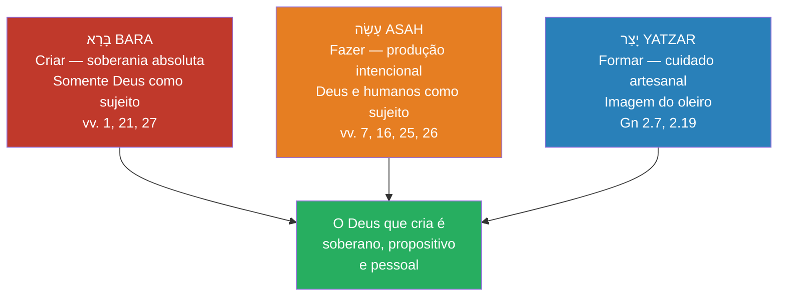

# Gênesis 1 — O texto hebraico

> **Pasta:** Gênesis 1 · **Índice da pasta:** [[00-como-usar]] · **Etapa:** material preparatório

---

## O que este documento é

O capítulo 1 de Gênesis **no original**, com o que cada palavra significa e como ela é usada ali.

Isto não é comentário. É o material bruto: se em algum ponto do estudo você quiser conferir se uma leitura se sustenta no texto — ou descobrir que ela depende de uma escolha de tradução — é aqui que se confere. Junto com [[02-traducoes-br]], é o que permite discordar do comentário com o mesmo material na mão.

Você não precisa ler hebraico para usar este documento. As três colunas de vocabulário (palavra, transliteração, sentido) funcionam sozinhas.

---

## 1. Convenções

**Direção.** O hebraico se lê **da direita para a esquerda**. Na tabela abaixo, cada linha começa pela direita.

**Vogais.** O hebraico bíblico foi escrito originalmente só com consoantes. Os pontos e traços abaixo e acima das letras (`בָּ`, `בְ`, `בִ`) são a **vocalização massorética**, acrescentada por escribas judeus entre os séculos VI e X d.C. para fixar a pronúncia recebida. Os traços adicionais sobre as palavras são **acentos de cantilação** — marcam entonação e, o que importa mais para exegese, **onde a frase se divide**.

**Raiz.** Quase toda palavra hebraica se organiza em torno de uma **raiz de três consoantes**, que carrega o campo de sentido. De `ב-ר-א` (*b-r-'*) vem *bara*, "criar". Saber a raiz é saber a família da palavra.

**Transliteração.** Sistema simplificado, para leitura em voz alta, não para uso acadêmico:

| Sinal | Lê-se | Sinal | Lê-se |
|---|---|---|---|
| `'` (*alef*) | pausa leve, sem som | `ch` | como o *j* espanhol / *ch* alemão |
| `'` (*ayin*) | som gutural, hoje mudo | `tz` | como *ts* em "tsé-tsé" |
| `sh` | como *ch* em "chave" | `q` | *k* gutural, mais atrás na boca |

---

## 2. Texto hebraico integral

*Edição: Miqra according to the Masorah (texto massorético com vocalização e cantilação).*

| v. | Texto |
|---:|---|
| **1** | בְּרֵאשִׁ֖ית בָּרָ֣א אֱלֹהִ֑ים אֵ֥ת הַשָּׁמַ֖יִם וְאֵ֥ת הָאָֽרֶץ׃ |
| **2** | וְהָאָ֗רֶץ הָיְתָ֥ה תֹ֙הוּ֙ וָבֹ֔הוּ וְחֹ֖שֶׁךְ עַל־פְּנֵ֣י תְה֑וֹם וְר֣וּחַ אֱלֹהִ֔ים מְרַחֶ֖פֶת עַל־פְּנֵ֥י הַמָּֽיִם׃ |
| **3** | וַיֹּ֥אמֶר אֱלֹהִ֖ים יְהִ֣י א֑וֹר וַֽיְהִי־אֽוֹר׃ |
| **4** | וַיַּ֧רְא אֱלֹהִ֛ים אֶת־הָא֖וֹר כִּי־ט֑וֹב וַיַּבְדֵּ֣ל אֱלֹהִ֔ים בֵּ֥ין הָא֖וֹר וּבֵ֥ין הַחֹֽשֶׁךְ׃ |
| **5** | וַיִּקְרָ֨א אֱלֹהִ֤ים ׀ לָאוֹר֙ י֔וֹם וְלַחֹ֖שֶׁךְ קָ֣רָא לָ֑יְלָה וַֽיְהִי־עֶ֥רֶב וַֽיְהִי־בֹ֖קֶר י֥וֹם אֶחָֽד׃ |
| **6** | וַיֹּ֣אמֶר אֱלֹהִ֔ים יְהִ֥י רָקִ֖יעַ בְּת֣וֹךְ הַמָּ֑יִם וִיהִ֣י מַבְדִּ֔יל בֵּ֥ין מַ֖יִם לָמָֽיִם׃ |
| **7** | וַיַּ֣עַשׂ אֱלֹהִים֮ אֶת־הָרָקִ֒יעַ֒ וַיַּבְדֵּ֗ל בֵּ֤ין הַמַּ֙יִם֙ אֲשֶׁר֙ מִתַּ֣חַת לָרָקִ֔יעַ וּבֵ֣ין הַמַּ֔יִם אֲשֶׁ֖ר מֵעַ֣ל לָרָקִ֑יעַ וַֽיְהִי־כֵֽן׃ |
| **8** | וַיִּקְרָ֧א אֱלֹהִ֛ים לָֽרָקִ֖יעַ שָׁמָ֑יִם וַֽיְהִי־עֶ֥רֶב וַֽיְהִי־בֹ֖קֶר י֥וֹם שֵׁנִֽי׃ |
| **9** | וַיֹּ֣אמֶר אֱלֹהִ֗ים יִקָּו֨וּ הַמַּ֜יִם מִתַּ֤חַת הַשָּׁמַ֙יִם֙ אֶל־מָק֣וֹם אֶחָ֔ד וְתֵרָאֶ֖ה הַיַּבָּשָׁ֑ה וַֽיְהִי־כֵֽן׃ |
| **10** | וַיִּקְרָ֨א אֱלֹהִ֤ים ׀ לַיַּבָּשָׁה֙ אֶ֔רֶץ וּלְמִקְוֵ֥ה הַמַּ֖יִם קָרָ֣א יַמִּ֑ים וַיַּ֥רְא אֱלֹהִ֖ים כִּי־טֽוֹב׃ |
| **11** | וַיֹּ֣אמֶר אֱלֹהִ֗ים תַּֽדְשֵׁ֤א הָאָ֙רֶץ֙ דֶּ֗שֶׁא עֵ֚שֶׂב מַזְרִ֣יעַ זֶ֔רַע עֵ֣ץ פְּרִ֞י עֹ֤שֶׂה פְּרִי֙ לְמִינ֔וֹ אֲשֶׁ֥ר זַרְעוֹ־ב֖וֹ עַל־הָאָ֑רֶץ וַֽיְהִי־כֵֽן׃ |
| **12** | וַתּוֹצֵ֨א הָאָ֜רֶץ דֶּ֠שֶׁא עֵ֣שֶׂב מַזְרִ֤יעַ זֶ֙רַע֙ לְמִינֵ֔הוּ וְעֵ֧ץ עֹֽשֶׂה־פְּרִ֛י אֲשֶׁ֥ר זַרְעוֹ־ב֖וֹ לְמִינֵ֑הוּ וַיַּ֥רְא אֱלֹהִ֖ים כִּי־טֽוֹב׃ |
| **13** | וַֽיְהִי־עֶ֥רֶב וַֽיְהִי־בֹ֖קֶר י֥וֹם שְׁלִישִֽׁי׃ |
| **14** | וַיֹּ֣אמֶר אֱלֹהִ֗ים יְהִ֤י מְאֹרֹת֙ בִּרְקִ֣יעַ הַשָּׁמַ֔יִם לְהַבְדִּ֕יל בֵּ֥ין הַיּ֖וֹם וּבֵ֣ין הַלָּ֑יְלָה וְהָי֤וּ לְאֹתֹת֙ וּלְמ֣וֹעֲדִ֔ים וּלְיָמִ֖ים וְשָׁנִֽים׃ |
| **15** | וְהָי֤וּ לִמְאוֹרֹת֙ בִּרְקִ֣יעַ הַשָּׁמַ֔יִם לְהָאִ֖יר עַל־הָאָ֑רֶץ וַֽיְהִי־כֵֽן׃ |
| **16** | וַיַּ֣עַשׂ אֱלֹהִ֔ים אֶת־שְׁנֵ֥י הַמְּאֹרֹ֖ת הַגְּדֹלִ֑ים אֶת־הַמָּא֤וֹר הַגָּדֹל֙ לְמֶמְשֶׁ֣לֶת הַיּ֔וֹם וְאֶת־הַמָּא֤וֹר הַקָּטֹן֙ לְמֶמְשֶׁ֣לֶת הַלַּ֔יְלָה וְאֵ֖ת הַכּוֹכָבִֽים׃ |
| **17** | וַיִּתֵּ֥ן אֹתָ֛ם אֱלֹהִ֖ים בִּרְקִ֣יעַ הַשָּׁמָ֑יִם לְהָאִ֖יר עַל־הָאָֽרֶץ׃ |
| **18** | וְלִמְשֹׁל֙ בַּיּ֣וֹם וּבַלַּ֔יְלָה וּֽלְהַבְדִּ֔יל בֵּ֥ין הָא֖וֹר וּבֵ֣ין הַחֹ֑שֶׁךְ וַיַּ֥רְא אֱלֹהִ֖ים כִּי־טֽוֹב׃ |
| **19** | וַֽיְהִי־עֶ֥רֶב וַֽיְהִי־בֹ֖קֶר י֥וֹם רְבִיעִֽי׃ |
| **20** | וַיֹּ֣אמֶר אֱלֹהִ֔ים יִשְׁרְצ֣וּ הַמַּ֔יִם שֶׁ֖רֶץ נֶ֣פֶשׁ חַיָּ֑ה וְעוֹף֙ יְעוֹפֵ֣ף עַל־הָאָ֔רֶץ עַל־פְּנֵ֖י רְקִ֥יעַ הַשָּׁמָֽיִם׃ |
| **21** | וַיִּבְרָ֣א אֱלֹהִ֔ים אֶת־הַתַּנִּינִ֖ם הַגְּדֹלִ֑ים וְאֵ֣ת כׇּל־נֶ֣פֶשׁ הַֽחַיָּ֣ה ׀ הָֽרֹמֶ֡שֶׂת אֲשֶׁר֩ שָׁרְצ֨וּ הַמַּ֜יִם לְמִֽינֵהֶ֗ם וְאֵ֨ת כׇּל־ע֤וֹף כָּנָף֙ לְמִינֵ֔הוּ וַיַּ֥רְא אֱלֹהִ֖ים כִּי־טֽוֹב׃ |
| **22** | וַיְבָ֧רֶךְ אֹתָ֛ם אֱלֹהִ֖ים לֵאמֹ֑ר פְּר֣וּ וּרְב֗וּ וּמִלְא֤וּ אֶת־הַמַּ֙יִם֙ בַּיַּמִּ֔ים וְהָע֖וֹף יִ֥רֶב בָּאָֽרֶץ׃ |
| **23** | וַֽיְהִי־עֶ֥רֶב וַֽיְהִי־בֹ֖קֶר י֥וֹם חֲמִישִֽׁי׃ |
| **24** | וַיֹּ֣אמֶר אֱלֹהִ֗ים תּוֹצֵ֨א הָאָ֜רֶץ נֶ֤פֶשׁ חַיָּה֙ לְמִינָ֔הּ בְּהֵמָ֥ה וָרֶ֛מֶשׂ וְחַֽיְתוֹ־אֶ֖רֶץ לְמִינָ֑הּ וַֽיְהִי־כֵֽן׃ |
| **25** | וַיַּ֣עַשׂ אֱלֹהִים֩ אֶת־חַיַּ֨ת הָאָ֜רֶץ לְמִינָ֗הּ וְאֶת־הַבְּהֵמָה֙ לְמִינָ֔הּ וְאֵ֛ת כׇּל־רֶ֥מֶשׂ הָֽאֲדָמָ֖ה לְמִינֵ֑הוּ וַיַּ֥רְא אֱלֹהִ֖ים כִּי־טֽוֹב׃ |
| **26** | וַיֹּ֣אמֶר אֱלֹהִ֔ים נַֽעֲשֶׂ֥ה אָדָ֛ם בְּצַלְמֵ֖נוּ כִּדְמוּתֵ֑נוּ וְיִרְדּוּ֩ בִדְגַ֨ת הַיָּ֜ם וּבְע֣וֹף הַשָּׁמַ֗יִם וּבַבְּהֵמָה֙ וּבְכׇל־הָאָ֔רֶץ וּבְכׇל־הָרֶ֖מֶשׂ הָֽרֹמֵ֥שׂ עַל־הָאָֽרֶץ׃ |
| **27** | וַיִּבְרָ֨א אֱלֹהִ֤ים ׀ אֶת־הָֽאָדָם֙ בְּצַלְמ֔וֹ בְּצֶ֥לֶם אֱלֹהִ֖ים בָּרָ֣א אֹת֑וֹ זָכָ֥ר וּנְקֵבָ֖ה בָּרָ֥א אֹתָֽם׃ |
| **28** | וַיְבָ֣רֶךְ אֹתָם֮ אֱלֹהִים֒ וַיֹּ֨אמֶר לָהֶ֜ם אֱלֹהִ֗ים פְּר֥וּ וּרְב֛וּ וּמִלְא֥וּ אֶת־הָאָ֖רֶץ וְכִבְשֻׁ֑הָ וּרְד֞וּ בִּדְגַ֤ת הַיָּם֙ וּבְע֣וֹף הַשָּׁמַ֔יִם וּבְכׇל־חַיָּ֖ה הָֽרֹמֶ֥שֶׂת עַל־הָאָֽרֶץ׃ |
| **29** | וַיֹּ֣אמֶר אֱלֹהִ֗ים הִנֵּה֩ נָתַ֨תִּי לָכֶ֜ם אֶת־כׇּל־עֵ֣שֶׂב ׀ זֹרֵ֣עַ זֶ֗רַע אֲשֶׁר֙ עַל־פְּנֵ֣י כׇל־הָאָ֔רֶץ וְאֶת־כׇּל־הָעֵ֛ץ אֲשֶׁר־בּ֥וֹ פְרִי־עֵ֖ץ זֹרֵ֣עַ זָ֑רַע לָכֶ֥ם יִֽהְיֶ֖ה לְאׇכְלָֽה׃ |
| **30** | וּֽלְכׇל־חַיַּ֣ת הָ֠אָ֠רֶץ וּלְכׇל־ע֨וֹף הַשָּׁמַ֜יִם וּלְכֹ֣ל ׀ רוֹמֵ֣שׂ עַל־הָאָ֗רֶץ אֲשֶׁר־בּוֹ֙ נֶ֣פֶשׁ חַיָּ֔ה אֶת־כׇּל־יֶ֥רֶק עֵ֖שֶׂב לְאׇכְלָ֑ה וַֽיְהִי־כֵֽן׃ |
| **31** | וַיַּ֤רְא אֱלֹהִים֙ אֶת־כׇּל־אֲשֶׁ֣ר עָשָׂ֔ה וְהִנֵּה־ט֖וֹב מְאֹ֑ד וַֽיְהִי־עֶ֥רֶב וַֽיְהִי־בֹ֖קֶר י֥וֹם הַשִּׁשִּֽׁי׃ |
### 2.1. Transliteração dos versículos 1–5

> **1** *Bereshit bara Elohim 'et hashamayim ve'et ha'aretz.*
> **2** *Veha'aretz hayetah tohu va-vohu; ve-choshekh 'al penei tehom; ve-ruach Elohim merachefet 'al penei ha-mayim.*
> **3** *Vayomer Elohim: yehi 'or; vayehi 'or.*
> **4** *Vayar Elohim 'et-ha'or ki-tov; vayavdel Elohim bein ha'or uvein ha-choshekh.*
> **5** *Vayiqra Elohim la'or yom, vela-choshekh qara laylah; vayehi-'erev vayehi-voqer yom 'echad.*

*A transliteração dos versículos 6–31 ainda não foi feita — ver seção 5.*

---

## 3. Léxico do capítulo

Os termos aparecem na ordem em que surgem no texto.

| Hebraico | Transliteração | Raiz | Sentido e uso **aqui** |
|---|---|---|---|
| בְּרֵאשִׁית | **bereshit** | ר-א-שׁ (*rosh*, cabeça) | "No princípio" / "em princípio de". Literalmente "na cabeça de". A forma é de estado construto, o que alimenta o debate sobre se 1.1 é frase independente ou oração subordinada → [[04-exegese-1-2]] |
| בָּרָא | **bara** | ב-ר-א | "Criar". Na Bíblia hebraica, **só Deus é sujeito deste verbo** — nunca um ser humano. Não se diz o material de que se cria |
| אֱלֹהִים | **Elohim** | א-ל-ה | "Deus". Forma **plural**, mas com verbo no **singular** (*bara*, não *bar'u*) — plural de majestade, não de número → §4.1 |
| אֵת | **'et** | — | Não se traduz. Marca o objeto direto definido: indica *o que* foi criado |
| הַשָּׁמַיִם | **hashamayim** | — | "Os céus". Forma dual/plural; não tem singular em uso |
| הָאָרֶץ | **ha'aretz** | — | "A terra". Junto com *shamayim*, forma um **merismo**: nomear os dois extremos para dizer "tudo" |
| תֹהוּ וָבֹהוּ | **tohu va-vohu** | — | "Sem forma e vazia". Par sonoro, quase rimado. *Tohu* = deserto informe; *vohu* = vazio. Não diz "mal", diz **inacabado**: sem contorno e sem habitantes — exatamente o que os seis dias resolvem |
| חֹשֶׁךְ | **choshekh** | ח-שׁ-ך | "Trevas". Estado, não criatura |
| תְּהוֹם | **tehom** | — | "Abismo", massa de água profunda. Cognato do nome *Tiamat*, a deusa do caos babilônica — mas **aqui não é personagem**, é água → [[09-antigo-oriente]] |
| רוּחַ | **ruach** | ר-ו-ח | "Espírito", "sopro" ou "vento" — a mesma palavra para os três. A tradução escolhe → [[02-traducoes-br]] |
| מְרַחֶפֶת | **merachefet** | ר-ח-ף | "Pairava". Particípio, ação contínua. O verbo reaparece em Dt 32.11 para a **águia sobre o ninho** — cuidado, não simples flutuação |
| אוֹר | **'or** | א-ו-ר | "Luz". Criada no dia 1, antes dos luminares do dia 4 |
| וַיֹּאמֶר | **vayomer** | א-מ-ר | "E disse". Abre cada ato criador: a criação se dá **por palavra**, não por esforço nem por combate |
| טוֹב | **tov** | ט-ו-ב | "Bom" — no sentido de **adequado ao propósito**, não de belo ou moralmente virtuoso. Ausente no segundo dia |
| וַיַּבְדֵּל | **vayavdel** | ב-ד-ל | "E separou". Verbo estruturante dos três primeiros dias; reaparece em Levítico para o santo e o profano |
| קָרָא | **qara** | ק-ר-א | "Chamou", nomeou. Nomear é exercer autoridade — Deus nomeia os domínios cósmicos; Adão nomeará os animais |
| יוֹם | **yom** | — | "Dia". Pode ser 24h, o período de luz, ou uma era ("no dia do SENHOR"). O centro do debate → [[11-debates]] |
| אֶחָד | **'echad** | — | "Um" — numeral **cardinal**, não ordinal. O texto diz "dia um", não "primeiro dia" (que seria *yom rishon*) |
| רָקִיעַ | **raqia** | ר-ק-ע | "Firmamento". A raiz significa **bater metal até estender em lâmina**. Daí "expansão", "abóbada" — e o problema de tradução → [[02-traducoes-br]] |
| מַיִם | **mayim** | — | "Águas". Sempre plural |
| יַבָּשָׁה | **yabbashah** | י-ב-שׁ (secar) | "A porção seca". Não "continente": o que emerge quando a água se recolhe |
| דֶּשֶׁא | **deshe'** | — | "Relva", vegetação rasteira |
| זֶרַע | **zera'** | ז-ר-ע | "Semente". Palavra que atravessará todo o livro: a *semente* da mulher (3.15), a *semente* de Abraão |
| לְמִינוֹ | **lemino** | מ-י-ן | "Segundo a sua espécie". *Min* = tipo, categoria. Marca ordem e fronteira, não taxonomia moderna |
| מְאֹרֹת | **me'orot** | א-ו-ר | "Luminares" — literalmente "portadores de luz". **O texto evita os nomes "sol" e "lua"**, que eram nomes de divindades vizinhas: aqui são lâmpadas, não deuses → [[09-antigo-oriente]] |
| מוֹעֲדִים | **mo'adim** | י-ע-ד | "Estações" — mas o termo é o das **festas religiosas** de Israel. O calendário litúrgico está inscrito na criação |
| לִמְשֹׁל | **limshol** | מ-שׁ-ל | "Para governar". Sol e lua *governam*, mas como funcionários, não como senhores |
| יִשְׁרְצוּ | **yishretzu** | שׁ-ר-ץ | "Fervilhem", enxameiem. Verbo de multidão em movimento |
| הַתַּנִּינִם | **hatanninim** | — | "Os grandes seres marinhos". Em Is 27.1 e Sl 74.13 a palavra designa o **monstro do caos**. Aqui aparece na lista de criaturas comuns — polêmica deliberada → [[09-antigo-oriente]] |
| נֶפֶשׁ חַיָּה | **nefesh chayyah** | נ-פ-שׁ | "Ser vivente", literalmente "garganta viva" — o que respira. Usado de animais aqui, e do ser humano em 2.7 |
| וַיְבָרֶךְ | **vayvarekh** | ב-ר-ך | "E abençoou". Bênção aqui é **capacitação**: dá o poder de fazer o que o mandamento seguinte ordena |
| פְּרוּ וּרְבוּ | **peru u-revu** | פ-ר-ה / ר-ב-ה | "Sejam fecundos e multipliquem-se". Imperativos, mas precedidos da bênção — o dom vem antes da ordem |
| בְּהֵמָה | **behemah** | — | "Animais domésticos", gado |
| רֶמֶשׂ | **remes** | ר-מ-שׂ | "O que rasteja". Categoria de movimento, não de espécie |
| נַעֲשֶׂה | **na'aseh** | ע-שׂ-ה | "Façamos". **Primeira pessoa do plural** — a única deliberação em todo o capítulo. Quem é "nós"? → [[08-imago-dei]] |
| אָדָם | **'adam** | — | "Ser humano", coletivo. Trocadilho com אֲדָמָה **'adamah**, "solo" — e homônimo do nome Adão |
| בְּצֶלֶם | **be-tselem** | צ-ל-ם | "À imagem". *Tselem* é a palavra usada para **estátua de rei ou de deus**. No Antigo Oriente, a imagem representava o soberano ausente no território → [[08-imago-dei]] |
| כִּדְמוּת | **ki-demut** | ד-מ-ה (assemelhar) | "Conforme a semelhança". Termo mais suave que *tselem*; a preposição indica correspondência, não identidade |
| וְיִרְדּוּ | **ve-yirdu** | ר-ד-ה | "E dominem". Verbo de autoridade real. Em Ez 34 é usado para o mau pastor que domina **com dureza** — a palavra não garante bondade, o contexto é que a define |
| וְכִבְשֻׁהָ | **ve-khivshuha** | כ-ב-שׁ | "E a sujeitem". Verbo forte, usado para submeter território. É o termo mais duro do capítulo → [[08-imago-dei]] |
| זָכָר וּנְקֵבָה | **zakhar u-neqevah** | — | "Macho e fêmea". Termos **biológicos**, não sociais (*'ish* e *'ishshah*, homem e mulher, só aparecem em Gn 2) |
| מְאֹד | **me'od** | — | "Muito". Só aparece no v. 31: *tov me'od*, "**muito bom**" — o veredito final sobre o conjunto, não sobre as partes |

---

## 4. Análise gramatical

### 4.1. Análise gramatical: *Elohim* com verbo singular *bara*

#### O fenômeno gramatical

A palavra *Elohim* (אֱלֹהִים) é morfologicamente **plural** em hebraico (terminação *-im*), mas em Gênesis 1.1 aparece com o verbo *bara* (בָּרָא) no **singular**: "Elohim bara" (Deus criou), e não "Elohim bar'u" (deuses criaram). Essa discrepância entre sujeito e predicado é **gramaticalmente intencional** e teologicamente significativa.

#### Explicações propostas

1. **Plural de majestade / intensidade** (*pluralis majestatis*) — A explicação mais difundida: o plural expressa intensificação, não número. Comunica a plenitude, a vastidão do poder e a grandeza incomparável do único Deus. Alguns hebraístas contestam que o hebraico bíblico possua de fato um "plural de majestade" como categoria gramatical estabelecida.

2. **Declaração monoteísta intencional** — A Torá teria acoplado intencionalmente o substantivo plural com o verbo singular para comunicar que Deus é Um — uma afirmação polêmica contra o politeísmo do Antigo Oriente Próximo.

3. **Plenitude divina e atributos "omni"** — O plural aponta para a unicidade de Deus e todos os seus atributos: onisciência, onipotência e onipresença — uma divindade que transcende categorias humanas comuns.

4. **Sementes trinitárias** (perspectiva cristã) — Muitos teólogos cristãos veem no plural de *Elohim* e em passagens como Gênesis 1.26 ("Façamos o homem") indícios de uma pluralidade dentro da unidade divina, reinterpretados à luz da revelação trinitária do Novo Testamento.

A tensão entre unidade (verbo singular) e plenitude (substantivo plural) contém profundidade teológica notável em apenas duas palavras hebraicas.

#### *Bara* como exclusividade divina

Na Escritura, somente Deus é sujeito do verbo *bara*. Seres humanos "fazem" (*asah*) coisas, mas somente Deus "cria" (*bara*). No contexto de Gênesis 1.1 — onde o objeto é "os céus e a terra" (a totalidade do cosmos) — a implicação de criação a partir do nada (*creatio ex nihilo*) é clara, confirmada por Hebreus 11.3.

### 4.2. Os verbos da criação: *bara*, *asah* e *yatzar*

Três verbos hebraicos descrevem a atividade criadora de Deus em Gênesis 1–2. Compreendê-los revela nuances importantes do ato criativo.

**Bara (בָּרָא) — "criar":**
- Somente Deus é sujeito deste verbo. Nunca é usado para atividade humana.
- Aparece três vezes em Gênesis 1: no v.1 (céus e terra), no v.21 (criaturas marinhas) e no v.27 (seres humanos — três vezes em um único versículo).
- Aponta para algo fundamentalmente *novo*, que somente Deus pode trazer à existência.
- Debate: *bara* implica necessariamente criação *ex nihilo*? O verbo em si significa "trazer à existência" — a inferência de criação a partir do nada vem do contexto (nenhum material preexistente é mencionado em Gn 1.1) e da confirmação de Hebreus 11.3. Alguns estudiosos observam que *bara* também pode significar "separar, distinguir" (cf. seu uso em Js 17.15, 18 para desbravar floresta).

**Asah (עָשָׂה) — "fazer, produzir":**
- Tanto Deus quanto seres humanos podem ser sujeitos deste verbo.
- Em Gênesis 1: firmamento (v.7), luminares (v.16), animais (v.25), seres humanos (v.26).
- Indica produção intencional — formar, organizar, estabelecer função.
- Não exige material preexistente em todos os casos — Gênesis 2.4 usa *asah* como resumo de *toda* a criação.

**Yatzar (יָצַר) — "formar, modelar":**
- Evoca a imagem do oleiro moldando o barro (Jr 18.1-6; Is 29.16; 45.9).
- Aparece em Gênesis 2.7 (Deus forma o homem do pó) e 2.19 (Deus forma os animais).
- É o mais concreto dos três verbos: implica trabalho íntimo, manual, artesanal.

**A interação dos verbos:**

Os três verbos *não* são categorias técnicas rígidas. Gênesis 2.4 resume: "No dia em que o SENHOR Deus *fez* (*asah*) a terra e os céus" — usando *asah* como termo geral para *toda* a criação, incluindo o que foi descrito com *bara* em Gn 1.1. De modo semelhante, Isaías 45.18 emprega os três verbos em paralelo: "Ele *formou* (*yatzar*) a terra, ele a *fez* (*asah*), ele a estabeleceu… ele a *criou* (*bara*)."

O padrão que emerge é claro: *bara* enfatiza a soberania divina e a novidade absoluta; *asah* enfatiza a produção intencional e funcional; *yatzar* enfatiza o cuidado artesanal e a intimidade do Criador com a criatura. Juntos, esses verbos pintam o retrato de um Deus que é, ao mesmo tempo, soberano, propositivo e pessoal.

---

## 5. Procedência e o que ainda falta

**Texto hebraico.** *Miqra according to the Masorah*, obtida via API do Sefaria em 2026-09-03. É edição do texto massorético com vocalização e acentuação completas. Nenhum caractere foi digitado de memória — o texto foi transferido da fonte e conferido em amostragem.

**Léxico.** Redigido para este documento. As raízes e campos semânticos seguem o uso corrente dos léxicos hebraicos padrão; onde uma afirmação depende de leitura disputada, o verbete aponta para o documento de estudo que a discute.

**Seções 4.1 e 4.2** vêm do antigo `genesis-capitulo-01.md`, onde eram §3.4 e §3.5. Foram renumeradas ao migrar (nenhuma remissão de `docs/posicoes.md` apontava para elas).

### Lacunas conhecidas

| O que falta | Observação |
|---|---|
| Transliteração dos vv. 6–31 | Feita apenas para 1–5 |
| Análise sintática por versículo | O documento traz léxico e duas análises gramaticais, não a sintaxe frase a frase |
| Aparato de variantes | Não há registro de leituras divergentes entre o TM, o Pentateuco Samaritano, a LXX e Qumran |
| Notas sobre os acentos de cantilação | Os acentos estão no texto, mas não há explicação de onde eles dividem a frase — o que importa em 1.1–2 |
