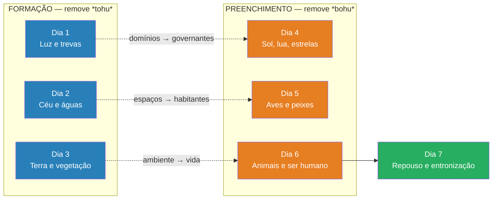

# Gênesis 1 — Os dias 1 a 3 — formação

> **Pasta:** Gênesis 1 · **Índice da pasta:** [[00-como-usar]]

---

## 5. Exegese dos dias da criação (1.3–31)

### 5.1. Estrutura em paralelos: formação e preenchimento

Há um paralelismo notável entre os seis dias, organizados em dois blocos de três:

| Formação (dias 1–3) | Preenchimento (dias 4–6) |
|---|---|
| **1º dia** — Luz / trevas | **4º dia** — Luminares que governam luz / trevas |
| **2º dia** — Separação das águas e firmamento | **5º dia** — Peixes e aves que ocupam esses espaços |
| **3º dia** — Terra seca e vegetação | **6º dia** — Animais terrestres e ser humano, que habitam a terra e se alimentam da vegetação |

Isso mostra um Deus que primeiro **forma** os espaços (dias 1–3) e depois **enche** esses espaços com habitantes (dias 4–6) — ordem, propósito e planejamento em cada etapa. A criação não é um ato caótico ou impulsivo, mas a expressão de um design intencional.

#### 5.1.1. O padrão de separação (*havdil*) — do caos à ordem

O verbo *hivdil* (הִבְדִּיל, da raiz *b-d-l*, "separar, distinguir") aparece cinco vezes em Gênesis 1: no v. 4 (luz e trevas), v. 6 (águas de cima e de baixo), v. 7 (execução dessa separação), v. 14 (dia e noite) e v. 18 (luz e trevas por meio dos luminares). Essa repetição não é acidental — ela revela que **separar é o ato criativo primário de Deus**. Onde havia *tohu va-vohu* (תֹּ֙הוּ וָבֹ֔הוּ, "sem forma e vazio"), Deus introduz distinções, limites e ordem. Criar, no vocabulário de Gênesis, é fundamentalmente estabelecer fronteiras onde antes reinava o caos indiferenciado.

Esse padrão reverbera por toda a Escritura. Em Levítico 10.10, os sacerdotes são chamados a "distinguir (*hivdil*) entre o santo e o profano, entre o impuro e o puro"; em Levítico 11.47, a mesma raiz governa a distinção entre animais limpos e imundos; e em Levítico 20.24–26, Deus declara que separou (*hivdil*) Israel das nações — da mesma forma como separou a luz das trevas no princípio. Os usos levíticos ecoam deliberadamente Gênesis 1: **os sacerdotes são chamados a manter, na esfera moral e cúltica, as mesmas distinções que Deus estabeleceu na criação**. Quando Isaías pronuncia "ai dos que chamam ao mal bem e ao bem mal, que fazem das trevas luz e da luz trevas" (Is 5.20), ele condena exatamente a dissolução dessas fronteiras criacionais. Paulo ecoa o mesmo princípio: "Que comunhão tem a luz com as trevas?" (2Co 6.14).

A implicação teológica é profunda: Deus é Deus de ordem, não de confusão (1Co 14.33). O pecado, por contraste, é precisamente a tentativa de borrar as distinções que Deus estabeleceu — morais, sexuais, espirituais. Na consumação escatológica, a separação última entre morte e vida é finalmente resolvida: "Não haverá mais morte" (Ap 21.4). Contudo, mesmo na nova criação, a distinção fundamental — entre Criador e criatura — permanece eterna e inviolável.

**Aplicação:** A vida cristã é, em essência, uma vida de discernimento — aprender a distinguir o que Deus distinguiu. O autor de Hebreus descreve os crentes maduros como aqueles que, "pelo exercício, têm as faculdades exercitadas para discernir tanto o bem como o mal" (Hb 5.14). Cultivar esse discernimento é honrar o Deus que, desde o primeiro dia, trouxe ordem ao caos por meio da separação.

### 5.2. A palavra eficaz de Deus — "Haja… e houve"

Em todos os dias, a criação acontece pela **palavra de Deus**: Ele diz, e acontece. A fórmula se repete como um refrão: "E Deus disse… e assim aconteceu." A criação é:
- expressão do seu **poder** — a Palavra cria e ordena,
- reflexo da sua **bondade** — "E Deus viu que era bom",
- e totalmente dependente da sua **vontade** — nada existe por acaso.

Isso fundamenta a importância da revelação escrita (Escrituras) e da pregação fiel: se Deus cria pela Palavra, a Palavra é o meio pelo qual Ele se faz conhecido e age no mundo.

**A fórmula discursiva analisada.** A expressão hebraica *wayyo'mer 'Elohim… wayehi-khen* ("e Deus disse… e assim foi") aparece dez vezes em Gênesis 1, formando o ritmo estrutural de todo o capítulo. Cada ato criativo segue um padrão tríplice: **fiat** (Deus ordena), **execução** (a criação obedece) e **avaliação** ("e Deus viu que era bom"). Essa sequência não é acidental — constitui uma arquitetura teológica completa que revela decreto, cumprimento e aprovação divina em cada etapa.

**A palavra performativa.** A fala de Deus não é meramente descritiva; ela é *performativa* — cria aquilo que declara. Isso distingue radicalmente a cosmogonia bíblica das cosmogonias do Antigo Oriente Próximo, nas quais os deuses tipicamente fabricam o mundo com as mãos (como no *Enuma Elish*, onde Marduk molda a terra a partir do corpo de Tiamat) ou geram a realidade por procriação divina. Em Gênesis 1, a mera palavra basta — nenhuma matéria prévia, nenhum esforço, nenhuma luta. Isso demonstra soberania absoluta: entre o decreto de Deus e a existência da coisa decretada não há resistência possível.

**O refrão *wayehi-khen* (וַיְהִי־כֵן).** A frase "e assim foi" expressa obediência imediata, completa e irresistível da criação ao comando divino. Não há atraso, não há luta, não há oposição — a realidade simplesmente se conforma à vontade expressa de Deus. O Salmo 33.9 captura essa verdade de forma lapidar: "Pois ele falou, e tudo se fez; ele ordenou, e tudo passou a existir." A criação inteira existe como resposta obediente à voz do Criador.

**O conceito de *davar* (דָּבָר).** Em hebraico, o termo *davar* significa simultaneamente "palavra" e "coisa/evento". Não há, no pensamento hebraico, separação entre a palavra de Deus e a realidade que ela produz. O que Deus fala, existe. Essa fusão semântica entre linguagem e realidade é teologicamente profunda: a palavra divina não apenas descreve o mundo — ela o constitui.

**Conexão com a teologia do *Logos*.** A palavra criadora de Gênesis 1 é o fundamento teológico direto de João 1.1–3: "No princípio era o Verbo (*Logos*), e o Verbo estava com Deus, e o Verbo era Deus. […] Todas as coisas foram feitas por meio dele." O mesmo princípio aparece em Hebreus 1.3, onde o Filho sustenta "todas as coisas pela palavra do seu poder", e em Hebreus 11.3: "pela fé entendemos que o universo foi formado pela palavra de Deus." Assim, a palavra criadora do Antigo Testamento encontra sua plenitude cristológica no Novo Testamento — o *Logos* eterno que cria em Gênesis 1 é o mesmo que se faz carne em João 1.14.

### 5.3. Primeiro dia — Luz (vv. 3–5)

Deus cria a luz por decreto verbal: "Haja luz!" A luz é separada das trevas, estabelecendo o primeiro ciclo de dia e noite. A luz existe antes dos luminares (criados no 4º dia), mostrando que a fonte última da luz é Deus, não os astros. Isso antecipa a revelação de que Deus é luz (1Jo 1.5) e que na nova criação não haverá necessidade de sol:

> "A cidade não precisa nem do sol, nem da lua, para lhe darem claridade, pois a glória de Deus a iluminou, e o Cordeiro é a sua lâmpada."
> *(Apocalipse 21.23)*

**O comando mais breve: *yehi 'or wayehi-'or* (יְהִי אוֹר וַיְהִי־אוֹר).** O primeiro decreto criador é também o mais curto de todo o capítulo — apenas quatro palavras em hebraico. A brevidade é teologicamente eloquente: o poder de Deus não precisa de elaboração. O verbo *hayah* (הָיָה) aparece no jussivo (*yehi*, "haja") — forma volitiva que expressa a vontade soberana — e é imediatamente seguido pelo narrativo *wayehi* ("e houve"), indicando cumprimento instantâneo e completo. Entre o comando e a realidade não há intervalo, resistência ou processo: Deus fala, e a luz existe.

**A primeira separação: *hivdil* (הִבְדִּיל).** No v. 4, Deus separa (*hivdil*) a luz das trevas — a primeira ocorrência desse verbo na Bíblia. Deus não destrói as trevas; Ele as limita, atribui-lhes fronteiras e um nome ("Noite"). Esse padrão de ordenar o caos por meio de separação e delimitação é estruturante em todo o capítulo (cf. separação das águas no v. 7, separação entre dia e noite no v. 14). Luz e trevas coexistem, mas sob jurisdição divina — cada uma confinada ao seu domínio. Para o leitor antigo, acostumado a mitologias em que trevas e luz eram deuses rivais, a mensagem é clara: ambas são criaturas sob o governo do único Deus verdadeiro.

**"E viu Deus que a luz era boa" (*ki-tov*).** Esta é a primeira ocorrência da fórmula de avaliação divina. Deus contempla sua própria obra e a declara *tov* — boa, adequada, conforme ao propósito. A luz é boa porque cumpre a função para a qual foi criada. É notável que as trevas **não** recebem essa avaliação: elas são nomeadas e delimitadas, mas o juízo positivo é reservado exclusivamente para a luz. Essa assimetria não é acidental — ela estabelece desde o início da Escritura a associação entre luz e bem, trevas e ausência de plenitude.

**A fórmula "tarde e manhã": *wayehi-erev wayehi-voqer yom echad*.** A sequência temporal começa com a tarde (trevas) e caminha em direção à manhã (luz) — um movimento da desordem para a ordem, da escuridão para a claridade. Essa estrutura é também a base para o calendário judaico, no qual o dia se inicia ao pôr do sol. Além disso, o texto usa *yom echad* ("dia um" — numeral cardinal), e não "primeiro dia" (ordinal). Alguns estudiosos entendem que o cardinal enfatiza a singularidade desse dia: é o dia em que o próprio tempo, como sequência ordenada, passa a existir.

**Significado teológico: luz sem sol.** A criação da luz antes dos luminares (4º dia) é teologicamente deliberada. A fonte última de toda iluminação não é o sol — é o próprio Deus. Essa verdade percorre toda a Escritura: "Deus é luz, e não há nele treva nenhuma" (1Jo 1.5); Ele é o "Pai das luzes, em quem não há mudança, nem sombra de variação" (Tg 1.17); e na nova criação, Deus e o Cordeiro substituem definitivamente o sol (Ap 21.23; 22.5). A luz do primeiro dia é, portanto, um prelúdio da glória escatológica.

**Aplicação:** A primeira obra de Deus na criação é trazer luz às trevas — e esse é também o seu primeiro ato na redenção. Paulo estabelece o paralelo de forma explícita: "Porque Deus, que disse: Das trevas resplandecerá a luz, ele mesmo resplandeceu em nosso coração, para iluminação do conhecimento da glória de Deus, na face de Cristo" (2Co 4.6). O evangelho é Deus dizendo *yehi 'or* na escuridão do coração humano. Onde quer que haja trevas espirituais — ignorância, pecado, desespero —, a palavra criadora de Deus é capaz de fazer resplandecer a luz da vida.

#### 5.3.1. Os atos de nomear (*qara*) — soberania e ordem

Em Gênesis 1, Deus não apenas cria — Ele **nomeia**. O verbo hebraico *qara* (קָרָא), "chamar, nomear", aparece cinco vezes nos três primeiros dias da criação. Deus nomeia a luz de "Dia" (*yom*, יוֹם), as trevas de "Noite" (*laylah*, לַיְלָה), o firmamento de "Céus" (*shamayim*, שָׁמַיִם), a porção seca de "Terra" (*eretz*, אֶרֶץ) e as águas reunidas de "Mares" (*yammim*, יַמִּים). Cada ato de nomear é um ato de **definição**: Deus atribui identidade, função e propósito a cada elemento.

No contexto do Antigo Oriente Próximo, nomear algo equivalia a exercer **soberania** sobre aquilo. Dar nome significava definir a natureza de algo, reivindicar autoridade e determinar seu lugar na ordem criada. Ao nomear os domínios cósmicos fundamentais — tempo (dia/noite), espaço (céus) e elementos (terra/mares) — Deus estabelece de forma inequívoca o seu senhorio sobre as estruturas básicas da realidade. Nenhum domínio escapa à sua jurisdição.

É significativo que Deus **não nomeia** as criaturas dos dias 4 a 6: os luminares, os animais e os seres humanos. Em vez disso, Ele delega a Adão a tarefa de nomear os animais (Gn 2.19-20). Essa delegação não é acidental — é uma **transferência de autoridade**, parte do mandato da *imago Dei*. O padrão é claro: Deus nomeia os domínios (dias 1–3), preenche esses domínios com criaturas (dias 4–6) e concede ao homem autoridade delegada para nomear e governar dentro deles. Essa soberania divina sobre a nomeação se estende a toda a criação: "Ele determina o número das estrelas e chama cada uma pelo nome" (Sl 147.4; cf. Is 40.26).

**Aplicação:** O ato divino de nomear revela que nada na criação é anônimo ou acidental. Cada elemento — da luz aos mares — possui identidade e propósito atribuídos pelo Criador. Se Deus nomeou e ordenou todas as coisas, o crente pode confiar que sua própria vida também tem nome, lugar e sentido no plano divino (cf. Is 43.1: "Eu o chamei pelo seu nome; você é meu").

### 5.4. Segundo dia — Firmamento (vv. 6–8)

Deus faz o firmamento (*raqia*), separando as águas superiores das inferiores. Ele organiza o espaço entre céu e terra. É o único dia em que não aparece a frase "e Deus viu que era bom" — a tradição judaica sugere que a obra de separação das águas se completaria no terceiro dia, que recebe uma dupla aprovação ("bom" duas vezes).

**Análise hebraica.** O comando divino utiliza a forma *yiqtol*: "Haja um firmamento (*raqia*) no meio das águas, e separe (*mavdil*) águas de águas" (v.6). No v.7 o verbo empregado é *asah* (עָשָׂה, "fez, fabricou"), e não *bara* — Deus "faz" ou "modela" o firmamento a partir do material aquoso já existente. A distinção é teologicamente relevante: *bara* marca o ato criador que não parte de material preexistente (v.1), e a origem da vida animal (v.21) e humana (v.27), enquanto *asah* indica formação a partir do que já existe, reforçando que o segundo dia é um ato de **organização** da matéria primordial.

**Arquitetura cósmica.** Até este ponto, tudo era água indiferenciada (v.2). Deus cria agora o espaço vertical — a expansão entre as águas superiores (nuvens, chuva) e as águas inferiores (mares). Surge uma estrutura tripartida: águas acima → firmamento (céu/atmosfera) → águas abaixo. Essa arquitetura prepara o "palco" que será preenchido no quinto dia, quando aves povoarão o céu e peixes encherão os mares — confirmando o paralelismo entre os dias de formação (1–3) e os dias de preenchimento (4–6).

**A ausência do *ki-tov*.** O segundo dia é o **único** em que não aparece a fórmula "e Deus viu que era bom." Três explicações principais merecem registro: (a) *Explicação rabínica* (Rashi; *Bereshit Rabbah* 4.6): a obra de separação das águas só se completa no terceiro dia, quando as águas se ajuntam e a terra seca aparece; por isso a aprovação é adiada, e o dia 3 recebe um duplo "bom" como compensação. (b) *Leitura patrística*: alguns Pais da Igreja associaram as águas superiores a poderes espirituais/angélicos, vendo na separação uma prefiguração da separação entre anjos fiéis e caídos — interpretação especulativa, porém historicamente relevante. (c) *Explicação literário-estrutural*: a ausência cria uma variação deliberada num texto de padrões rígidos, direcionando a atenção do leitor para a conclusão no terceiro dia. A explicação rabínica é a mais satisfatória do ponto de vista textual, pois respeita a estrutura interna da narrativa.

**Conexão com o dilúvio.** Em Gênesis 7.11, Deus "abre as comportas dos céus" — as águas acima do firmamento são liberadas, **revertendo** a separação do segundo dia. O dilúvio é, assim, um evento de "des-criação" (*de-creation*), desfazendo a ordem cósmica estabelecida na criação. Isso torna o firmamento teologicamente significativo: ele é uma fronteira que Deus sustenta — e que pode remover em juízo. A mesma soberania que separa é a que reúne novamente (cf. 2Pe 3.5-7).

**Aplicação:** Deus cria espaço para a vida antes de criar a vida propriamente dita. Ele prepara ambientes antes de preenchê-los. Esse é o Seu padrão também na redenção: "Na casa de meu Pai há muitas moradas… vou preparar-vos lugar" (Jo 14.2-3). Antes de chamar o Seu povo, Deus já preparou o lugar, o caminho e as condições para recebê-lo. O crente pode descansar sabendo que o Deus que estruturou o cosmos com ordem e propósito conduz a sua vida com a mesma sabedoria providencial.

### 5.5. Terceiro dia — Terra seca e vegetação (vv. 9–13)

Dois atos criativos: (1) ajuntamento das águas e aparecimento da terra seca; (2) produção de vegetação — relva, ervas e árvores frutíferas "segundo as suas espécies."

Deus faz a terra produzir vegetação, utilizando o que já criou para gerar novas expressões de vida. Isso mostra um **design intencional** e um sistema de **reprodução contínua**, sem necessidade de novos atos criadores para cada planta. Deus vincula a vida à terra — da mesma terra de onde o homem será formado depois (*'adam* de *'adamah*).

O terceiro dia é singular na narrativa por conter **dois atos criativos distintos**, e isso se reflete na estrutura literária: a fórmula *ki-tov* ("e viu Deus que isso era bom") aparece **duas vezes** — no v. 10, após o aparecimento da terra seca, e no v. 12, após a produção da vegetação. Essa dupla aprovação não é mera repetição; ela **compensa** a ausência do *ki-tov* no segundo dia, de modo que o total de sete aprovações ao longo do capítulo se mantém — reforçando a simetria do relato e o significado teológico do número sete como completude.

O comando divino no v. 11 especifica três categorias de vegetação em ordem crescente de complexidade: *deshe* (דֶּשֶׁא, "relva" — cobertura vegetal rasteira e genérica), *esev mazria zera* (עֵשֶׂב מַזְרִיעַ זֶרַע, "erva que produz semente" — plantas que se reproduzem por semeadura) e *ets peri* (עֵץ פְּרִי, "árvore frutífera" — árvores que dão fruto com semente). A progressão vai do simples ao complexo, do rente ao solo até as copas elevadas, revelando um design ordenado e intencional. Cada categoria se reproduz "segundo a sua espécie" (*lemin*, לְמִין), indicando que Deus estabeleceu limites e distinções dentro da criação vegetal — ordem, não caos.

A formulação "produza a terra" (*tadshé ha'aretz*) é teologicamente rica: a terra é convocada como **agente participante** da criação. Ela não age por conta própria — é a palavra de Deus que a capacita — mas recebe uma função ativa. Temos aqui o primeiro exemplo de **criação mediata**, em que Deus opera por meio do que já criou (tema desenvolvido em 5.5.1 abaixo). A expressão "cuja semente está nele" (*asher zar'o-vo*) revela que Deus embutiu na criação a **capacidade de perpetuação**: a vida vegetal se reproduz porque foi projetada para isso. Não é necessário um novo milagre a cada estação; a providência divina opera por meio do design original.

O Salmo 104.14 ecoa diretamente o terceiro dia ao declarar que Deus "faz crescer a relva para os animais e a vegetação para o cultivo do homem" — a vegetação do dia 3 é vista como provisão contínua, não apenas evento passado. Isaías 55.10-11, por sua vez, compara a eficácia da palavra de Deus à chuva que faz a terra "produzir e brotar" — usando a mesma linguagem agrícola de Gn 1.11-12 para ensinar que a palavra divina sempre cumpre seu propósito.

**Aplicação:** A fertilidade da terra é dádiva, não direito. Cada colheita, cada refeição, cada jardim que floresce é um eco do terceiro dia — a provisão contínua de Deus por meio das capacidades que Ele mesmo inseriu na criação. Reconhecer isso transforma a gratidão em ato de adoração.

#### 5.5.1. "Produza a terra" — criação mediata e causas secundárias

Em três momentos de Gênesis 1, Deus não cria diretamente por fiat puro, mas convoca elementos já criados a participarem do processo criativo: **"Produza a terra relva" (*tadshé ha'aretz deshe*, v.11)**, **"Produzam as águas enxames de seres viventes" (*yishretsu hammayim*, v.20)** e **"Produza a terra seres viventes" (*totsé ha'aretz nephesh chayyah*, v.24)**. Nesses casos, a terra e as águas atuam como **causas secundárias** — instrumentos do poder divino, não fontes autônomas de vida.

Calvino notou esse padrão com precisão teológica: Deus poderia ter criado tudo instantaneamente e sem mediação, mas escolheu investir a criação com capacidades produtivas, conferindo à terra e às águas uma "fertilidade" que reflete Sua generosidade[^calvino-1554]. A criação não é apenas um **evento pontual**, mas a inauguração de um **sistema contínuo** de produtividade sob a soberania divina.

A teologia reformada distingue entre **criação imediata** (*creatio immediata* — como *bara* em v.1, v.21, v.27, onde Deus age sem intermediários) e **criação mediata** (*creatio mediata* — onde Deus opera por meio de causas secundárias que Ele mesmo estabeleceu). Ambas são igualmente atos de Deus; a diferença está no modo, não na autoria. Bavinck observa que essa distinção fundamenta a doutrina da **providência**: o mesmo Deus que criou continua sustentando e governando a criação por meio das leis naturais que Ele mesmo implantou[^bavinck-1895].

Esse princípio tem implicações profundas: (1) a natureza não é divina nem autossuficiente — ela produz porque Deus a capacitou; (2) o trabalho humano com a terra (agricultura, ciência, tecnologia) participa do mandato criacional — colaboramos com as capacidades que Deus inseriu na criação; (3) a distinção entre criação imediata e mediata nos protege tanto do **deísmo** (Deus criou e se afastou) quanto do **ocasionalismo** (Deus faz tudo diretamente, sem causas secundárias). A posição bíblica é a de um Deus que **cria, sustenta e governa** — pessoalmente presente, mas atuando também por meio da ordem que estabeleceu.

---

## Notas

[^bavinck-1895]: BAVINCK, Herman. *Gereformeerde Dogmatiek*. Vol. 2. Kampen: J. H. Kok, 1895–1901. (Ed. inglesa: *Reformed Dogmatics*, vol. 2: *God and Creation*. Grand Rapids: Baker Academic, 2004.)

[^calvino-1554]: CALVINO, João. *Commentaries on the First Book of Moses Called Genesis*. 1554. Reimpr. Edinburgh: Banner of Truth Trust, 1965.

