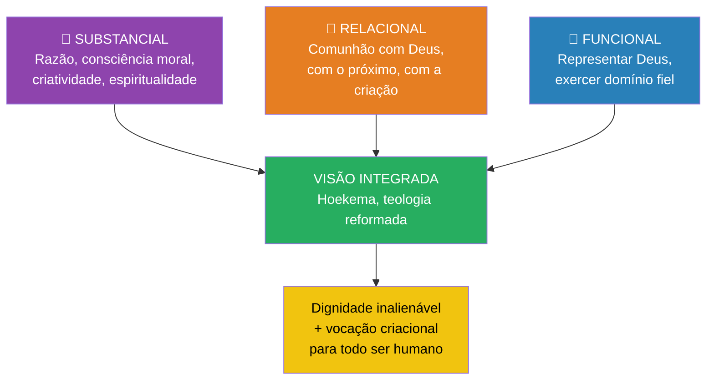

# Gênesis 1 — Imagem de Deus e dignidade humana (1.26–28)

> **Pasta:** Gênesis 1 · **Índice da pasta:** [[00-como-usar]]

---

## 6. Imagem de Deus e dignidade humana (1.26–28)

### 6.1. "Façamos o homem à nossa imagem…"

Aqui temos algo único na narrativa: pela primeira e única vez, Deus cria um ser **à sua imagem e semelhança** (*tselem* e *demut*). O ser humano é dotado de capacidades que refletem atributos de Deus: pensar, falar, raciocinar, criar, ter personalidade, inteligência e consciência moral.

Isso fundamenta:
- a **dignidade intrínseca** do ser humano — cada pessoa tem valor que não depende de utilidade, produtividade ou status social,
- a impossibilidade de reduzi-lo a "apenas mais um animal" — ser imagem de Deus o distingue de toda a criação,
- e a seriedade de qualquer pecado contra a vida — assassinato, opressão e desumanização são ataques à imagem do Criador.

### 6.2. Homem e mulher — igualdade e complementaridade

O texto enfatiza que Deus cria **homem e mulher**, ambos à imagem de Deus, ambos com **igual valor e dignidade**. Ele os cria em pares, não como indivíduos isolados, e não como dois do mesmo sexo. Eles são criados para se **complementarem** — com funções diferentes e características biológicas distintas, mas ambos igualmente portadores da imagem de Deus.

Daqui decorre que:
- o casamento, desde o princípio, é **entre um homem e uma mulher**,
- com **base criacional** e não meramente cultural.

Jesus confirma isso diretamente:

> "Não tendes lido que o Criador, desde o princípio, os fez homem e mulher e que disse: 'Por essa razão, o homem deixará pai e mãe e se unirá à sua mulher, tornando-se os dois uma só carne'? Assim, eles já não são dois, mas uma só carne. Portanto, que ninguém separe o que Deus uniu."
> *(Mateus 19.4–6)*

### 6.3. Mandato cultural: domínio e mordomia da criação

Nos versos 26–28, Deus dá ao ser humano:
- **domínio** sobre peixes, aves, animais e sobre a terra (v. 26, 28),
- **fecundidade** — "sejam fecundos, multipliquem-se, encham a terra" (v. 28),
- e as **plantas como alimento** (v. 29).

Isso significa que o homem foi colocado como **representante de Deus no mundo** — vice-regente do Rei — para cuidar, cultivar e governar a criação. O chamado é para:
- **trabalhar** — o trabalho é parte do projeto original de Deus, não consequência do pecado,
- **cultivar** — desenvolver a criação em ciência, arte, política, educação, economia,
- **governar com responsabilidade** — domínio não é licença para destruição, mas chamado à mordomia fiel.

Este é o **mandato cultural**: a vocação humana de representar Deus na história por meio do trabalho, da família, da cultura e do cuidado com a criação. Ele abrange todo tipo de vocação legítima — profissões técnicas, artes, negócios, serviço doméstico, política, ensino.

#### Os verbos do domínio: *radah* (רָדָה) e *kabash* (כָּבַשׁ)

O mandato cultural repousa sobre dois verbos hebraicos que merecem exame cuidadoso. O primeiro é **radah** (רָדָה), usado nos vv. 26 e 28, que significa "governar, ter domínio, reger." Fora de Gênesis, *radah* descreve o governo de reis — Salomão "dominava sobre toda a região" (1Rs 4.24) — e a supervisão de senhores sobre servos (Lv 25.43, 46, 53), onde o Senhor adverte expressamente: "não dominarás sobre ele com rigor." Em Ezequiel 34.4, Deus condena os pastores de Israel porque exerceram *radah* com dureza e violência. O padrão bíblico é claro: *radah* legítimo é governo firme, porém justo e compassivo. No contexto pré-queda de Gênesis 1, onde tudo é "muito bom" (*tov meod*), *radah* só pode ser entendido como governança benevolente — o ser humano como pastor-regente da criação.

O segundo verbo é **kabash** (כָּבַשׁ), usado no v. 28, que significa "sujeitar, subjugar, trazer sob controle." É um termo mais vigoroso: aparece em contextos de conquista militar (Nm 32.22, 29; Js 18.1) e de subjugação de povos (2Sm 8.11; Jr 34.11, 16). A força do verbo pode surpreender numa criação declarada "muito boa." Muitos estudiosos sugerem que *kabash* indica que a terra, embora boa, requer esforço e trabalho para ser cultivada e organizada — antecipando o mandato de Gênesis 2.15, "para a cultivar e a guardar" (*le'ovdah uleshomrah*). A criação não é hostil, mas tampouco é passiva; ela convida ao labor criativo.

No **contexto do Antigo Oriente Próximo**, reis eram descritos como "pastores" nomeados pelos deuses para governar com firmeza e justiça. Gênesis democratiza esse vocabulário régio: não apenas o monarca, mas **todo ser humano** recebe o mandato de *radah* e *kabash* — mais uma expressão da "democratização" da ideologia real que marca a *imago Dei*.

Após a queda (Gn 3), esses verbos se distorcem. O domínio se converte em exploração, opressão e destruição ambiental. A crise ecológica é, teologicamente, fracasso do mandato criacional — *radah* sem a sabedoria de Deus degenera em tirania. No entanto, Cristo é o verdadeiro exercício de *radah*: o Bom Pastor que dá a vida pelas ovelhas (Jo 10.11), que governa com amor sacrificial, não com dominação. Os redimidos são chamados a restaurar o padrão original — exercer domínio como mordomos fiéis, sob a autoridade e à semelhança do Rei que serve.

### 6.4. *Tselem* e *demut* no contexto do Antigo Oriente Próximo

#### Reis como imagens dos deuses

Em todo o Antigo Oriente Próximo, apenas o rei ou um oficial de alta patente podia ser designado como "imagem de Deus":
- No **Egito**, o faraó era considerado a encarnação viva de Hórus e filho de Rá — sua natureza divina era exclusiva.
- Na **Mesopotâmia**, textos acadianos usam *salmu* ("imagem") para designar estátuas de reis, e reis como Esaradom são chamados "imagem de Marduque" ou "imagem de Shamash".
- Uma **inscrição bilíngue** no Tell Fekheriye (séc. IX a.C.) usa tanto *tselem* quanto *demut* em aramaico para descrever uma estátua real — os mesmos termos de Gênesis 1.26.

#### A "democratização" revolucionária de Gênesis 1

Gênesis 1.26–28 toma uma linguagem que era *exclusivamente real* e a aplica a **todos** os seres humanos, sem distinção. Isso é amplamente reconhecido como uma "democratização da ideologia real do AOP" — uma das afirmações teológicas mais revolucionárias do mundo antigo.

Como escreve J. Richard Middleton[^middleton-2005]: "O *imago Dei* designa o ofício real ou vocação dos seres humanos como representantes e agentes de Deus no mundo, dotados de poder autorizado para participar do governo de Deus ou administração dos recursos e criaturas da terra."

Não há possibilidade de reivindicar funções exclusivas de autoridade para certos grupos. Do maior rei ao mais humilde escravo, todos carregam igualmente a imagem de Deus.

#### O ser humano como "estátua viva" no templo cósmico

No AOP, estátuas de divindades eram colocadas dentro dos templos para representar a presença do deus. Em Gênesis 1, **não há estátua** no templo cósmico — em seu lugar, Deus coloca os *seres humanos* como suas "imagens" vivas. Os humanos são as estátuas vivas de Deus no templo cósmico, representando Sua presença e Seu governo na terra.

### 6.5. "Façamos o homem" — o plural de Gênesis 1.26

A mudança de linguagem no versículo 26 é uma das mais notáveis em todo o capítulo. Até aqui, Deus criava por comando impessoal — "haja luz", "produza a terra". Agora, porém, Ele diz: **"Façamos o homem à nossa imagem"** (*na'aseh adam betsalmenu*). O verbo passa ao plural coortativo. Por quê? Quatro interpretações principais foram propostas ao longo da história:

1. **Plural de majestade** — Deus estaria usando um "nós" régio, como monarcas que falam de si no plural. O problema é que, embora o plural majestático se aplique a substantivos em hebraico (como o próprio *Elohim*), a evidência de seu uso em *verbos* coortativo é fraca. A maioria dos gramáticos hebraístas rejeita essa explicação como anacrônica.

2. **Conselho divino (*divine council*)** — Deus estaria se dirigindo à Sua corte celestial, os anjos. Há textos que sustentam a ideia de um conselho celestial: 1Rs 22.19-22, Jó 1.6, Is 6.8 ("Quem irá por NÓS?"), Sl 82.1. Contudo, o versículo 27 deixa claro que **somente Deus cria** — todos os verbos retornam ao singular: "criou Deus o homem" (*wayyibra Elohim*). Anjos não participam do ato criador.

3. **Plural de deliberação** — Deus estaria deliberando consigo mesmo, num recurso retórico que marca a solenidade do momento. Essa leitura, proposta por Westermann, destaca que a mudança de linguagem sinaliza algo sem precedente: está prestes a surgir o portador da imagem de Deus. O plural seria uma pausa dramática na narrativa.

4. **Indicação trinitária** — O plural refletiria a pluralidade de pessoas dentro do único Deus. Essa leitura é confirmada retrospectivamente pela revelação do Novo Testamento: o Filho é agente da criação (Jo 1.3; Cl 1.16), e o Espírito pairava sobre as águas (Gn 1.2). Os pais da igreja — Ireneu, Basílio, Agostinho — liam consistentemente "façamos" como diálogo intratrinitário.

**A posição reformada:** Calvino e a tradição reformada geralmente favorecem uma combinação das opções 3 e 4. O plural marca deliberação solene *e* é plenamente consistente com a pluralidade trinitária, embora a doutrina completa da Trindade aguarde a revelação neotestamentária. Calvino advertiu contra usar este texto isoladamente para "provar" a Trindade, mas afirmou que ele é inteiramente consonante com ela.

**O que todas as posições concordam:** A mudança para "façamos" marca a criação do ser humano como **qualitativamente diferente** de tudo o mais. Deus não simplesmente ordena — Ele delibera. O ser humano não é um acréscimo casual, mas o **clímax intencional** da criação. Essa pausa divina revela cuidado, propósito e intimidade. Antes de formar aquele que carregaria Sua imagem, o Criador, por assim dizer, detém-se e pondera — não por necessidade, mas para que a narrativa registre a dignidade singular da humanidade diante de toda a ordem criada.

### 6.6. Três interpretações teológicas da *imago Dei*

Ao longo da história da Igreja, três grandes modelos foram propostos para explicar em que consiste a imagem de Deus no ser humano (Gn 1.26-28).

**1. Visão substancial (ou estrutural).** A imagem reside nas *capacidades* humanas: razão, consciência moral, autoconsciência, livre arbítrio, criatividade e espiritualidade. Essa foi a visão dominante dos Pais da Igreja até a Reforma. Agostinho localizou a imagem na capacidade da alma racional para memória, entendimento e vontade — uma analogia trinitária. Os Padrões de Westminster (CFW 4.2) definem a imagem como "conhecimento, justiça e verdadeira santidade." A força dessa visão é que ela se ancora na distinção observável entre humanos e o restante da criação. Sua fraqueza é que pode sugerir, ainda que involuntariamente, que pessoas com capacidades diminuídas — bebês, portadores de deficiência intelectual — carregam menos a imagem de Deus.

**2. Visão relacional.** A imagem *é* a capacidade de relacionamento — com Deus, com o próximo e com a criação. Karl Barth enfatizou que a expressão "homem e mulher" no v. 27 é a chave para a *imago Dei*: trata-se de ser-em-relação, refletindo a natureza relacional do Deus triúno. Essa perspectiva explica por que o isolamento é declarado "não bom" (Gn 2.18) mesmo antes da Queda. Sua fraqueza é que pode tornar-se abstrata: toda criatura, em algum sentido, se relaciona com Deus.

**3. Visão funcional (ou vocacional).** A imagem *é* a comissão — representar Deus exercendo domínio (v. 28). Essa leitura possui o suporte mais forte do AOP: no Egito e na Mesopotâmia, "imagem de deus" designava o representante real, o vice-regente. Middleton[^middleton-2005] demonstra que Gênesis democratiza esse conceito real, estendendo-o a *todos* os seres humanos. A imagem não é algo que se *possui*, mas algo que se *exerce* — o ser humano "imageia" Deus ao exercer domínio fiel. A força dessa visão é a conexão direta com o contexto imediato (vv. 26b-28). Sua fraqueza é que pode reduzir a imagem à função, perdendo a dimensão ontológica.

**A visão reformada integrada.** A maioria dos teólogos reformados contemporâneos adota uma abordagem *integrada*: a imagem é **estrutural** (o ser humano possui capacidades que refletem Deus), **relacional** (foi feito para comunhão com Deus e com o próximo) e **funcional** (foi chamado a representar Deus na criação). Essas não são visões concorrentes, mas aspectos complementares de uma única realidade. Anthony Hoekema[^hoekema-1986] argumentou de forma persuasiva a favor dessa integração, mostrando que Gênesis 1.26-28, 5.1-3 e 9.6 sustentam as três dimensões simultaneamente. Essa visão integrada preserva a dignidade inalienável de todo ser humano — independentemente de idade, capacidade ou função — e ao mesmo tempo honra o chamado vocacional que o Criador confiou à humanidade.

---

## Notas

[^hoekema-1986]: HOEKEMA, Anthony A. *Created in God's Image*. Grand Rapids: Eerdmans, 1986.

[^middleton-2005]: MIDDLETON, J. Richard. *The Liberating Image: The Imago Dei in Genesis 1*. Grand Rapids: Brazos, 2005.

