# Gênesis 1 — Conexões canônicas

> **Pasta:** Gênesis 1 · **Índice da pasta:** [[00-como-usar]]

---

## 8. Conexões canônicas

```mermaid
flowchart TD
    GN["📖 GÊNESIS 1<br/>A Criação"]

    subgraph AT["Antigo Testamento"]
        S33["Sl 33.6, 9<br/>Palavra criadora"]
        S104["Sl 104<br/>Criação sustentada"]
        S8["Sl 8<br/>Imago Dei e domínio"]
        S19["Sl 19<br/>Céus proclamam glória"]
        S148["Sl 148<br/>Liturgia cósmica"]
        IS["Is 40–45<br/>Criador = Redentor"]
        IS65["Is 65.17; 66.22<br/>Nova criação AT"]
        JR["Jr 4.23<br/>Descriação como juízo"]
        JO38["Jó 38–41<br/>Criador interroga"]
        PV["Pv 8.22-31<br/>Sabedoria na criação"]
        AM["Am 4.13; 5.8<br/>Doxologias do Criador"]
    end

    subgraph NT["Novo Testamento"]
        JO["Jo 1.1-3<br/>Cristo = Logos criador"]
        RM5["Rm 5.12-21<br/>Adão/Cristo tipologia"]
        CO15["1Co 15.45-49<br/>Último Adão"]
        CL["Cl 1.15-17<br/>Imagem perfeita"]
        CO["2Co 4.6<br/>Nova criação"]
        AT17["At 17.24-28<br/>Areópago: Criador"]
        PE["2Pe 3.5-13<br/>Palavra → juízo → nova criação"]
        TM["1Tm 2.13<br/>Ordem da criação"]
        HB["Hb 4.9-10<br/>Sábado escatológico"]
        AP["Ap 21–22<br/>Nova criação consumada"]
    end

    GN --> S33 & S104 & S8 & S19 & S148
    GN --> IS & IS65 & JR & JO38 & PV & AM
    GN --> JO & RM5 & CO15 & CL & CO
    GN --> AT17 & PE & TM & HB & AP

    IS65 -.->|"promessa"| AP
    RM5 -.->|"tipologia"| CO15

    style GN fill:#c0392b,color:#fff
    style S33 fill:#2980b9,color:#fff
    style S104 fill:#2980b9,color:#fff
    style S8 fill:#2980b9,color:#fff
    style S19 fill:#2980b9,color:#fff
    style S148 fill:#2980b9,color:#fff
    style IS fill:#2980b9,color:#fff
    style IS65 fill:#2980b9,color:#fff
    style JR fill:#2980b9,color:#fff
    style JO38 fill:#2980b9,color:#fff
    style PV fill:#2980b9,color:#fff
    style AM fill:#2980b9,color:#fff
    style JO fill:#27ae60,color:#fff
    style RM5 fill:#27ae60,color:#fff
    style CO15 fill:#27ae60,color:#fff
    style CL fill:#27ae60,color:#fff
    style CO fill:#27ae60,color:#fff
    style AT17 fill:#27ae60,color:#fff
    style PE fill:#27ae60,color:#fff
    style TM fill:#27ae60,color:#fff
    style HB fill:#27ae60,color:#fff
    style AP fill:#27ae60,color:#fff
```

### 8.1. Gênesis 1 no Antigo Testamento

#### Salmo 33.6, 9 — A palavra criadora

> "Mediante a palavra do SENHOR foram feitos os céus, e todo o exército deles, pelo sopro (*ruach*) da sua boca… Pois ele falou, e tudo se fez; ele ordenou, e tudo passou a existir."
> *(Salmo 33.6, 9)*

O salmista afirma que a criação aconteceu *bi-devar YHWH* — "pela palavra do SENHOR" — ecoando diretamente o refrão de Gênesis 1: "E disse Deus." A palavra (*davar*) e o sopro/espírito (*ruach*) aparecem juntos no v. 6, revelando a cooperação de Palavra e Espírito na criação — o mesmo padrão de Gn 1.2–3, onde o Espírito paira sobre as águas e, em seguida, Deus fala. Não há matéria preexistente independente nem intermediários: a vontade soberana de Deus, expressa em Sua palavra, é causa suficiente de toda a realidade.

#### Salmo 104 — O hino da criação sustentada

O Salmo 104 é a expansão mais extensa de Gênesis 1 dentro do Antigo Testamento. O poeta segue a mesma sequência dos dias da criação — luz (v. 2), separação das águas (vv. 3–9), vegetação (vv. 14–18), luminares (v. 19), animais (vv. 20–26), provisão de alimento (vv. 27–28) — transformando o relato em louvor.

A passagem central para a teologia da criação está nos vv. 29–30:

> "Se escondes o rosto, ficam perturbados; se lhes retiras o fôlego (*ruach*), morrem e voltam ao pó. Envias o teu Espírito (*ruach*), e são criados, e assim renovas a face da terra."
> *(Salmo 104.29–30)*

A criação não é apenas evento passado, mas sustentação contínua. Deus alimenta, dá água, concede fôlego — cada criatura depende d'Ele momento a momento. Retirar Sua *ruach* é morte; enviá-la é renovação. A criação permanece porque Deus não para de sustentá-la.

#### Isaías 40–45 — O Criador como Redentor

No chamado "Segundo Isaías," a teologia da criação serve à teologia da redenção. O argumento profético é direto: o Deus que criou o cosmos é o mesmo que resgatará Israel do exílio. Isaías acumula as evidências:

- **Is 40.26** — "Levantai ao alto os olhos e vede: quem criou estas coisas? Aquele que faz sair o exército delas uma por uma, e a todas chama pelo nome" — Deus nomeia cada estrela, exercendo domínio total sobre a criação.
- **Is 40.28** — "Não sabes, não ouviste que o Deus eterno, o SENHOR, o Criador dos confins da terra, não se cansa, nem se fatiga?" — O Criador possui energia inesgotável para redimir.
- **Is 42.5** — "Assim diz o SENHOR Deus, que criou os céus e os estendeu, e espraiou a terra… que dá fôlego de vida ao povo" — criar e dar vida são atos contínuos do mesmo Deus.
- **Is 44.24** — "Eu sou o SENHOR, que faço todas as coisas, que sozinho estendi os céus e espraiou a terra" — criação exclusiva, sem auxiliares divinos.
- **Is 45.18** — "Não a criou para ser um caos (*tohu*), mas para ser habitada" — o mesmo termo *tohu* de Gn 1.2 reaparece: o estado vazio e desordenado era provisório, pois a intenção divina sempre foi encher a terra de vida e de Sua glória.

O êxodo da Babilônia é retratado como uma **nova criação** (Is 43.19): "Eis que faço coisa nova." Criação e redenção são atos do mesmo Deus soberano — um padrão que culminará na "nova criação" do Novo Testamento (2Co 5.17; Ap 21.1).

#### Jeremias 4.23 — A "descriação" como juízo

> "Olhei para a terra, e ei-la sem forma e vazia (*tohu va-vohu*); para os céus, e não tinham luz."
> *(Jeremias 4.23)*

Jeremias contempla Judá sob juízo e vê o inverso exato de Gênesis 1. As palavras *tohu va-vohu* — que aparecem apenas em Gn 1.2 e aqui — indicam uma reversão deliberada da ordem criacional. A terra perde sua forma (v. 23a), os céus perdem a luz (v. 23b), os montes tremem (v. 24), não há ser humano (v. 25a), as aves fogem (v. 25b). É uma desmontagem sistemática dos dias da criação. O juízo divino é retratado como "descriação" — Deus desfaz a ordem que Ele mesmo estabeleceu. Isso revela quão grave é o pecado: ele ameaça reverter a própria estrutura da realidade que Deus pronunciou "boa."

#### Provérbios 8.22–31 — A Sabedoria presente na criação

> "O SENHOR me possuía no início da sua obra, antes de suas obras mais antigas. Desde a eternidade fui estabelecida… Quando ele fixava os fundamentos da terra, eu estava ao seu lado como artífice (*amon*), e eu era cada dia as suas delícias, folgando perante ele em todo o tempo."
> *(Provérbios 8.22–23, 29–30)*

A Sabedoria personificada (*chokmah*) declara que estava presente antes de toda a criação e participava dela como "artífice" ou "mestre de obras" (*amon*). O Novo Testamento identifica essa Sabedoria com Cristo: "Cristo, poder de Deus e sabedoria de Deus" (1Co 1.24; cf. 1.30). A alegria da Sabedoria "folgando" na criação (Pv 8.31) acrescenta uma dimensão de deleite ao ato criador — Deus não cria por necessidade, mas com prazer soberano. A criação é obra de um Deus que se alegra no que faz.

#### Jó 38–41 — O Criador interroga a criatura

> "Onde estavas tu quando eu lançava os fundamentos da terra? Dize-mo, se tens entendimento. Quem lhe fixou as medidas, se é que o sabes? Ou quem estendeu sobre ela o cordel? Sobre que estão fundadas as suas bases? Ou quem lhe assentou a pedra angular, quando as estrelas da alva juntas alegremente cantavam, e todos os filhos de Deus jubilavam?"
> *(Jó 38.4–7)*

No clímax do livro de Jó, Deus responde ao sofredor não com explicações filosóficas, mas com perguntas sobre a criação. A teofania dos capítulos 38–41 é um passeio majestoso pelas obras do Criador: a fundação da terra (38.4–7), a luz e as trevas (38.12–15), o mar e seus limites (38.8–11), as estrelas e constelações (38.31–33), os animais selvagens (38.39–39.30) e as grandes criaturas Beemote e Leviatã (40.15–41.34). A sequência evoca deliberadamente os domínios de Gênesis 1 — luz, águas, céus, terra, animais — percorrendo a criação como um catálogo de soberania divina.

A pergunta central — "Onde estavas tu quando eu lançava os fundamentos da terra?" — não visa humilhar Jó por crueldade, mas reposicionar a criatura diante do Criador. Se Deus é sábio o suficiente para projetar e sustentar todo o cosmos, Ele é digno de confiança mesmo quando Seus caminhos são incompreensíveis. A teologia da criação, aqui, serve à doxologia e à humildade: conhecer o Criador de Gênesis 1 é o fundamento para confiar n'Ele em meio ao sofrimento.

#### Salmo 8 — "Que é o homem?" — O eco de Gn 1.26–28

> "Quando contemplo os teus céus, obra dos teus dedos, a lua e as estrelas que ali firmaste, que é o homem, para que dele te lembres? E o filho do homem, para que o visites? Fizeste-o, no entanto, por um pouco menor do que os seres celestiais e de glória e de honra o coroaste. Deste-lhe domínio sobre as obras das tuas mãos; tudo puseste debaixo dos seus pés."
> *(Salmo 8.3–6)*

O Salmo 8 é o eco poético mais direto de Gn 1.26–28 em todo o Saltério. A exclamação *mah-enosh* — "que é o homem?" — não expressa desprezo, mas espanto reverente diante da dignidade que Deus concedeu à criatura humana. Diante da imensidão dos céus e das estrelas, o salmista se maravilha: por que o Criador de tudo isso se importaria com seres tão frágeis?

A resposta vem nos versículos seguintes e repete a linguagem de Gênesis 1: o ser humano foi feito "por um pouco menor que os seres celestiais" (*me'at me-elohim*), coroado de "glória e honra" — termos que apontam para a *imago Dei* — e recebeu "domínio sobre as obras" das mãos de Deus. É o mandato de Gn 1.28 transformado em louvor. A vocação humana de governar a criação não é pretensão autônoma; é dom concedido pelo Criador.

O Novo Testamento dá a esse salmo um alcance cristológico decisivo. Hebreus 2.6–9 cita o Salmo 8 e o aplica a Jesus: "Vemos, todavia, Jesus, que foi feito por um pouco menor do que os anjos… coroado de glória e de honra, por causa do sofrimento da morte." O mandato de domínio que a humanidade caída não consegue cumprir plenamente é cumprido por Cristo, o último Adão, que governa toda a criação como Senhor ressurreto.

#### Salmo 19.1–6 — Os céus proclamam a glória de Deus

> "Os céus proclamam a glória de Deus, e o firmamento anuncia as obras das suas mãos. Um dia discursa a outro dia, e uma noite revela conhecimento a outra noite."
> *(Salmo 19.1–2)*

O que Gênesis 1.14–18 descreve no Dia 4 — a criação dos luminares no firmamento — o Salmo 19 interpreta teologicamente: os céus não são cenário mudo, mas pregadores incansáveis da glória de Deus. Dia após dia, noite após noite, a criação "discursa" e "revela conhecimento," embora sem palavras audíveis (v. 3). É uma comunicação contínua, universal, que atravessa toda a terra (v. 4).

Essa é a doutrina da revelação geral por meio da criação. O firmamento de Gn 1.6–8, os luminares de Gn 1.14–18, não existem apenas para separar dia e noite ou marcar estações — eles testemunham o Criador. O apóstolo Paulo retomará essa verdade em Romanos 1.20: "Os atributos invisíveis de Deus… desde a criação do mundo se veem claramente, sendo percebidos por meio das coisas que foram criadas." O Salmo 19 é o elo veterotestamentário entre a narrativa de Gênesis 1 e a teologia paulina da revelação natural.

#### Salmo 148 — A liturgia cósmica da criação

> "Louvai ao SENHOR desde os céus; louvai-o nas alturas! Louvai-o, todos os seus anjos; louvai-o, todos os seus exércitos! Louvai-o, sol e lua; louvai-o, todas as estrelas de luz! Louvai-o, céus dos céus e as águas que estão acima dos céus! Louvem eles o nome do SENHOR, pois ele ordenou, e foram criados."
> *(Salmo 148.1–5)*

O Salmo 148 é uma convocação litúrgica de toda a criação para o louvor, e sua estrutura espelha a arquitetura de Gênesis 1. Os versículos 1–6 convocam os elementos celestes — anjos, sol, lua, estrelas, águas acima dos céus — enquanto os versículos 7–12 convocam os elementos terrestres — monstros marinhos, abismos, fogo, granizo, montes, árvores, animais, reis e povos. É a mesma divisão "acima e abaixo" do firmamento de Gn 1.6–8, agora transformada em coro de louvor.

O versículo 5 é especialmente significativo: "Ele ordenou, e foram criados" (*tsivvah ve-nivra'u*). A fórmula condensa o mecanismo criador de Gênesis 1 — a palavra imperativa de Deus que traz à existência — em uma única linha doxológica. A criação existe para louvar o Criador; esse é seu propósito último. O Salmo 148 revela que a narrativa de Gênesis 1 não é apenas cosmogonia, mas fundamento de uma liturgia cósmica na qual toda a realidade participa.

#### Isaías 65.17; 66.22 — Novos céus e nova terra — a promessa de nova criação no AT

> "Pois eis que eu crio novos céus e nova terra; e não haverá lembrança das coisas passadas, nem mais se recordarão."
> *(Isaías 65.17)*

Esta é uma das passagens mais importantes para a teologia bíblica da criação, pois estabelece o arco que liga Gênesis 1 a Apocalipse 21. O verbo utilizado é *bara* — o mesmo verbo exclusivo de Gn 1.1 — agora aplicado ao futuro escatológico: Deus *criará* novos céus e nova terra. A promessa reaparece em Is 66.22: "Porque assim como os novos céus e a nova terra, que hei de fazer, estarão diante de mim, diz o SENHOR, assim há de estar a vossa posteridade e o vosso nome."

O uso de *bara* é teologicamente decisivo. Não se trata de um reparo superficial, mas de um ato criador tão radical quanto o primeiro. Ao mesmo tempo, a continuidade de "céus e terra" — os mesmos termos de Gn 1.1 — indica que a criação original não será descartada, mas renovada e consumada. A esperança bíblica não é a fuga do mundo material, mas a sua redenção.

O grande arco narrativo das Escrituras ganha forma aqui: Gênesis 1 registra a criação original, Isaías 65 anuncia a promessa de nova criação, e Apocalipse 21.1 — "Vi novo céu e nova terra" — proclama a consumação. É o mesmo Deus Criador atuando do primeiro ao último capítulo da Bíblia. Para a interpretação dos "dias" de Gênesis 1 na perspectiva analógica ou dos dias divinos, essa conexão é especialmente relevante: a criação é um projeto divino em andamento, que caminha para sua plenitude escatológica.

#### Amós 4.13; 5.8 — Doxologias do Criador nos profetas menores

> "Porque eis que ele é o que forma os montes, e cria o vento (*ruach*), e declara ao homem qual é o seu pensamento; faz da alva trevas e pisa sobre os altos da terra; SENHOR, Deus dos Exércitos, é o seu nome."
> *(Amós 4.13)*

Em meio a oráculos de juízo contra Israel, o profeta Amós insere breves e poderosas doxologias que identificam o Deus que julga com o Deus que criou. Amós 4.13 acumula vocabulário de Gênesis 1: "forma" (*yotser*), "cria" (*bara*), "vento/espírito" (*ruach*), "trevas" e "alva." O Deus que anuncia juízo não é uma divindade menor — é o Criador dos montes, do vento e da luz.

Amós 5.8 amplia o quadro: "Aquele que fez as Plêiades e o Órion, que torna a densa treva em manhã e escurece o dia em noite." As constelações — sinais do domínio cósmico de Deus — são evidência de que o Criador governa toda a realidade. A mesma mão que fixou as estrelas nos céus (Gn 1.16–17) é a mão que pesa os pecados de Israel na balança da justiça.

O ponto teológico é claro: mesmo no contexto de juízo profético, o fundamento do argumento é a identidade de Deus como Criador. O apelo à criação nos profetas menores reforça que a teologia de Gênesis 1 não ficou confinada à narrativa das origens — ela permeia toda a pregação profética como base para a soberania, o juízo e a misericórdia de Deus.

### 8.2. Gênesis 1 no Novo Testamento

#### João 1.1–3, 14 — Cristo como Verbo criador e tabernáculo de Deus

> "No princípio era o Verbo, e o Verbo estava com Deus, e o Verbo era Deus. Ele estava no princípio com Deus. Todas as coisas foram feitas por meio dele, e, sem ele, nada do que foi feito se fez."
> *(João 1.1–3)*

> "E o Verbo se fez carne e habitou entre nós, cheio de graça e de verdade, e vimos a sua glória, glória como do unigênito do Pai."
> *(João 1.14)*

O prólogo de João é uma releitura cristológica de Gênesis 1. O grego *eskēnōsen* ("habitou/tabernaculou") em João 1.14 evoca diretamente o tabernáculo do AT (*skēnē*), onde a glória de Deus habitava entre Israel (Êx 25.8). Assim como Deus habitou outrora no tabernáculo, agora habita plenamente em Cristo — o templo vivo de Deus entre os homens. A conexão sonora com *Shekinah* (a presença visível de Deus) é intencional: os Targuns frequentemente identificam a *Shekinah* com a *Memra* (Palavra).

#### Colossenses 1.15–20 — Cristo como imagem perfeita e sustentador

> "Ele é a imagem do Deus invisível, o primogênito de toda a criação; pois, nele, foram criadas todas as coisas, nos céus e sobre a terra, as visíveis e as invisíveis… Tudo foi criado por meio dele e para ele. Ele é antes de todas as coisas, e nele, tudo subsiste."
> *(Colossenses 1.15–17)*

N.T. Wright[^wright-2008] observa que este hino traça todo o arco narrativo desde a rebelião de Adão até a restauração da criação sob o senhorio de Jesus. Cristo é a *imago Dei* perfeita que Adão falhou em ser. E a reconciliação "de todas as coisas" (v. 20) aponta para a nova criação como restauração e superação da bondade original.

#### 2 Coríntios 4.6 — Nova criação como paralelo do primeiro dia

> "Porque Deus, que disse: 'Das trevas resplandecerá a luz', ele mesmo resplandeceu em nosso coração, para iluminação do conhecimento da glória de Deus, na face de Cristo."
> *(2 Coríntios 4.6)*

Paulo vê a salvação como um ato de **nova criação**, tão poderoso quanto o ato original. Assim como no primeiro dia Deus fez resplandecer a luz (Gn 1.3), a primeira obra que Ele realiza na vida do cristão é resplandecer Sua luz no coração e iluminar o conhecimento de Sua glória "na face de Cristo." A conversão genuína é um "haja luz" espiritual.

#### Efésios 4.24 e Colossenses 3.10 — Restauração da imagem de Deus

> "Revistam-se do novo ser humano, criado segundo Deus, em justiça e retidão procedentes da verdade."
> *(Efésios 4.24)*

> "Revistam-se do novo ser humano, que se renova para o pleno conhecimento, segundo a imagem daquele que o criou."
> *(Colossenses 3.10)*

A imagem de Deus danificada pelo pecado está sendo restaurada em Cristo. A linguagem de "revestir-se" do novo ser humano "segundo a imagem daquele que o criou" é uma citação deliberada de Gênesis 1.26–27. A santificação é o processo de restauração da *imago Dei*.

#### Hebreus 4.1–11 — O sábado como promessa escatológica

> "Portanto, resta um repouso para o povo de Deus. Porque aquele que entrou no descanso de Deus, também ele mesmo descansou de suas obras, assim como Deus das suas."
> *(Hebreus 4.9–10)*

O autor de Hebreus cita Gênesis 2.2 para mostrar que o descanso de Deus não se limita a um local geográfico ou evento passado. O descanso oferecido por Deus através de Jesus é o **cumprimento definitivo** do sábado e das promessas divinas do AT — o descanso salvífico é o ponto culminante da história redentora de Deus.

#### Apocalipse 21–22 — A nova criação como consumação

> "E vi um novo céu e uma nova terra, pois o primeiro céu e a primeira terra passaram."
> *(Apocalipse 21.1)*

> "A cidade não precisa nem do sol, nem da lua, para lhe darem claridade, pois a glória de Deus a iluminou, e o Cordeiro é a sua lâmpada."
> *(Apocalipse 21.23)*

> "Já não haverá noite. Ninguém precisará de lâmpada, nem da luz do sol, pois o Senhor Deus brilhará sobre eles."
> *(Apocalipse 22.5)*

A nova criação é uma **reversão escatológica** e **superação** de Gênesis 1. Enquanto na criação original luz e trevas foram separadas em períodos distintos (dia e noite), na nova criação não haverá mais noite nem necessidade de sol, porque Deus mesmo será a luz eterna. A dependência de fontes criadas de luz dá lugar à presença direta de Deus como fonte última de iluminação.

#### Romanos 5.12–21 — Adão e Cristo: a tipologia central da Escritura

> "Entretanto, a morte reinou desde Adão até Moisés, mesmo sobre aqueles que não pecaram à semelhança da transgressão de Adão, o qual é tipo (*typos*) daquele que havia de vir. […] Pois, se pela ofensa de um só a morte reinou por meio desse, muito mais (*pollō mallon*) os que recebem a abundância da graça e o dom da justiça reinarão em vida por meio de um só, Jesus Cristo. […] Porque, como, pela desobediência de um só homem, muitos se tornaram pecadores, assim também, pela obediência de um só, muitos se tornarão justos."
> *(Romanos 5.14, 17, 19)*

Esta é **a** conexão tipológica fundamental entre Gênesis e o Novo Testamento. Paulo declara explicitamente que Adão é *typos* — tipo, figura — daquele que havia de vir, isto é, Cristo. Toda a estrutura do argumento repousa sobre o paralelismo antitético entre dois homens representativos: por um homem (Adão) o pecado e a morte entraram no mundo; por um homem (Cristo) a graça e a vida abundaram. A conexão com Gênesis 1.26–28 é direta: Adão recebeu o mandato de dominar, frutificar e guardar a criação, mas falhou; Cristo, o último Adão, cumpre perfeitamente aquilo que o primeiro Adão deveria ter realizado.

O peso teológico deste texto é decisivo. Sem ele, a seção de conexões canônicas permanece incompleta, pois Romanos 5 é o lugar onde Paulo articula de modo mais sistemático a relação Adão–Cristo. Além disso, o *pollō mallon* ("muito mais") de Paulo revela que a graça não apenas repara o dano — ela o supera. A solução excede o problema: onde o pecado abundou, a graça superabundou (Rm 5.20). A nova criação em Cristo não é mera restauração do Éden, mas glorificação que ultrapassa a condição original.

#### 1 Coríntios 15.21–22, 45–49 — Primeiro Adão e último Adão

> "O primeiro homem, Adão, foi feito alma vivente (*psychēn zōsan*); o último Adão, espírito vivificante (*pneuma zōopoioun*). […] O primeiro homem, formado da terra, é terreno; o segundo homem é do céu. Como foi o homem terreno, assim são também os terrenos; e, como é o homem celestial, assim são também os celestiais. E, assim como trouxemos a imagem do terreno, traremos também a imagem do celestial."
> *(1 Coríntios 15.45, 47–49)*

Paulo retoma aqui a linguagem de Gênesis 1.26–27 e 2.7. O primeiro Adão foi formado do pó da terra e recebeu o fôlego de vida (*nephesh chayyah* na LXX: *psychēn zōsan*); o último Adão, porém, não apenas recebe vida — Ele a concede. Cristo é *pneuma zōopoioun*, espírito que vivifica. A distinção entre o terreno e o celestial não é depreciação da criação material, mas indicação de que o plano de Deus sempre apontou para algo além do Éden original.

A dimensão escatológica é central: "traremos também a imagem do celestial" (v. 49). Isso completa o grande arco da *imago Dei* na Escritura: a imagem é criada em perfeição original (Gn 1.26–27), danificada pela queda (Gn 3), progressivamente restaurada na santificação (Cl 3.10; Ef 4.24) e, por fim, plenamente glorificada na ressurreição (1Co 15.49). Gênesis 1 não é o ponto final, mas o primeiro movimento de uma sinfonia que culmina na conformidade plena dos redimidos à imagem do Filho de Deus (Rm 8.29).

#### Atos 17.24–28 — Gênesis 1 na evangelização: o Deus que fez o mundo

> "O Deus que fez o mundo e tudo o que nele existe, sendo ele Senhor do céu e da terra, não habita em santuários feitos por mãos humanas. Ele próprio é quem a todos dá vida, respiração e tudo mais. De um só fez toda a raça humana para habitar sobre toda a face da terra."
> *(Atos 17.24–26)*

No Areópago de Atenas, Paulo enfrenta uma audiência pagã que não conhece as Escrituras de Israel. Sua estratégia apologética é notável: ele não começa pela Lei, pelo êxodo ou pela história de Israel, mas pela **criação**. "O Deus que fez o mundo e tudo o que nele existe" ecoa diretamente Gênesis 1.1; "de um só fez toda a raça humana" ecoa Gênesis 1.27. Paulo trata Gênesis 1 como ponto de contato universal — a doutrina da criação é acessível a qualquer ser humano, pois todos vivem no mundo que Deus fez.

O versículo 28 acrescenta uma dimensão de sustentação contínua: "Nele vivemos, nos movemos e existimos." A criação não é um evento isolado no passado; Deus continua sustentando ativamente tudo o que fez. Para o projeto de evangelização e apologética cristã, este texto é paradigmático: Gênesis 1 é o ponto de partida para comunicar o evangelho em um contexto pagão ou secular, exatamente como Paulo o utilizou em Atenas. Onde não há familiaridade com a Bíblia, a criação é a porta de entrada.

#### 2 Pedro 3.5–7, 13 — Criação pela palavra, juízo e nova criação

> "Eles deliberadamente ignoram que, pela palavra de Deus, existiram os céus desde a antiguidade, bem como a terra, formada da água e por meio da água. Pelas mesmas coisas, o mundo daquele tempo foi destruído, sendo inundado por água. Ora, os céus que agora existem e a terra, pela mesma palavra, estão guardados para o fogo, reservados para o Dia do Juízo e da destruição dos ímpios. […] Nós, porém, segundo a sua promessa, esperamos novos céus e nova terra, nos quais habita a justiça."
> *(2 Pedro 3.5–7, 13)*

Pedro traça um arco grandioso que começa em Gênesis 1 e termina na consumação escatológica. O versículo 5 é uma referência direta à criação por *fiat*: "pela palavra de Deus existiram os céus… e a terra" — a mesma palavra do "disse Deus" de Gênesis 1. A sequência é precisa: criação pela palavra (Gn 1), juízo pelo dilúvio (Gn 6–9), juízo futuro pelo fogo e, finalmente, "novos céus e nova terra" — citando Isaías 65.17 e antecipando Apocalipse 21.1. A cadeia canônica fica completa: Gn 1 → Is 65 → 2Pe 3 → Ap 21.

É digno de nota que Pedro, no versículo 8, afirma que "para o Senhor, um dia é como mil anos, e mil anos, como um dia." Esse princípio — de que a perspectiva temporal de Deus transcende as categorias humanas — é relevante para a discussão sobre os "dias" de Gênesis 1. A mesma elasticidade temporal que Pedro atribui a Deus no contexto escatológico pode ser aplicada à compreensão dos dias da criação, reforçando a possibilidade de que eles não sejam necessariamente períodos solares de 24 horas.

#### 1 Timóteo 2.13–14 — A ordem da criação como fundamento ético

> "Porque primeiro foi formado Adão, depois, Eva."
> *(1 Timóteo 2.13)*

Paulo fundamenta sua instrução ética apelando diretamente à **ordem da criação** narrada em Gênesis 1–2. Ele não recorre a costumes culturais, preferências pessoais ou conveniências pastorais — recorre ao fato de que "primeiro foi formado Adão, depois, Eva." A criação é tratada como alicerce normativo para a vida da igreja.

Este apelo paulino é teologicamente significativo porque demonstra que o Novo Testamento trata a narrativa de Gênesis 1–2 como **histórica e autoritativa** para doutrina e ética — não como mito, alegoria ou relato meramente simbólico. O mesmo padrão aparece em Mateus 19.4–6, onde Jesus apela a Gênesis 1.27 e 2.24 para fundamentar a doutrina do casamento, e em 1 Coríntios 11.7–9, onde Paulo apela à criação do homem como imagem e glória de Deus. Essa consistência do Novo Testamento em tratar Gênesis como base para instrução ética é particularmente relevante para a perspectiva reformada deste projeto: a ordem da criação possui caráter normativo permanente, pois reflete a intenção do Criador para a vida humana.

#### Outros textos

- **Hebreus 1.2–3** — Deus falou pelo Filho, por quem também fez o universo; Ele sustenta todas as coisas pela palavra do seu poder.
- **Hebreus 11.3** — Pela fé entendemos que o universo foi formado pela palavra de Deus.
- **Mateus 19.4–6** — Jesus confirma Gênesis 1.27 e 2.24 como fundamento do casamento.
- **Romanos 1.20** — Os atributos invisíveis de Deus são percebidos desde a criação do mundo.
- **Romanos 8.19–22** — A criação geme, aguardando a libertação da escravidão à corrupção para compartilhar a liberdade da glória dos filhos de Deus. N.T. Wright[^wright-2008] chama este texto de "a peça mais espetacular de teologia da criação de Paulo, uma explosão de uma leitura renovada de Gênesis 1–3".
- **2 Coríntios 5.17** — "Se alguém está em Cristo, é nova criação."
- **1 Coríntios 11.7–9** — o homem é imagem e glória de Deus; a mulher, glória do homem — Paulo apela à ordem da criação de Gn 1.27.

---

## Notas

[^wright-2008]: WRIGHT, N. T. *Surprised by Hope: Rethinking Heaven, the Resurrection, and the Mission of the Church*. New York: HarperOne, 2008.

