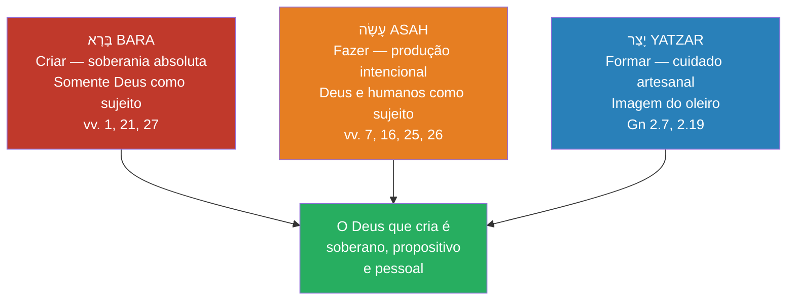

# Gênesis 1 — Análise gramatical

> **Módulo:** [[../01-texto-hebraico|Texto hebraico — índice]] · **Pasta:** Gênesis 1 · **Etapa:** material preparatório

---

## *Elohim* com verbo singular *bara*

### O fenômeno gramatical

A palavra *Elohim* (אֱלֹהִים) é morfologicamente **plural** em hebraico (terminação *-im*), mas em Gênesis 1.1 aparece com o verbo *bara* (בָּרָא) no **singular**: "Elohim bara" (Deus criou), e não "Elohim bar'u" (deuses criaram). Essa discrepância entre sujeito e predicado é **gramaticalmente intencional** e teologicamente significativa.

### Explicações propostas

1. **Plural de majestade / intensidade** (*pluralis majestatis*) — A explicação mais difundida: o plural expressa intensificação, não número. Comunica a plenitude, a vastidão do poder e a grandeza incomparável do único Deus. Alguns hebraístas contestam que o hebraico bíblico possua de fato um "plural de majestade" como categoria gramatical estabelecida.

2. **Declaração monoteísta intencional** — A Torá teria acoplado intencionalmente o substantivo plural com o verbo singular para comunicar que Deus é Um — uma afirmação polêmica contra o politeísmo do Antigo Oriente Próximo.

3. **Plenitude divina e atributos "omni"** — O plural aponta para a unicidade de Deus e todos os seus atributos: onisciência, onipotência e onipresença — uma divindade que transcende categorias humanas comuns.

4. **Sementes trinitárias** (perspectiva cristã) — Muitos teólogos cristãos veem no plural de *Elohim* e em passagens como Gênesis 1.26 ("Façamos o homem") indícios de uma pluralidade dentro da unidade divina, reinterpretados à luz da revelação trinitária do Novo Testamento.

A tensão entre unidade (verbo singular) e plenitude (substantivo plural) contém profundidade teológica notável em apenas duas palavras hebraicas.

### *Bara* como exclusividade divina

Na Escritura, somente Deus é sujeito do verbo *bara*. Seres humanos "fazem" (*asah*) coisas, mas somente Deus "cria" (*bara*). No contexto de Gênesis 1.1 — onde o objeto é "os céus e a terra" (a totalidade do cosmos) — a implicação de criação a partir do nada (*creatio ex nihilo*) é clara, confirmada por Hebreus 11.3.

---

## Os verbos da criação: *bara*, *asah* e *yatzar*

Três verbos hebraicos descrevem a atividade criadora de Deus em Gênesis 1–2. Compreendê-los revela nuances importantes do ato criativo.

**Bara (בָּרָא) — "criar":**
- Somente Deus é sujeito deste verbo. Nunca é usado para atividade humana.
- Aparece três vezes em Gênesis 1: no v.1 (céus e terra), no v.21 (criaturas marinhas) e no v.27 (seres humanos — três vezes em um único versículo).
- Aponta para algo fundamentalmente *novo*, que somente Deus pode trazer à existência.
- Debate: *bara* implica necessariamente criação *ex nihilo*? O verbo em si significa "trazer à existência" — a inferência de criação a partir do nada vem do contexto (nenhum material preexistente é mencionado em Gn 1.1) e da confirmação de Hebreus 11.3.
- **Atenção ao binyan.** As ocorrências acima são **qal**. O que aparece em `Js 17.15,18` para "desbravar floresta" está no **piel** (וּבֵרֵאתָ) — outro padrão verbal. Ocorrências em binyanim diferentes **não somam** (§11.10), e citá-la sem essa distinção sugere que o verbo de Gn 1.1 também significa "derrubar mato". *(O BDB arquiva o piel dentro da mesma entrada, e não como homógrafo; o homógrafo que ele separa é outro — בָּרָא II, "ser gordo", `1Sm 2.29`. Ver [[../../docs/lexicos/bara|o verbete]].)*

**Asah (עָשָׂה) — "fazer, produzir":**
- Tanto Deus quanto seres humanos podem ser sujeitos deste verbo.
- Em Gênesis 1: firmamento (v.7), luminares (v.16), animais (v.25), seres humanos (v.26).
- Indica produção intencional — formar, organizar, estabelecer função.
- Não exige material preexistente em todos os casos — Gênesis 2.4 usa *asah* como resumo de *toda* a criação.

**Yatzar (יָצַר) — "formar, modelar":**
- Evoca a imagem do oleiro moldando o barro (Jr 18.1-6; Is 29.16; 45.9).
- Aparece em Gênesis 2.7 (Deus forma o homem do pó) e 2.19 (Deus forma os animais).
- É o mais concreto dos três verbos: implica trabalho íntimo, manual, artesanal.

**A interação dos verbos:**

Os três verbos *não* são categorias técnicas rígidas. Gênesis 2.4 resume: "No dia em que o SENHOR Deus *fez* (*asah*) a terra e os céus" — usando *asah* como termo geral para *toda* a criação, incluindo o que foi descrito com *bara* em Gn 1.1. De modo semelhante, Isaías 45.18 emprega os três verbos em paralelo: "Ele *formou* (*yatzar*) a terra, ele a *fez* (*asah*), ele a estabeleceu… ele a *criou* (*bara*)."

O padrão que emerge é claro: *bara* enfatiza a soberania divina e a novidade absoluta; *asah* enfatiza a produção intencional e funcional; *yatzar* enfatiza o cuidado artesanal e a intimidade do Criador com a criatura. Juntos, esses verbos pintam o retrato de um Deus que é, ao mesmo tempo, soberano, propositivo e pessoal.

---

**Texto para conferir as formas:** [[02-texto-integral|hebraico integral]] · **Consulta lexical:** [[04-lexico-do-capitulo|léxico do capítulo]] · [[05-termos-decisivos|termos decisivos]]
