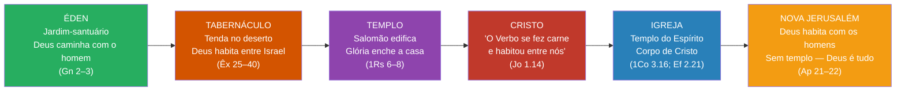
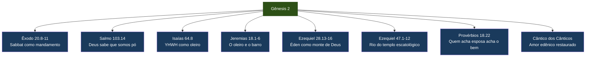
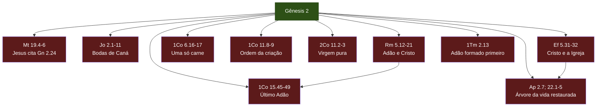

# Gênesis Capítulo 2 — O Homem, a Mulher e o Casamento

**Análise exegética, teológica e prática de Gênesis 2.1–25**

---

## Sumário

**[[#1. Texto bíblico base (NAA)]]**

**[[#2. Resumo do capítulo]]**

**[[#3. Texto hebraico e termos-chave]]**
- [[#3.1. Gênesis 2.4–7 (transliterado)]]
- [[#3.2. Vocabulário principal]]
- [[#3.3. A fórmula *toledot* e a relação entre Gênesis 1 e 2]]
- [[#3.4. De *Elohim* a *YHWH Elohim* — a mudança de nome divino]]

**[[#4. Exegese de Gênesis 2.1–3 — O sétimo dia]]**
- [[#4.1. O repouso divino: *shabat*, *wayekal* e *wayebarekh*]]
- [[#4.2. Santificação do sétimo dia e implicações teológicas]]

**[[#5. Exegese de Gênesis 2.4–25]]**
- [[#5.1. A segunda narrativa: complemento, não contradição]]
- [[#5.2. A formação do homem — *yatsar*, *aphar* e *neshamah* (2.7)]]
- [[#5.3. O jardim do Éden (2.8–14) — geografia, rios e significado teológico]]
- [[#5.4. As duas árvores: vida e conhecimento (2.9, 16–17)]]
- [[#5.5. O mandato de cultivar e guardar — *abad* e *shamar* (2.15)]]
- [[#5.6. A proibição e o pacto — a aliança adâmica (2.16–17)]]
- [[#5.7. "Não é bom que o homem esteja só" (2.18) — solidão e comunidade]]
- [[#5.8. A nomeação dos animais (2.19–20) — autoridade, sabedoria e ausência]]
- [[#5.9. A criação da mulher (2.21–23) — *tsela*, *ish* e *ishshah*]]
- [[#5.10. O casamento: "uma só carne" (2.24–25) — instituição divina]]

**[[#6. Temas teológicos de Gênesis 2]]**
- [[#6.1. *YHWH Elohim*: o Deus transcendente é também imanente]]
- [[#6.2. O Éden como proto-templo e santuário de Deus]]
- [[#6.3. Trabalho como vocação original, não como castigo]]
- [[#6.4. A aliança de obras (pacto adâmico)]]
- [[#6.5. Casamento como tipo de Cristo e a Igreja]]
- [[#6.6. Dignidade e complementaridade de homem e mulher]]

**[[#7. Gênesis 2 diante do Antigo Oriente Próximo]]**
- [[#7.1. Paralelos com *Atrahasis* e *Enuma Elish*]]
- [[#7.2. O jardim divino na literatura mesopotâmica]]
- [[#7.3. Contrastes teológicos: dignidade humana vs. servidão aos deuses]]

**[[#8. Conexões canônicas]]**
- [[#8.1. Gênesis 2 no Antigo Testamento]]
- [[#8.2. Gênesis 2 no Novo Testamento]]

**[[#9. Aplicações doutrinárias e práticas]]**
- [[#9.1. Síntese doutrinária de Gênesis 2]]
- [[#9.2. Casamento e família]]
- [[#9.3. Trabalho e vocação]]
- [[#9.4. Aplicações pastorais e devocionais]]

**[[#10. Perspectivas da teologia reformada sobre Gênesis 2]]**
- [[#10.1. João Calvino — Deus como oleiro e jardineiro]]
- [[#10.2. Herman Bavinck — O pacto de obras e a probationary command]]
- [[#10.3. Geerhardus Vos — O Éden e a escatologia]]
- [[#10.4. Confissão de Fé de Westminster — Capítulos 4 e 7]]

**[[#11. Bibliografia recomendada]]**

**[[#12. Notas]]**

---

## 1. Texto bíblico base (NAA)

> ¹ Assim, pois, foram acabados os céus e a terra e todo o seu exército. ² No sétimo dia, Deus já havia completado a obra que tinha feito e, no sétimo dia, descansou de toda a obra que fizera. ³ E Deus abençoou o sétimo dia e o santificou, porque nele descansou de toda a obra que, como Criador, fizera.
>
> ⁴ Esta é a gênese dos céus e da terra, quando foram criados, no dia em que o SENHOR Deus fez a terra e os céus. ⁵ Ainda não havia nenhuma planta do campo na terra, pois ainda nenhuma erva do campo havia brotado; porque o SENHOR Deus não tinha feito chover sobre a terra, e também não havia homem para cultivar o solo. ⁶ Mas uma neblina subia da terra e regava toda a superfície do solo.
>
> ⁷ Então o SENHOR Deus formou o homem do pó da terra e lhe soprou nas narinas o fôlego de vida, e o homem passou a ser alma vivente.
>
> ⁸ E o SENHOR Deus plantou um jardim no Éden, na direção do Oriente, e pôs nele o homem que tinha formado. ⁹ Do solo o SENHOR Deus fez brotar toda sorte de árvores agradáveis à vista e boas para alimento; e também a árvore da vida no meio do jardim e a árvore do conhecimento do bem e do mal.
>
> ¹⁰ E saía um rio do Éden para regar o jardim e dali se dividia, repartindo-se em quatro braços. ¹¹ O primeiro chama-se Pisom; é o que rodeia toda a terra de Havilá, onde há ouro. ¹² O ouro dessa terra é bom; também se encontram ali o bdélio e a pedra de ônix. ¹³ O segundo rio chama-se Giom; é o que rodeia toda a terra de Cuxe. ¹⁴ O terceiro rio chama-se Tigre; é o que corre pelo oriente da Assíria. E o quarto rio é o Eufrates.
>
> ¹⁵ O SENHOR Deus tomou o homem e o colocou no jardim do Éden para o cultivar e o guardar. ¹⁶ E o SENHOR Deus lhe deu esta ordem: De toda árvore do jardim você pode comer livremente; ¹⁷ mas da árvore do conhecimento do bem e do mal você não deve comer; porque, no dia em que dela comer, você certamente morrerá.
>
> ¹⁸ Disse mais o SENHOR Deus: Não é bom que o homem esteja só; farei para ele uma auxiliadora que lhe seja idônea. ¹⁹ Tendo o SENHOR Deus formado da terra todos os animais do campo e todas as aves dos céus, trouxe-os ao homem, para ver como este lhes chamaria; e o nome que o homem desse a todos os seres viventes, esse seria o nome deles. ²⁰ O homem deu nomes a todos os animais domésticos, às aves dos céus e a todos os animais selvagens; mas para o homem não se achava uma auxiliadora que lhe fosse idônea.
>
> ²¹ Então o SENHOR Deus fez cair pesado sono sobre o homem, e este adormeceu; tomou uma das suas costelas e fechou o lugar com carne. ²² E da costela que o SENHOR Deus tomara ao homem, formou uma mulher e a trouxe ao homem. ²³ E disse o homem: Esta, afinal, é osso dos meus ossos e carne da minha carne; ela será chamada mulher, porque do homem foi tirada.
>
> ²⁴ Por isso, deixa o homem pai e mãe e se une à sua mulher, tornando-se os dois uma só carne. ²⁵ Ora, um e outro, o homem e sua mulher, estavam nus e não se envergonhavam.

---

## 2. Resumo do capítulo

Gênesis 2 muda o foco do panorama cósmico de Gênesis 1 para um zoom íntimo: o ser humano em relação com Deus, com a terra e com o outro. O capítulo abre com a conclusão solene da criação — o repouso divino no sétimo dia (vv. 1–3) — e então recua para narrar, em detalhe, a formação do homem, a preparação do jardim do Éden, a vocação de trabalho, a primeira lei divina e, finalmente, a criação da mulher e a instituição do casamento.

Se Gênesis 1 responde **"quem criou?"** e **"o que foi criado?"**, Gênesis 2 responde **"para que fim?"** e **"em que relações?"** O Deus transcendente (*Elohim*) que cria por decreto agora é revelado como *YHWH Elohim* — o Deus pessoal que forma com as mãos, sopra, planta, conversa e apresenta. A teologia de Gênesis 2 é profundamente relacional: o ser humano foi feito para Deus (recebendo Seu fôlego), para a terra (cultivando-a), para o outro (no casamento) e para a obediência (guardando a palavra divina).

---

## 3. Texto hebraico e termos-chave

### 3.1. Gênesis 2.4–7 (transliterado)

> *'Elleh toledot hashamayim veha'arets behibbare'am beyom asot YHWH Elohim erets veshamayim.*
> "Estas são as gerações dos céus e da terra, quando foram criados, no dia em que o SENHOR Deus fez a terra e os céus."

> *Vayyitser YHWH Elohim et-ha'adam aphar min-ha'adamah vayyippach be'appav nishmat chayyim vayehi ha'adam lenephesh chayyah.*
> "Então o SENHOR Deus formou o homem do pó da terra e lhe soprou nas narinas o fôlego de vida, e o homem passou a ser alma vivente."

### 3.2. Vocabulário principal

| Termo hebraico | Transliteração | Significado | Referência |
|---|---|---|---|
| תּוֹלְדוֹת | *toledot* | gerações, origens, história | 2.4 |
| יהוה אֱלֹהִים | *YHWH Elohim* | SENHOR Deus (nome pessoal + título) | 2.4ss |
| יָצַר | *yatsar* | formar, moldar (como oleiro) | 2.7 |
| עָפָר | *aphar* | pó, terra | 2.7 |
| נִשְׁמַת חַיִּים | *nishmat chayyim* | fôlego/sopro de vida | 2.7 |
| נֶפֶשׁ חַיָּה | *nephesh chayyah* | ser/alma vivente | 2.7 |
| גַּן | *gan* | jardim (cercado, protegido) | 2.8 |
| עֵדֶן | *Eden* | deleite, prazer | 2.8 |
| עֵץ הַחַיִּים | *ets hachayyim* | árvore da vida | 2.9 |
| עֵץ הַדַּעַת | *ets hada'at* | árvore do conhecimento | 2.9 |
| עָבַד | *abad* | cultivar, servir, trabalhar | 2.15 |
| שָׁמַר | *shamar* | guardar, proteger, vigiar | 2.15 |
| מוֹת תָּמוּת | *mot tamut* | certamente morrerás (infinitivo absoluto) | 2.17 |
| עֵזֶר כְּנֶגְדּוֹ | *ezer kenegdo* | auxiliadora correspondente/idônea | 2.18 |
| צֵלָע | *tsela* | costela, lado, flanco | 2.21 |
| אִישׁ / אִשָּׁה | *ish* / *ishshah* | homem / mulher (trocadilho) | 2.23 |
| בָּשָׂר אֶחָד | *basar echad* | uma só carne | 2.24 |
| עֲרוּמִּים | *arummim* | nus (cf. 3.1 *arum* = astuto) | 2.25 |

### 3.3. A fórmula *toledot* e a relação entre Gênesis 1 e 2

A expressão *'elleh toledot* ("estas são as gerações/origens de…") aparece onze vezes em Gênesis e funciona como o marcador estrutural do livro inteiro[^wenham-1987]. Em 2.4, ela introduz não um novo relato da criação, mas os **desdobramentos** daquilo que foi criado em Gênesis 1. A fórmula olha para frente: "estas são as gerações dos céus e da terra" anuncia o que acontecerá *dentro* da criação recém-inaugurada — a história do homem, do jardim e do casamento.

Gênesis 1 e 2, portanto, não são relatos paralelos concorrentes, mas **panorama e zoom**. Gênesis 1 é a visão de cima — toda a criação em seis dias; Gênesis 2 é a câmera descendo ao nível do solo para mostrar em detalhe a formação do homem, a preparação do Éden e a criação da mulher. Wenham observa que essa técnica de "relato geral seguido de desenvolvimento detalhado" é comum na historiografia antiga do Oriente Próximo[^wenham-1987].

### 3.4. De *Elohim* a *YHWH Elohim* — a mudança de nome divino

Em Gênesis 1, Deus é chamado exclusivamente *Elohim* — título genérico que enfatiza Seu poder como Criador cósmico. A partir de Gênesis 2.4, o nome composto *YHWH Elohim* ("SENHOR Deus") aparece — ocorrendo vinte vezes neste capítulo e no seguinte. A crítica literária clássica (hipótese documentária/JEDP) usou essa mudança para postular duas fontes independentes ("J" e "P"). No entanto, a explicação teológica é mais convincente:

- ***Elohim*** revela o Deus **transcendente**, majestoso, soberano sobre o cosmos.
- ***YHWH*** revela o Deus **imanente**, pessoal, relacional, que se comunica com Sua criatura.

A combinação *YHWH Elohim* em Gênesis 2–3 funciona como uma **ponte deliberada** entre os dois nomes: o mesmo Deus que criou os céus e a terra por Sua palavra agora Se abaixa para moldar o homem do pó, soprar em suas narinas, plantar um jardim e apresentar a mulher ao homem. Cassuto[^cassuto-1961] argumenta que a combinação é literariamente intencional: o autor une os dois nomes precisamente para mostrar que *Elohim* de Gênesis 1 e *YHWH* de Gênesis 2 são **o mesmo Deus**.

---

## 4. Exegese de Gênesis 2.1–3 — O sétimo dia

### 4.1. O repouso divino: *shabat*, *wayekal* e *wayebarekh*

> ¹ Assim, pois, foram acabados os céus e a terra e todo o seu exército. ² No sétimo dia, Deus já havia completado a obra que tinha feito e, no sétimo dia, descansou de toda a obra que fizera. ³ E Deus abençoou o sétimo dia e o santificou, porque nele descansou de toda a obra que, como Criador, fizera.
> *(Gênesis 2.1–3, NAA)*

Os três primeiros versículos de Gênesis 2 pertencem teologicamente à narrativa da criação de Gênesis 1. Eles constituem o **clímax** da semana criativa — não um oitavo ato, mas a coroação de todos os seis dias anteriores. Quatro verbos hebraicos sustentam a teologia deste texto, e cada um merece atenção cuidadosa.

#### *Wayekal* — "completou"

O verbo *kalah* (כָּלָה), no *wayyiqtol* — *wayekal* — significa "completar, terminar, concluir". A ênfase não recai sobre cansaço, mas sobre **realização plena**. A obra está pronta; nada falta, nada sobra. A criação não é um projeto inacabado ou abandonado, mas um trabalho levado a termo pelo Deus soberano. Isaías reforça esse ponto com clareza inequívoca:

> "Você não sabe? Você não ouviu? O SENHOR é o Deus eterno, o Criador dos confins da terra. Ele não se cansa, nem se fatiga."
> *(Isaías 40.28, NAA)*

Deus não descansa porque esgotou Suas forças. Ele descansa porque **completou** Sua obra. A diferença é teologicamente decisiva: o repouso divino é sinal de suficiência, não de insuficiência.

#### *Wayishbot* — "descansou, cessou"

O verbo *shabat* (שָׁבַת) — de onde se deriva o substantivo *shabbat* (sábado) — significa "cessar, parar, desistir de". Deus cessou a atividade criadora. Isso não significa inatividade absoluta — Jesus afirma em João 5.17: "Meu Pai trabalha até agora, e eu trabalho também." Deus continua sustentando, governando e providenciando. O que cessou foi o ato de **criar novas categorias de seres**. A obra de criação está encerrada; a obra de providência continua.

#### *Wayebarekh* — "abençoou"

O verbo *barakh* (בָּרַךְ) indica que Deus investiu o sétimo dia de **potência e favor**. No contexto de Gênesis 1, a bênção aparece sobre os animais (1.22) e sobre o ser humano (1.28). Agora ela recai sobre o **tempo** — não sobre uma criatura, mas sobre um dia. Deus declara que esse dia carrega algo que os outros seis não possuem: uma vocação especial de descanso, reflexão e comunhão com o Criador.

#### *Wayeqaddesh* — "santificou"

O verbo *qadash* (קָדַשׁ) significa "separar, consagrar, tornar santo". Deus separou o sétimo dia de todos os demais, conferindo-lhe um caráter único. A santificação do sétimo dia é a **primeira ocorrência de santidade** em toda a Escritura (ver seção 4.2 abaixo).

#### A ausência da fórmula "tarde e manhã"

Um detalhe notável: ao contrário dos seis dias anteriores, o sétimo dia **não possui a fórmula de encerramento** "houve tarde e manhã". Vos[^vos-1948] e Kline[^kline-2006] observam que essa ausência é teologicamente significativa. Enquanto cada dia de trabalho é delimitado — tem início e fim —, o dia de repouso permanece **aberto**. O autor de Hebreus capta essa implicação:

> "Portanto, resta um repouso sabático para o povo de Deus. Pois aquele que entrou no descanso de Deus também descansou das suas obras, como Deus das suas."
> *(Hebreus 4.9–10, NAA)*

O repouso do sétimo dia aponta para além de si mesmo — para o descanso escatológico que Deus preparou para o Seu povo. A criação inteira caminha em direção a um *shabbat* definitivo, quando Deus será "tudo em todos" (1Co 15.28). O sétimo dia, sem fim declarado, é uma **promessa aberta**: o repouso final ainda está diante de nós.

### 4.2. Santificação do sétimo dia e implicações teológicas

O fato de que a **primeira coisa declarada santa** na Escritura não é um lugar, um objeto ou uma pessoa, mas o **tempo**, possui implicações profundas. Deus santifica um dia antes de santificar uma montanha (Sinai), um tabernáculo ou um povo. Isso revela que a santidade, na perspectiva bíblica, não depende de espaços físicos, mas da **presença e da palavra de Deus** que consagra o ordinário.

#### Fundamento para o mandamento do sábado

Quando Deus entrega o Decálogo a Israel, o quarto mandamento é explicitamente ancorado em Gênesis 2.1–3:

> "Lembre-se do dia de sábado, para o santificar. Seis dias você trabalhará e fará toda a sua obra; mas o sétimo dia é o sábado dedicado ao SENHOR, seu Deus. (...) Porque em seis dias o SENHOR fez os céus e a terra, o mar e tudo o que neles há e, ao sétimo dia, descansou. Por isso, o SENHOR abençoou o dia de sábado e o santificou."
> *(Êxodo 20.8–11, NAA)*

O sábado não é uma invenção mosaica, mas uma **ordenança da criação**. Ele existia como dom antes de existir como lei. Deus embutiu na estrutura do tempo um ritmo de trabalho e descanso que reflete o Seu próprio agir. A obediência ao sábado é, portanto, uma forma de **imitar a Deus** (*imitatio Dei*) — trabalhar seis dias e descansar no sétimo é viver conforme o padrão divino.

#### O sábado como dom, não como fardo

Jesus declarou que "o sábado foi feito por causa do homem, e não o homem por causa do sábado" (Mc 2.27). O repouso semanal é **presente antes de ser mandamento**. Deus, que não precisa descansar, instituiu o descanso para a criatura que precisa. Isso revela um Deus que conhece as limitações do ser humano e que, desde a criação, providenciou ritmo e renovação. A cultura moderna, obcecada por produtividade ininterrupta, precisa ouvir novamente esta verdade: o descanso não é fraqueza — é obediência.

#### Ritmo de trabalho e repouso na ordem da criação

O padrão seis-mais-um está enraizado na própria estrutura da semana criativa. Seis dias de trabalho legítimo e produtivo seguidos de um dia de pausa, reflexão e adoração não são mera convenção social — são **design divino**. Bavinck[^bavinck-2004] observa que esse ritmo protege o ser humano de dois extremos igualmente destrutivos: a preguiça (que nega o mandato de trabalho) e a exaustão (que nega o dom do descanso).

#### Significado escatológico

A semana da criação não é apenas retrospectiva, mas **prospectiva**. Os seis dias de trabalho apontam para a história — o labor da humanidade no mundo. O sétimo dia aponta para a consumação — o descanso final no qual toda a criação entrará. Vos[^vos-1948] desenvolve esse tema com maestria: o sábado da criação é um **princípio escatológico** embutido na fundação do mundo. Desde o início, Deus sinalizou que a história tem um alvo — não o caos, não o ciclo eterno, mas o **repouso consumado** na presença de Deus.

> **Aplicação prática:** O cristão que guarda o dia do Senhor — não por legalismo, mas por gratidão — participa de um ritmo que vem desde a criação e aponta para a eternidade. Cada domingo é um eco do sétimo dia e uma antecipação do descanso eterno. Trabalhe com diligência nos seis dias; descanse com confiança no sétimo. Esse ritmo declara: "Eu não sou Deus. Eu dependo dEle. E Ele cuida de mim enquanto descanso."

---

## 5. Exegese de Gênesis 2.4–25

### 5.1. A segunda narrativa: complemento, não contradição

A partir de 2.4, o leitor encontra uma mudança perceptível de estilo, vocabulário e foco. A crítica bíblica clássica — especialmente a hipótese documentária (JEDP), formulada por Wellhausen no século XIX — interpretou essa mudança como evidência de duas fontes literárias independentes: um "documento P" (sacerdotal) em Gênesis 1 e um "documento J" (javista) em Gênesis 2. Segundo essa leitura, um redator posterior teria costurado textos originalmente distintos e até contraditórios.

No entanto, essa interpretação enfrenta problemas sérios. O próprio texto oferece uma explicação mais natural e literariamente elegante: Gênesis 1 e 2 não são dois relatos concorrentes da criação, mas **panorama e zoom**. Gênesis 1 é a câmera de cima — a perspectiva cósmica, ordenada, litúrgica, que cobre toda a criação em seis dias. Gênesis 2 é a câmera no chão — o foco íntimo, relacional, narrativo, que se concentra na formação do homem, no jardim e no casamento.

Os propósitos são distintos e complementares:

- **Gênesis 1** responde: *Quem criou? O que foi criado? Em que ordem?* O tema é a **soberania cósmica** de Deus.
- **Gênesis 2** responde: *Para que fim? Em que relações? Com que vocação?* O tema é a **intimidade relacional** de Deus com o ser humano.

A fórmula *toledot* em 2.4 (já analisada em 3.3) confirma essa leitura. Como observa Wenham[^wenham-1987], a expressão *'elleh toledot* não introduz um segundo relato de criação, mas os **desdobramentos** do que foi criado em Gênesis 1 — ela olha para frente, não para trás. Cassuto[^cassuto-1961] demonstra que as supostas contradições (ordem de criação dos animais, papel do homem) desaparecem quando se reconhece que Gênesis 2 não pretende recontar a sequência de Gênesis 1, mas detalhar aspectos que o panorama cósmico não cobriu. Waltke[^waltke-2001] reforça: "Os dois relatos são como um mapa e uma fotografia do mesmo terreno — cada um mostra o que o outro não pode."

Este projeto segue a leitura de **unidade composicional** do texto, reconhecendo Gênesis 1–2 como obra integrada de um mesmo autor sob inspiração divina, sem negar a existência de fontes e tradições, mas recusando a fragmentação que retira do texto sua coerência teológica.

### 5.2. A formação do homem — *yatsar*, *aphar* e *neshamah* (2.7)

> Então o SENHOR Deus formou o homem do pó da terra e lhe soprou nas narinas o fôlego de vida, e o homem passou a ser alma vivente.
> *(Gênesis 2.7, NAA)*

Este é um dos versículos mais densos de toda a Escritura. Em uma única frase, o texto revela a **origem material**, a **origem espiritual** e a **natureza integral** do ser humano. Cada termo merece análise cuidadosa.

#### *Yatsar* — formar, moldar como oleiro

O verbo *yatsar* (יָצַר) descreve o trabalho de um artesão que molda argila com as mãos. A imagem é radicalmente diferente da criação por decreto em Gênesis 1 ("Deus disse… e houve"). Aqui, *YHWH Elohim* se abaixa, toca a matéria, **forma** o homem com intimidade pessoal. O mesmo verbo aparece na metáfora do oleiro em Jeremias e Isaías:

> "Como barro nas mãos do oleiro, assim vocês são nas minhas mãos, ó casa de Israel."
> *(Jeremias 18.6, NAA)*

> "Mas agora, ó SENHOR, tu és nosso Pai. Nós somos o barro, e tu, o nosso oleiro; e todos nós, obra das tuas mãos."
> *(Isaías 64.8, NAA)*

A criação do homem não é um ato frio e distante, mas um gesto de artesão — cuidadoso, deliberado, pessoal. Deus não delega a criação do homem a causas secundárias ("produza a terra", como em 1.24); Ele mesmo forma, com Suas próprias mãos.

#### *Aphar min-ha'adamah* — "pó da terra"

A matéria-prima do homem é *aphar* (עָפָר) — pó, terra, partículas do solo. E o texto preserva o trocadilho mais significativo de Gênesis: *adam* (אָדָם, "homem") vem de *adamah* (אֲדָמָה, "terra/solo"). O ser humano é, literalmente, "o terroso" — aquele que vem da terra e que a ela retornará.

Essa origem material comunica duas verdades simultaneamente:

1. **Humildade.** O ser humano é pó. Ele não é divino, não é autossuficiente, não é eterno por natureza. O salmista declara: "Pois ele conhece a nossa estrutura e sabe que somos pó" (Sl 103.14). Abraão, diante de Deus, confessa: "Eu, que sou pó e cinza" (Gn 18.27). A origem material do homem é um antídoto permanente contra a arrogância.

2. **Dignidade.** Embora feito de pó, o homem foi formado pelas mãos de Deus. O material é humilde, mas o Artesão é divino. A dignidade humana não vem da matéria de que somos feitos, mas de **Quem nos fez** e **como nos fez**.

#### *Nishmat chayyim* — "fôlego de vida"

Após formar o corpo do pó, Deus **sopra** (*vayyippach*) nas narinas do homem o *nishmat chayyim* — o fôlego de vida, o sopro vital. Este é um ato direto, pessoal, íntimo: Deus se aproxima da criatura inerte e lhe comunica vida pela Sua própria respiração.

É fundamental distinguir este ato da criação dos animais. Os animais também são chamados *nephesh chayyah* (seres viventes) em Gênesis 1.20–21, 24. No entanto, em nenhum lugar a Escritura diz que Deus soprou pessoalmente o fôlego de vida nos animais. O *nishmat chayyim* comunicado diretamente por Deus ao homem é único — ele marca o ser humano como criatura à parte, receptor direto do sopro divino, portador da *imago Dei*.

#### *Nephesh chayyah* — "alma vivente, ser vivente"

O resultado do sopro divino é que "o homem passou a ser *nephesh chayyah*" — um ser vivente. A expressão não descreve a adição de uma "alma" a um corpo (como na antropologia grega dualista), mas a emergência de um **ser integral**, uma pessoa viva e completa. O ser humano não **tem** uma alma; ele **é** uma alma vivente. Corpo e espírito não são compartimentos separados, mas dimensões de uma unidade criada por Deus.

Essa visão holística é confirmada pelo restante da Escritura. O Eclesiastes contempla o caminho reverso:

> "O pó volta à terra, de onde veio, e o espírito volta a Deus, que o deu."
> *(Eclesiastes 12.7, NAA)*

Na morte, o que Deus uniu se separa temporariamente — mas a esperança cristã é a **ressurreição do corpo** (1Co 15.42–49), quando a integridade original será restaurada em glória.

> **Aplicação prática:** Gênesis 2.7 destrói simultaneamente duas mentiras: a de que somos apenas matéria (materialismo) e a de que o corpo é irrelevante ou mau (gnosticismo). O cristão honra o corpo como criação de Deus e cuida da alma como receptora do sopro divino. Somos pó — mas pó amado, formado e vivificado pelo Criador.

### 5.3. O jardim do Éden (2.8–14) — geografia, rios e significado teológico

> ⁸ E o SENHOR Deus plantou um jardim no Éden, na direção do Oriente, e pôs nele o homem que tinha formado. ⁹ Do solo o SENHOR Deus fez brotar toda sorte de árvores agradáveis à vista e boas para alimento; e também a árvore da vida no meio do jardim e a árvore do conhecimento do bem e do mal.
> *(Gênesis 2.8–9, NAA)*

> ¹⁰ E saía um rio do Éden para regar o jardim e dali se dividia, repartindo-se em quatro braços. ¹¹ O primeiro chama-se Pisom; é o que rodeia toda a terra de Havilá, onde há ouro. ¹² O ouro dessa terra é bom; também se encontram ali o bdélio e a pedra de ônix. ¹³ O segundo rio chama-se Giom; é o que rodeia toda a terra de Cuxe. ¹⁴ O terceiro rio chama-se Tigre; é o que corre pelo oriente da Assíria. E o quarto rio é o Eufrates.
> *(Gênesis 2.10–14, NAA)*

#### O nome e a localização

A expressão hebraica é *gan be-Eden miqqedem* — "um jardim em Éden, na direção do oriente". O termo *Eden* (עֵדֶן) significa "deleite" ou "prazer". Deus não apenas cria o homem — Ele prepara para ele um **lugar de abundância e alegria**. O jardim não é o Éden inteiro, mas uma área específica dentro de uma região maior chamada Éden. Deus "planta" (*nata*) o jardim: mais uma vez, a linguagem é de intimidade e cuidado pessoal.

#### Os quatro rios

O texto lista quatro rios que nascem de uma única fonte no Éden: o Pisom (que rodeia Havilá, terra de ouro, bdélio e ônix), o Giom (que rodeia Cuxe), o Tigre (*Chiddeqel*, que corre a leste da Assíria) e o Eufrates (*Perat*). A menção do Tigre e do Eufrates aponta para a região da Mesopotâmia, mas a identificação do Pisom e do Giom permanece debatida entre os estudiosos. A geografia pré-diluviana pode ter sido radicalmente alterada, tornando impossível a localização exata.

No entanto, o significado teológico importa mais do que a precisão cartográfica. Um único rio nasce no Éden e se divide em quatro braços que regam toda a terra. A imagem é de **bênção que flui da presença de Deus para o mundo**. Onde Deus habita, há abundância; de onde Deus está, a vida se espalha.

#### O Éden como proto-templo

Beale[^beale-2004] demonstra de forma convincente que o jardim do Éden funciona como o **primeiro santuário** de Deus na terra — um proto-templo que antecipa o tabernáculo, o templo de Salomão e, finalmente, a Nova Jerusalém. As correspondências são notáveis:

- **Deus caminha no jardim** (Gn 3.8) — a mesma linguagem usada para a presença de Deus no tabernáculo (Lv 26.12; Dt 23.14).
- **Ouro, bdélio e ônix** (Gn 2.12) — os mesmos materiais usados na construção do tabernáculo e nas vestes sacerdotais (Êx 25.7; 28.9, 20).
- **Adão deveria *abad* (servir) e *shamar* (guardar) o jardim** (Gn 2.15) — os mesmos verbos usados para o serviço sacerdotal dos levitas no tabernáculo (Nm 3.7–8; 8.26; 18.5–6).
- **A entrada do Éden fica a leste**, guardada por querubins (Gn 3.24) — o tabernáculo e o templo também tinham entrada voltada para o leste, com querubins sobre a arca e bordados nas cortinas (Êx 26.31; 1Rs 6.23–29).
- **Rios fluem do Éden** — em Ezequiel 47.1–12, rios de vida fluem do templo escatológico; em Apocalipse 22.1–2, o rio da vida flui do trono de Deus e do Cordeiro.

Essa progressão — Éden, tabernáculo, templo, Nova Jerusalém — revela que toda a história bíblica é a história de Deus **expandindo Sua presença habitacional** até que ela cubra toda a terra. O plano original do Éden não foi abandonado; foi adiado pelo pecado e será consumado na nova criação.

> **Aplicação prática:** Se o Éden era um lugar da presença de Deus, e se a Nova Jerusalém é o Éden restaurado e expandido, então o cristão vive entre esses dois jardins — já resgatado, ainda peregrinando, esperando a consumação. Cada culto, cada oração, cada momento de comunhão com Deus é uma antecipação do jardim final.

### 5.4. As duas árvores: vida e conhecimento (2.9, 16–17)

> Do solo o SENHOR Deus fez brotar toda sorte de árvores agradáveis à vista e boas para alimento; e também a árvore da vida no meio do jardim e a árvore do conhecimento do bem e do mal.
> *(Gênesis 2.9, NAA)*

> E o SENHOR Deus lhe deu esta ordem: De toda árvore do jardim você pode comer livremente; mas da árvore do conhecimento do bem e do mal você não deve comer; porque, no dia em que dela comer, você certamente morrerá.
> *(Gênesis 2.16–17, NAA)*

#### A árvore da vida — *ets hachayyim*

A árvore da vida (*ets hachayyim*, עֵץ הַחַיִּים) ocupa o centro do jardim. Ela é símbolo de **vida contínua em comunhão com Deus**. Enquanto o homem tivesse acesso a ela, viveria — não porque a árvore possuísse propriedades mágicas, mas porque ela representava sacramentalmente a vida que Deus sustenta.

A árvore da vida reaparece ao longo da Escritura como fio condutor:

- Em Provérbios, a sabedoria é "árvore de vida para os que a alcançam" (Pv 3.18; cf. 11.30; 13.12; 15.4).
- Após a queda, o acesso à árvore é bloqueado por querubins e espada flamejante (Gn 3.22–24) — o homem caído não pode mais alcançar a vida eterna por si mesmo.
- No final da Escritura, a árvore reaparece na Nova Jerusalém: "Ao vencedor, darei de comer da árvore da vida, que se encontra no paraíso de Deus" (Ap 2.7). E em Apocalipse 22.2, ela está em ambos os lados do rio da vida, produzindo frutos a cada mês, "e as folhas da árvore são para a cura das nações."

O arco bíblico é completo: a árvore **dada** no Éden, **negada** após a queda e **restaurada** na Nova Jerusalém conta a história inteira da redenção. O que Adão perdeu, Cristo reconquistou.

#### A árvore do conhecimento do bem e do mal — *ets hada'at tov vara*

Esta árvore é cercada de debate. O que significa "conhecimento do bem e do mal"? Três interpretações principais foram propostas ao longo da história:

1. **Autonomia moral** — a capacidade (ou pretensão) de decidir por si mesmo o que é certo e errado, independentemente de Deus. Esta é a interpretação preferida pela maioria dos comentaristas reformados[^waltke-2001] e é a que melhor se encaixa no contexto narrativo: a tentação da serpente em Gênesis 3 é precisamente "sereis como Deus, conhecedores do bem e do mal" (3.5) — isto é, vocês mesmos definirão a moral.

2. **Conhecimento sexual** — uma leitura minoritária que interpreta "conhecer" no sentido de experiência sexual. Embora o verbo *yada* possa ter essa conotação em outros contextos (Gn 4.1), o contexto de Gênesis 2–3 não apoia essa leitura como principal.

3. **Onisciência ou sabedoria universal** — o desejo de possuir conhecimento total, próprio de Deus. Essa leitura tem mérito parcial, mas reduz a questão a um problema epistemológico quando o texto enfatiza o problema **moral**.

A proibição, portanto, não é sobre manter o ser humano na ignorância. É sobre **confiança**: aceitará a criatura a definição divina de bem e mal, ou tentará arrancá-la com as próprias mãos? O mandamento testa não a inteligência de Adão, mas sua **fé e submissão** ao Criador.

#### *Mot tamut* — "certamente morrerás"

A sentença *mot tamut* (מוֹת תָּמוּת) emprega o **infinitivo absoluto** seguido do verbo finito — uma construção hebraica de ênfase máxima: "morrendo, morrerás" ou "certamente morrerás". Não há ambiguidade nem espaço para negociação. A desobediência traz a morte — não como punição arbitrária, mas como **consequência natural** de romper a relação com Aquele que é a fonte da vida. Quem se separa da Vida, encontra a morte.

### 5.5. O mandato de cultivar e guardar — *abad* e *shamar* (2.15)

> O SENHOR Deus tomou o homem e o colocou no jardim do Éden para o cultivar e o guardar.
> *(Gênesis 2.15, NAA)*

Dois verbos definem a vocação original do homem: *abad* (עָבַד) — cultivar, trabalhar, servir — e *shamar* (שָׁמַר) — guardar, proteger, vigiar. Isoladamente, cada um deles é comum na Escritura. Juntos, porém, formam uma combinação rara e teologicamente carregada.

#### *Abad* — servir

O verbo *abad* significa "trabalhar" ou "servir". No contexto agrícola, refere-se ao cultivo da terra. Mas o mesmo verbo é usado para descrever o **serviço sacerdotal** dos levitas no tabernáculo: "para servir (*abad*) no serviço da tenda da congregação" (Nm 8.26; cf. 3.7–8; 18.5–6).

#### *Shamar* — guardar

O verbo *shamar* significa "guardar, proteger, vigiar". Os levitas eram encarregados de "guardar (*shamar*) a guarda do tabernáculo" (Nm 1.53; 3.7–8) — proteger o espaço sagrado contra profanação.

#### A combinação sacerdotal

O dado decisivo é que a combinação *abad* + *shamar* aparece junta, fora de Gênesis 2.15, **apenas** em textos que descrevem deveres sacerdotais levíticos[^beale-2004]. Isso não pode ser coincidência. A implicação é clara: Adão não era apenas um agricultor — ele era um **sacerdote-jardineiro**. Sua vocação era servir a Deus no jardim-santuário e guardar a santidade daquele espaço sagrado. O Éden era o primeiro templo, e Adão era o primeiro sacerdote.

#### Trabalho como ordenança da criação

Um ponto pastoral fundamental emerge deste versículo: o trabalho existia **antes da queda**. Ele não é castigo nem consequência do pecado. O que o pecado introduziu foi a **dificuldade** do trabalho — "maldita é a terra por sua causa; em fadigas obterá dela o sustento durante todos os dias da sua vida" (Gn 3.17). Mas o trabalho em si é **dom divino**, parte da vocação original do ser humano como portador da imagem de Deus.

> **Aplicação prática:** Todo trabalho legítimo é serviço a Deus. O professor, o médico, o pedreiro, a mãe que cuida dos filhos — todos exercem uma forma do *abad* original. E todo cristão é chamado a *shamar* — a guardar e proteger aquilo que Deus lhe confiou: a família, a igreja, a criação, a verdade. A teologia da vocação começa aqui, em Gênesis 2.15.

### 5.6. A proibição e o pacto — a aliança adâmica (2.16–17)

> E o SENHOR Deus lhe deu esta ordem: De toda árvore do jardim você pode comer livremente; mas da árvore do conhecimento do bem e do mal você não deve comer; porque, no dia em que dela comer, você certamente morrerá.
> *(Gênesis 2.16–17, NAA)*

#### A generosidade antes da proibição

Antes de qualquer análise teológica, é preciso notar a **estrutura** do mandamento. Deus não começa com "não"; Ele começa com "sim". "De toda árvore do jardim você pode comer **livremente**" — o hebraico usa o infinitivo absoluto (*akol tokel*) para enfatizar a ampla liberdade. Dezenas, talvez centenas de árvores à disposição do homem, sem restrição. E então, **uma única** proibição: "mas da árvore do conhecimento do bem e do mal você não deve comer."

A proporção é teologicamente significativa: a vontade de Deus é esmagadoramente generosa. A proibição não define a relação — a **liberdade** define a relação. A obediência solicitada é mínima; a bênção oferecida é máxima. Quando a serpente, em Gênesis 3.1, distorcer essa proporção ("É verdade que Deus disse: De nenhuma árvore do jardim você poderá comer?"), ela estará invertendo a realidade: transformando a generosidade de Deus em tirania.

#### A estrutura do pacto

A teologia reformada identifica neste texto os elementos de um **pacto** (aliança) entre Deus e o homem, tradicionalmente chamado de **Aliança de Obras** ou **Pacto de Obras** (Confissão de Fé de Westminster 7.2)[^wcf]:

| Elemento do pacto | Correspondência em Gn 2.16–17 |
|---|---|
| Senhor soberano | YHWH Elohim — o Criador e Legislador |
| Vassalo/servo | Adão — representante da humanidade |
| Estipulação | Não comer da árvore do conhecimento |
| Bênção implícita | Vida (acesso contínuo à árvore da vida) |
| Maldição/sanção | Morte ("certamente morrerás") |

Embora a palavra "aliança" (*berit*) não apareça explicitamente em Gênesis 2, Oseias 6.7 declara: "Eles, porém, como Adão, transgrediram a aliança" — confirmando que a relação entre Deus e Adão tinha caráter pactual.

#### Adão como cabeça federal

A teologia reformada ensina que Adão agia não apenas por si, mas como **representante federal** de toda a humanidade. Sua obediência teria assegurado vida para todos os seus descendentes; sua desobediência trouxe morte para todos. Paulo desenvolve esse princípio com clareza:

> "Portanto, assim como por um só homem entrou o pecado no mundo, e pelo pecado, a morte, e assim a morte passou a todos os homens, porque todos pecaram."
> *(Romanos 5.12, NAA)*

A estrutura Adão–Cristo é fundamental para a soteriologia paulina: "Pois assim como, em Adão, todos morrem, assim também, em Cristo, todos serão vivificados" (1Co 15.22). Adão é o primeiro cabeça federal; Cristo é o segundo e último Adão (1Co 15.45).

#### A natureza da morte ameaçada

Que morte Deus ameaça? A resposta é tríplice:

1. **Morte espiritual** — separação imediata de Deus. No dia em que comeram, Adão e Eva não morreram fisicamente de imediato, mas a comunhão íntima com Deus foi rompida. Eles se esconderam (Gn 3.8).
2. **Morte física** — a mortalidade entrou na experiência humana. "Pó és, e ao pó tornarás" (Gn 3.19). O corpo, originalmente destinado à vida, agora caminha para a decomposição.
3. **Morte eterna** — a condenação final, da qual somente a graça de Deus pode livrar. A "segunda morte" de Apocalipse 20.14 é a consumação daquilo que começou no Éden.

#### O fundamento de toda ética

Este texto é também a base de toda a ética bíblica. Com a primeira proibição, Deus estabelece que existe um "você deve" e um "você não deve" que **não depende da opinião humana**. A moralidade não é construída pelo homem; ela é **revelada** por Deus. Antes de qualquer código legal, antes do Sinai, antes do Decálogo, há uma palavra divina que define o bem e proíbe o mal. Toda a legislação posterior — mosaica, profética, apostólica — está enraizada nesse princípio: **Deus fala, e o homem obedece**.

### 5.7. "Não é bom que o homem esteja só" (2.18) — solidão e comunidade

> Disse mais o SENHOR Deus: Não é bom que o homem esteja só; farei para ele uma auxiliadora que lhe seja idônea.
> *(Gênesis 2.18, NAA)*

#### O choque do "não é bom"

Após sete declarações de "bom" (*tov*) e "muito bom" (*tov me'od*) em Gênesis 1, o leitor encontra pela primeira vez na Escritura as palavras **"não é bom"** (*lo-tov*). O efeito literário é intencional — é um choque. Tudo o que Deus fez até aqui era bom; agora, algo na criação ainda não está completo. E note: isso acontece **antes da queda**. A solidão do homem não é consequência do pecado; é uma **lacuna deliberada** na criação que Deus mesmo identifica e se propõe a preencher.

A expressão hebraica é *lo-tov heyot ha'adam levaddo* — "não é bom o ser/estar do homem sozinho". Deus projetou o ser humano para a **relação**. A solidão completa contradiz o design divino. O homem, mesmo em comunhão perfeita com Deus e cercado pela criação, necessita de um outro — alguém que esteja "diante dele", face a face, em correspondência.

#### *Ezer kenegdo* — "auxiliadora que lhe corresponda"

A expressão *ezer kenegdo* (עֵזֶר כְּנֶגְדּוֹ) é uma das mais mal compreendidas da Escritura. A tradução "auxiliadora" pode sugerir, para o leitor moderno, um papel subordinado ou inferior. Nada poderia estar mais longe do significado hebraico.

**O termo *ezer*** (עֵזֶר) significa "ajudador, aliado, socorro, resgatador". E, de forma notável, esse mesmo termo é usado para descrever o **próprio Deus** como ajudador de Israel:

- "O nosso socorro (*ezer*) está no nome do SENHOR, que fez o céu e a terra." (Sl 124.8)
- "Feliz aquele que tem o Deus de Jacó como seu auxílio (*ezer*)." (Sl 146.5)
- "Tu és o meu auxílio (*ezer*) e o meu libertador." (Sl 70.5)

Se Deus é chamado *ezer* de Israel sem que isso implique inferioridade, então a mulher ser chamada *ezer* do homem também não implica inferioridade. O termo comunica **força a serviço do outro** — aliança, não subalternidade.

**O termo *kenegdo*** (כְּנֶגְדּוֹ) é composto de *ke-* ("como"), *neged* ("diante de, em frente a") e o sufixo pronominal *-o* ("dele"). Literalmente: "como diante dele" — isto é, alguém que está **face a face** com ele, correspondente a ele, que lhe é igual e complementar. A imagem é de dois que se olham nos olhos, no mesmo nível.

Juntos, *ezer kenegdo* significa: "uma aliada forte que lhe corresponde" — **igual em dignidade, distinta em função, complementar em vocação**. O ser humano, feito à imagem de Deus, só reflete plenamente essa imagem na relação de alteridade: homem e mulher juntos, face a face.

### 5.8. A nomeação dos animais (2.19–20) — autoridade, sabedoria e ausência

> Tendo o SENHOR Deus formado da terra todos os animais do campo e todas as aves dos céus, trouxe-os ao homem, para ver como este lhes chamaria; e o nome que o homem desse a todos os seres viventes, esse seria o nome deles. O homem deu nomes a todos os animais domésticos, às aves dos céus e a todos os animais selvagens; mas para o homem não se achava uma auxiliadora que lhe fosse idônea.
> *(Gênesis 2.19–20, NAA)*

#### O ato de nomear como exercício de domínio

Em Gênesis 1.5, 8, 10, **Deus** nomeia as realidades fundamentais: dia, noite, céus, terra, mares. Nomear, no contexto bíblico, é exercer autoridade e definir a identidade do nomeado. Agora, Deus delega essa prerrogativa a Adão: o homem *qara* (קָרָא) — "chama, nomeia" — os animais. Ele exerce, na prática, o domínio sobre a criação que lhe foi conferido em 1.28.

O ato de nomear também revela **sabedoria**: Adão observa cada animal, discerne suas características e atribui um nome que lhe corresponde. Isso demonstra a imagem de Deus em ação — a capacidade racional, linguística e perceptiva do ser humano, não corrompida pelo pecado, funcionando em plena harmonia com o Criador.

#### O propósito mais profundo: a ausência

Mas a cena tem um propósito mais profundo do que demonstrar a autoridade de Adão. Deus traz os animais ao homem não apenas para que ele os nomeie, mas para tornar **visível e experimentado** aquilo que Deus já declarou: "não é bom que o homem esteja só." Adão examina cada criatura — o leão, a águia, o boi — e nenhuma delas é *ezer kenegdo*. Nenhum animal, por mais nobre ou belo, pode ser o companheiro que corresponde ao homem.

A conclusão do texto é enfática e deliberada: "mas para o homem não se achava uma auxiliadora que lhe fosse idônea." A busca percorre toda a criação animal e retorna vazia. A lacuna permanece. E é precisamente essa ausência experimentada que prepara o leitor — e o próprio Adão — para o ato único e sublime que vem a seguir: a criação da mulher.

### 5.9. A criação da mulher (2.21–23) — *tsela*, *ish* e *ishshah*

> Então o SENHOR Deus fez cair pesado sono sobre o homem, e este adormeceu; tomou uma das suas costelas e fechou o lugar com carne. E da costela que o SENHOR Deus tomara ao homem, formou uma mulher e a trouxe ao homem. E disse o homem: Esta, afinal, é osso dos meus ossos e carne da minha carne; ela será chamada mulher, porque do homem foi tirada.
> *(Gênesis 2.21–23, NAA)*

#### *Tardemah* — o sono profundo

Deus faz cair sobre Adão uma *tardemah* (תַּרְדֵּמָה) — um sono profundo, sobrenatural. Não se trata de anestesia; trata-se de **ação divina soberana**. O mesmo termo aparece em Gênesis 15.12, quando Deus faz cair um *tardemah* sobre Abraão antes de ratificar a aliança com ele. O padrão é claro: quando Deus age de forma definitiva e pactual, o homem é colocado em passividade total. A criação da mulher é obra exclusiva de Deus — Adão não participa, não contribui, não opina. Ele dorme; Deus age.

#### *Tsela* — costela ou lado

O termo *tsela* (צֵלָע) é tradicionalmente traduzido como "costela", mas seu campo semântico é mais amplo. Em outras passagens, *tsela* designa o "lado" de uma construção: o lado do tabernáculo (Êx 26.20, 26–27), o lado da arca (Êx 25.12), as câmaras laterais do templo (1Rs 6.5). A ideia pode ser não apenas de uma costela individual, mas de uma porção do **lado** do homem.

Essa observação deu origem à reflexão clássica, frequentemente atribuída a Matthew Henry (embora já presente em sentido semelhante nos comentários de Calvino): "Ela não foi feita da cabeça dele, para governá-lo; nem dos pés, para ser pisada por ele; mas do lado, para ser igual a ele; debaixo do braço, para ser protegida; e junto ao coração, para ser amada." A precisão da atribuição pode ser discutida, mas a intuição teológica é sólida e fiel ao texto.

#### *Vayyiven* — "edificou"

Um detalhe verbal surpreendente: o texto não diz que Deus "formou" (*yatsar*) a mulher — como fez com o homem em 2.7 — mas que **"edificou"** (*vayyiven*, do verbo *banah*, בָּנָה). Deus *constrói* a mulher. O verbo *banah* é arquitetônico — usado para a construção de cidades, templos e casas. A mulher não é moldada do pó como o homem; ela é construída, edificada, a partir de material já vivo. Há intencionalidade, design, projeto deliberado.

#### A primeira fala humana: poesia e alegria

O versículo 23 registra a **primeira fala humana** em toda a Escritura — e ela é **poesia**:

> *Zot happa'am etsem me'atsamay uvasar mibbesari;*
> *lezot yiqqare ishshah ki me'ish luqqachah-zot.*

"Esta, afinal (*happa'am* — "desta vez!", "finalmente!"), é osso dos meus ossos e carne da minha carne; ela será chamada mulher (*ishshah*), porque do homem (*ish*) foi tirada."

A exclamação *happa'am* ("desta vez!") transborda alegria. Após o desfile de animais — cada um examinado, nomeado e descartado como companheiro — Adão vê a mulher e exclama com reconhecimento e celebração: "**Esta**, sim!" A busca acabou. A lacuna foi preenchida. O "não é bom" de 2.18 foi resolvido.

O trocadilho *ish/ishshah* é intraduzível em sua plenitude, mas comunica **unidade de natureza**: ela é chamada *ishshah* ("mulher") porque de *ish* ("homem") foi tomada. Os nomes se espelham, assim como as pessoas se espelham — distintas, mas da mesma essência.

**Implicação teológica:** A mulher não é uma adição secundária ou uma solução improvisada. Ela é o **clímax da criação** — a última obra de Deus, aquela que transforma o "não é bom" em "muito bom". Sem ela, a criação estava incompleta. Com ela, a imagem de Deus brilha em relação.

### 5.10. O casamento: "uma só carne" (2.24–25) — instituição divina

> Por isso, deixa o homem pai e mãe e se une à sua mulher, tornando-se os dois uma só carne. Ora, um e outro, o homem e sua mulher, estavam nus e não se envergonhavam.
> *(Gênesis 2.24–25, NAA)*

#### A voz do narrador

O versículo 24 não é fala de Adão nem fala de Deus — é um **comentário do narrador**, uma declaração editorial que extrai do evento narrado um princípio universal. "Por isso" (*al-ken*) conecta a criação da mulher a partir do homem com a instituição permanente do casamento. O que Deus fez com Adão e Eva não é uma história isolada — é o **modelo normativo** para todas as gerações.

#### Os três movimentos do casamento

O texto descreve o casamento em três verbos que formam uma sequência inseparável:

1. **Deixar** (*ya'azov*, עָזַב) — "deixa o homem pai e mãe". O casamento cria uma **nova unidade primária de lealdade**. Os vínculos com a família de origem permanecem, mas são subordinados à nova aliança conjugal. Isso era especialmente radical numa cultura patriarcal, onde o filho geralmente permanecia na casa paterna.

2. **Unir-se** (*davaq*, דָּבַק) — "e se une à sua mulher". O verbo *davaq* significa "aderir, apegar-se, colar-se". É o mesmo verbo usado para descrever a relação de Israel com Deus: "ao SENHOR, seu Deus, vocês devem seguir, a ele devem temer, os seus mandamentos devem guardar (...) a ele devem se apegar (*davaq*)" (Dt 13.4; cf. 10.20; 11.22; Js 23.8). O casamento, portanto, é descrito com a mesma linguagem de **aliança** que define a relação entre Deus e Seu povo.

3. **Tornar-se uma só carne** (*hayu levasar echad*) — "tornando-se os dois uma só carne". A expressão *basar echad* ("uma só carne") denota uma união **holística**: sexual, emocional, espiritual e social. Não é apenas coabitação nem apenas intimidade física — é a fusão de duas vidas inteiras em uma unidade nova e indissolúvel.

#### Ordenança da criação, não remédio para o pecado

O casamento é instituído **antes da queda**. Ele não é um mal necessário, nem uma concessão à fraqueza humana, nem uma instituição meramente social. Ele é **ordenança da criação** — tão originário quanto o trabalho, tão fundamental quanto o sábado. O pecado danificará o casamento (como danifica tudo), mas não o inventou nem o define.

#### Jesus e Paulo: a autoridade definitiva de Gênesis 2.24

Jesus cita diretamente este versículo como argumento definitivo contra o divórcio:

> "Não leram que, no princípio, o Criador os fez homem e mulher e disse: Por isso, o homem deixará pai e mãe e se unirá à sua mulher, e os dois se tornarão uma só carne? De modo que já não são mais dois, porém uma só carne. Portanto, o que Deus ajuntou não o separe o homem."
> *(Mateus 19.4–6, NAA)*

Note que Jesus atribui Gênesis 2.24 ao **Criador** — não a Moisés, não ao narrador humano, mas a Deus. O comentário narrativo é elevado a palavra divina. O casamento é projeto de Deus, e sua definição não está sujeita a revisão humana.

Paulo, por sua vez, descobre em Gênesis 2.24 uma tipologia ainda mais profunda:

> "Por isso, o homem deixará pai e mãe e se unirá à sua mulher, e os dois se tornarão uma só carne. Grande é este mistério; eu, porém, me refiro a Cristo e à igreja."
> *(Efésios 5.31–32, NAA)*

O casamento humano é **tipo** — imagem terrena de uma realidade celestial. A união entre marido e mulher aponta para a união entre Cristo e a Igreja. Cada casamento cristão é uma parábola viva do evangelho: Cristo deixou a glória do Pai, uniu-se à Sua noiva (a Igreja) e os dois se tornaram um.

#### Nudez sem vergonha (v. 25)

O capítulo encerra com uma nota de **inocência perfeita**: "estavam nus (*arummim*, עֲרוּמִּים) e não se envergonhavam." Antes do pecado, não havia necessidade de esconder-se — nem de Deus, nem um do outro. A transparência era total; a confiança, absoluta; a vulnerabilidade, sem risco.

O autor bíblico escolhe a palavra *arummim* ("nus") com precisão deliberada, pois em 3.1 a serpente será descrita como *arum* (עָרוּם, "astuta, sagaz"). O trocadilho é sutil mas poderoso: a nudez inocente do casal será confrontada pela astúcia da serpente, e o resultado será vergonha, cobertura e fuga. O que era transparência se tornará ocultamento; o que era confiança se tornará medo.

Este versículo funciona como uma **porta que se fecha** sobre o paraíso. O leitor sabe — porque já leu ou já ouviu a história — que esse estado de inocência será perdido no próximo capítulo. A beleza de 2.25 é tingida de tristeza antecipatória. Mas a esperança do evangelho responde: o que foi perdido no Éden será restaurado em Cristo. A vergonha será coberta — não por folhas de figueira, mas pelo sangue do Cordeiro.

> **Aplicação prática:** O casamento cristão é chamado a refletir três verdades de Gênesis 2.24–25: (1) prioridade — o cônjuge vem antes da família de origem; (2) permanência — a união é para a vida, como a aliança de Cristo com a Igreja; (3) transparência — a intimidade conjugal floresce onde há confiança e vulnerabilidade mútua, sem máscaras. Onde o pecado danificou essas três colunas, o evangelho oferece restauração: em Cristo, podemos aprender novamente a deixar, unir e ser transparentes.

## 6. Temas teológicos de Gênesis 2

Gênesis 2 não é apenas narrativa histórica — é um texto denso de teologia. Sob a superfície aparentemente simples de um relato sobre um homem, um jardim e uma mulher, encontram-se temas que percorrem toda a Escritura: a natureza de Deus, a vocação humana, a aliança, o casamento e a dignidade do ser humano. Nesta seção, examinaremos seis grandes eixos teológicos que emergem do capítulo.

### 6.1. *YHWH Elohim*: o Deus transcendente é também imanente

Em Gênesis 1, Deus cria por decreto soberano: "E disse Deus: Haja…" (*vayomer Elohim*). O nome utilizado é *Elohim* — título que enfatiza poder, majestade e transcendência. Deus está "acima" da criação, chamando-a à existência por Sua palavra. A partir de Gênesis 2.4, porém, o nome muda para *YHWH Elohim* ("SENHOR Deus"), e com ele muda também o modo como Deus é retratado. Agora Ele **forma** o homem do pó (*yatsar*, 2.7), **sopra** em suas narinas (*vayyippach*, 2.7), **planta** um jardim (*vayyitta*, 2.8), **coloca** o homem nele (*vayyannicheihu*, 2.15), **fala** diretamente com ele (2.16–17), **observa** que algo não está bom (2.18), **traz** os animais ao homem (2.19), **faz cair** um sono profundo (2.21) e **apresenta** a mulher (2.22).

Essa mudança não é acidental. A combinação *YHWH Elohim* funciona como ponte teológica: o Deus soberano que cria os céus e a terra é **o mesmo** que desce ao nível do solo para moldar Adão com Suas mãos e conversar com ele. Dois erros são evitados de uma só vez:

1. **O deísmo** — a ideia de que Deus é um relojoeiro distante, que criou o universo e Se retirou. Gênesis 2 mostra um Deus que Se envolve pessoalmente com Sua criação.
2. **O panteísmo** — a ideia de que Deus é uma força impessoal misturada com a natureza. Gênesis 2 mostra um Deus que é *distinto* da criação (Ele forma o homem do pó — Deus não *é* o pó), mas Se relaciona intimamente com ela.

Calvino observou que Deus, ao usar linguagem antropomórfica (mãos, sopro, caminhada), "acomoda-se" à capacidade humana de compreensão[^calvino-2014]. Deus não tem mãos físicas; mas para que o homem compreenda o cuidado pessoal do Criador, a Escritura o descreve como um oleiro que molda, um jardineiro que planta, um pai que apresenta a noiva ao filho. Essa **acomodação** não torna o relato menos verdadeiro — torna-o mais acessível. O Deus infinito comunica verdades infinitas em linguagem finita.

> **Aplicação:** Se Deus é ao mesmo tempo transcendente e imanente, então nosso culto deve refletir ambas as realidades: reverência profunda diante do Criador soberano *e* confiança íntima no Pai que nos conhece pelo nome. A oração cristã não é um ritual dirigido a uma força cósmica impessoal, mas conversa com o Deus que formou cada um de nós com Suas mãos.

### 6.2. O Éden como proto-templo e santuário de Deus

Uma das percepções mais fecundas da teologia bíblica contemporânea é que o jardim do Éden funciona como um **proto-templo** — o primeiro lugar de encontro entre Deus e o homem. G. K. Beale demonstrou extensamente que os paralelos entre o Éden e o tabernáculo/templo de Israel são numerosos demais para serem coincidência[^beale-2004]. Consideremos os principais:

1. **A presença de Deus que "caminha".** Em Gênesis 3.8, Deus "passeava no jardim" — o verbo hebraico *mithalekh* (hitpael de *halakh*) é o mesmo usado para descrever a presença de Deus no tabernáculo: "Andarei entre vós" (Lv 26.12; Dt 23.14; 2Sm 7.6-7). O Éden era o lugar onde Deus habitava com o homem.

2. **Os verbos *abad* e *shamar*.** Em Gênesis 2.15, Adão é colocado no jardim para "cultivá-lo" (*abad*) e "guardá-lo" (*shamar*). Esses dois verbos, quando aparecem juntos em outros textos do Pentateuco, descrevem exclusivamente o **serviço levítico** no tabernáculo (Nm 3.7-8; 8.26; 18.5-6). Adão não era apenas agricultor — era **sacerdote** no santuário de Deus.

3. **Os querubins.** Após a queda, querubins são postos a guardar o caminho para a árvore da vida (Gn 3.24). No tabernáculo, querubins de ouro ficam sobre a arca da aliança (Ex 25.18-22); no templo de Salomão, querubins gigantes cobrem o Santo dos Santos (1Rs 6.23-28); no véu do tabernáculo, querubins são bordados (Ex 26.31). Os querubins marcam a fronteira entre o espaço sagrado de Deus e o mundo caído.

4. **Ouro, bdélio e ônix.** Gênesis 2.12 menciona o ouro, o bdélio (*bedolach*) e a pedra de ônix na terra de Havilá, associados ao Éden. Esses mesmos materiais são usados na construção do tabernáculo e nas vestes sacerdotais (Ex 25.7, 11; 28.9, 20; Nm 11.7).

5. **O rio que flui.** De Éden sai um rio que rega o jardim e se divide em quatro braços (Gn 2.10). Ezequiel vê um rio fluindo debaixo do limiar do templo restaurado, dando vida por onde passa (Ez 47.1-12). João vê o rio da água da vida fluindo do trono de Deus e do Cordeiro na Nova Jerusalém, com a árvore da vida em suas margens (Ap 22.1-2). O padrão é constante: **de onde Deus habita, flui vida**.

6. **A orientação para o leste.** Após a expulsão, Adão e Eva saem "ao oriente do Éden" (Gn 3.24), e os querubins guardam a entrada pelo lado leste. O tabernáculo e o templo de Salomão tinham sua entrada voltada para o leste (Ex 27.13-14; Ez 43.1-4). Entrar no santuário era, simbolicamente, caminhar de volta ao Éden.

A implicação é notável: Adão era um **sacerdote-rei** no jardim-santuário de Deus. Seu chamado era servir (*abad*) a Deus e guardar (*shamar*) Sua presença santa. Quando falhou, os querubins e a espada flamejante fecharam o acesso. Toda a história da redenção, de certa forma, é a história de Deus reabrindo o caminho de volta ao Éden — através do tabernáculo, do templo, de Cristo (o verdadeiro templo, Jo 2.19-21), da Igreja (templo do Espírito, 1Co 3.16; Ef 2.19-22) e, finalmente, da Nova Jerusalém, onde "o Senhor Deus Todo-Poderoso e o Cordeiro são o seu templo" (Ap 21.22).

> **Aplicação:** Cada culto cristão é um eco do Éden — um momento em que entramos na presença de Deus para servi-Lo e guardá-Lo em nossos corações. E cada ato de obediência é um exercício do sacerdócio original para o qual fomos criados.

### 6.3. Trabalho como vocação original, não como castigo

Uma das contribuições mais importantes de Gênesis 2 para a ética cristã é a afirmação de que o trabalho é uma **ordenança da criação**, não uma consequência do pecado. *Antes* da queda, Deus colocou o homem no jardim "para o cultivar e o guardar" (2.15). O trabalho não é maldição — é **vocação**.

O verbo *abad* (עָבַד) carrega um campo semântico rico: trabalhar, servir, cultivar, adorar. Na Escritura, o mesmo verbo descreve tanto o trabalho agrícola quanto o serviço litúrgico a Deus. Isso sugere que, na visão bíblica, **todo trabalho legítimo é uma forma de serviço a Deus**. Não há divisão entre o "sagrado" e o "secular" na ordem da criação.

O que a queda trouxe não foi o trabalho, mas o **sofrimento no trabalho**:

> Maldita é a terra por sua causa; em sofrimento você comerá dela todos os dias da sua vida. Ela lhe dará espinhos e ervas daninhas, e você comerá das plantas do campo. Com o suor do seu rosto você comerá o seu pão…
> *(Gênesis 3.17-19, NAA)*

Observe: a terra é maldita, não o trabalho. O homem continuará trabalhando, mas agora com suor, espinhos e frustração. A diferença entre Gênesis 2.15 e Gênesis 3.17-19 é a diferença entre trabalho como **alegria** e trabalho como **labuta** (*itstsabon*).

Lutero e Calvino, no contexto da Reforma, resgataram a dignidade de toda vocação legítima. Contra a distinção medieval entre "vida contemplativa" (clero) e "vida ativa" (leigos), os reformadores ensinaram que o fazendeiro, o sapateiro, a mãe de família e o magistrado servem a Deus em seus chamados tanto quanto o pastor no púlpito[^calvino-2014]. Calvino escreveu que cada pessoa deve considerar seu trabalho como um "posto de sentinela" (*statio*) designado por Deus — ninguém deve desprezar sua vocação nem invadir a alheia.

A teologia reformada afirma que o trabalho humano participa dos **propósitos criativos e providenciais de Deus**. Quando o agricultor planta, o médico cura, o professor ensina e o engenheiro constrói, estão exercendo — ainda que de forma imperfeita neste mundo caído — o mandato original de cultivar e guardar a criação.

> **Aplicações práticas:**
> 1. **Contra o ativismo desenfreado (*workaholism*):** Se o trabalho é vocação, não identidade, então nosso valor não depende de nossa produtividade. Deus descansou no sétimo dia — e somos chamados a fazer o mesmo.
> 2. **Contra a preguiça (*sloth*):** Se o trabalho é ordenança da criação, então evitar o trabalho é resistir ao propósito de Deus para nós. "Se alguém não quer trabalhar, também não coma" (2Ts 3.10).
> 3. **Contra a dicotomia sagrado-secular:** Toda vocação legítima é santa quando exercida para a glória de Deus (1Co 10.31).

### 6.4. A aliança de obras (pacto adâmico)

A teologia reformada identifica em Gênesis 2.15-17 os elementos de uma **aliança** entre Deus e Adão — tradicionalmente chamada de "aliança de obras" ou "pacto de obras" (*foedus operum*). A Confissão de Fé de Westminster declara:

> A distância entre Deus e a criatura é tão grande que, embora as criaturas racionais lhe devam obediência como ao seu Criador, nunca poderiam fruir nada dele como bem-aventurança e galardão, senão por alguma voluntária condescendência da parte de Deus, a qual lhe aprouve expressar por meio de aliança. (CFW 7.1)

Embora a palavra "aliança" (*berit*) não apareça em Gênesis 2, os **elementos estruturais** de uma aliança estão presentes[^kline-2006]:

| Elemento | Texto |
|----------|-------|
| **Soberano** | *YHWH Elohim* — o Senhor que estabelece os termos |
| **Vassalo** | Adão — representante da humanidade |
| **Estipulação** | "De toda árvore do jardim você pode comer livremente; mas da árvore do conhecimento do bem e do mal você não deve comer" (2.16-17) |
| **Bênção implícita** | Vida — acesso contínuo à árvore da vida e comunhão com Deus |
| **Sanção/maldição** | "No dia em que dela comer, você certamente morrerá" (*mot tamut*, 2.17) |

Oseias 6.7 confirma a linguagem pactual: "Mas eles, como Adão, transgrediram a aliança" — indicando que a relação de Adão com Deus era entendida como aliança já na tradição profética.

É importante esclarecer o que "aliança de obras" **não** significa. Não significa que Adão pudesse "merecer" a salvação por esforço próprio, como se Deus estivesse em dívida. Significa que Deus, por pura **condescendência graciosa**, estabeleceu um arranjo pelo qual a obediência de Adão seria o caminho da vida e sua desobediência o caminho da morte. A aliança de obras é, em si mesma, um ato de graça — pois Deus não era obrigado a prometer coisa alguma à criatura.

Adão ocupava nessa aliança o papel de **cabeça federal** (*caput foederale*) da humanidade. Sua obediência ou desobediência não afetaria apenas a si mesmo, mas a todos os seus descendentes. Paulo desenvolve esse princípio com força cristológica:

> Portanto, assim como por um só homem entrou o pecado no mundo, e pelo pecado, a morte, e assim a morte passou a todos os homens, porque todos pecaram…
> *(Romanos 5.12, NAA)*

A lógica pactual de Romanos 5.12-21 depende inteiramente da realidade de Gênesis 2: se Adão não foi cabeça federal real de uma aliança real, então Cristo como "segundo Adão" perde seu fundamento teológico. Kline[^kline-2006] organiza a sequência assim: **probação** (período de teste no jardim) → **transgressão** (Gn 3) → **maldição** (Gn 3.14-19) → **promessa de redenção** (Gn 3.15, o *protoevangelium*).

> **Aplicação:** A aliança de obras é o fundamento sobre o qual a aliança da graça é construída. Sem compreender que Adão falhou como nosso representante, não entendemos por que precisamos de Cristo como nosso novo representante. O evangelho não começa em Mateus — começa em Gênesis 2.

### 6.5. Casamento como tipo de Cristo e a Igreja

O casamento instituído em Gênesis 2.24 não é apenas uma ordenança social — é, nas palavras do apóstolo Paulo, um **mistério** (*mysterion*) que aponta para Cristo e a Igreja:

> Por isso, deixará o homem a seu pai e a sua mãe e se unirá à sua mulher, e os dois se tornarão uma só carne. Grande é este mistério, mas eu me refiro a Cristo e à igreja.
> *(Efésios 5.31-32, NAA)*

Paulo não está fazendo uma alegoria arbitrária. Ele está dizendo que o casamento edênico é **tipológico** — foi projetado desde o princípio para ser uma parábola viva da relação entre Cristo e Seu povo. Os paralelos são notáveis:

1. **O sono de Adão e a morte de Cristo.** Deus fez cair pesado sono sobre Adão (*tardemah*, Gn 2.21), abriu seu lado e da costela formou a mulher. Cristo dormiu o sono da morte na cruz; Seu lado foi aberto por uma lança, e dele saiu sangue e água (Jo 19.34) — símbolos da Igreja que nasce do sacrifício do noivo.

2. **A exclamação de alegria.** Adão vê a mulher e exclama com júbilo: "Esta, afinal, é osso dos meus ossos e carne da minha carne!" (Gn 2.23). Cristo Se alegra sobre Sua noiva com regozijo (Is 62.5; Sf 3.17). O Noivo celestial não recebe Sua Igreja com indiferença, mas com deleite.

3. **"Deixar e unir-se".** Gênesis 2.24 diz que o homem "deixa pai e mãe" para se unir à sua mulher. Cristo deixou a glória do Pai celestial, esvaziou-se a Si mesmo (Fp 2.6-8) e Se uniu ao Seu povo, assumindo carne humana para tornar-se "um" conosco.

4. **"Uma só carne" e união espiritual.** O marido e a mulher tornam-se "uma só carne" (*basar echad*). De modo análogo, os crentes são "um só espírito com o Senhor" (1Co 6.17) e membros do Seu corpo (Ef 5.30). A intimidade do casamento reflete a intimidade da comunhão entre Cristo e a Igreja.

5. **As bodas do Cordeiro.** A história da Bíblia começa com um casamento no jardim (Gn 2) e termina com um casamento na cidade santa: "Alegremo-nos, exultemos e demos-lhe a glória, porque são chegadas as bodas do Cordeiro, e a sua esposa já se preparou" (Ap 19.7). O arco narrativo da Escritura é um arco nupcial — do Éden à Nova Jerusalém.

> **Aplicação:** O casamento cristão não é um mero contrato social ou arranjo de conveniência. É uma **parábola viva do evangelho** — o marido representa o amor sacrificial de Cristo; a esposa representa a Igreja que se entrega com alegria ao seu Senhor. Todo casamento cristão fiel é, portanto, uma pregação silenciosa do evangelho diante do mundo.

### 6.6. Dignidade e complementaridade de homem e mulher

Gênesis 2 é o texto fundacional para a antropologia bíblica sobre homem e mulher. Combinado com Gênesis 1.27 ("homem e mulher os criou"), o capítulo estabelece dois princípios igualmente inegociáveis: **igual dignidade** e **distinção de papéis**.

**Dignidade igual.** A mulher, assim como o homem, é criada à imagem de Deus (Gn 1.27). Ela não é um ser inferior, uma criatura de segunda classe ou um apêndice do homem. O termo *ezer kenegdo* (עֵזֶר כְּנֶגְדּוֹ, "auxiliadora idônea/correspondente") é frequentemente mal interpretado como se indicasse subordinação. Mas o substantivo *ezer* ("ajudador, socorro") é usado na Escritura predominantemente para descrever **o próprio Deus** em relação a Israel: "O nosso socorro (*ezer*) está no nome do SENHOR, que fez o céu e a terra" (Sl 124.8; cf. Sl 33.20; 70.5; 115.9-11; Dt 33.7, 26). Se *ezer* implicasse inferioridade, Deus seria inferior a Israel — o que é absurdo. O termo indica **capacidade indispensável**, não subordinação.

A preposição *kenegdo* (כְּנֶגְדּוֹ, literalmente "como diante dele" ou "correspondente a ele") reforça a igualdade: a mulher é da **mesma natureza** que o homem — "osso dos meus ossos e carne da minha carne" (2.23). Ela não é feita do pó da terra como algo separado, mas do próprio lado do homem, indicando **parceria íntima** e **identidade compartilhada**.

**Distinção de papéis.** Ao mesmo tempo, o texto indica diferenciação. O homem é formado primeiro (2.7); a mulher é formada a partir dele (2.21-22). O homem recebe a ordem sobre a árvore antes da criação da mulher (2.16-17). O homem nomeia os animais (2.19-20) e também nomeia a mulher (2.23). Essas distinções — de ordem, de modo de criação, de responsabilidade primária — são significativas e serão retomadas pelo Novo Testamento.

O apóstolo Paulo fundamenta seu ensino sobre os papéis de homem e mulher explicitamente na **ordem da criação**, não em convenções culturais passageiras:

- **Gálatas 3.28** — "Não há homem nem mulher, pois todos vós sois um em Cristo Jesus." Igualdade de acesso à graça e de posição diante de Deus.
- **1 Coríntios 11.3-12** — A relação de homem e mulher reflete uma ordem que remonta à criação, mas é marcada por interdependência: "nem a mulher é independente do homem, nem o homem, independente da mulher, no Senhor" (v. 11).
- **1 Timóteo 2.12-13** — Paulo apela à ordem da criação ("Adão foi formado primeiro, depois Eva") como base para a distinção de papéis na liderança da igreja.
- **1 Pedro 3.7** — A mulher é "co-herdeira da graça da vida" — igualdade de herança espiritual, mesmo dentro de uma relação de papéis distintos.

A posição reformada evita dois extremos:

1. **O patriarcalismo opressor**, que usa a liderança masculina para justificar domínio, abuso ou desprezo pela mulher. Isso é uma distorção da queda (Gn 3.16), não da criação.
2. **O igualitarismo que apaga a ordem criacional**, argumentando que toda distinção de papéis entre homem e mulher é resultado do pecado e deve ser eliminada. Mas Gênesis 2 coloca a distinção *antes* da queda — ela faz parte do projeto original de Deus.

A melhor analogia para compreender essa realidade vem da própria **Trindade**: o Pai, o Filho e o Espírito Santo são iguais em essência, glória e poder — mas distintos em suas relações e funções. O Filho submete-Se voluntariamente ao Pai (Jo 6.38; 1Co 15.28) sem que isso diminua Sua divindade. De modo análogo, a complementaridade entre homem e mulher reflete **igualdade de ser** com **distinção funcional**, num arranjo que é belo, harmonioso e glorificador de Deus[^bavinck-2004].

> **Aplicações práticas:**
> 1. Todo ser humano — homem ou mulher — possui dignidade inviolável como portador da imagem de Deus. Qualquer forma de abuso, degradação ou discriminação contra a mulher é uma ofensa ao Criador.
> 2. A complementaridade de papéis no casamento e na igreja não é opressão, mas reflexo da ordem criacional que aponta para a harmonia trinitária.
> 3. A igreja deve ser o lugar onde a dignidade da mulher é mais exaltada e onde a liderança masculina é mais servicial — à semelhança de Cristo, que "não veio para ser servido, mas para servir" (Mc 10.45).

---

## 7. Gênesis 2 diante do Antigo Oriente Próximo

A narrativa de Gênesis 2 não foi escrita em um vácuo cultural. Ela surgiu no contexto do Antigo Oriente Próximo (ANE — *Ancient Near East*), onde diversas civilizações — sumerianos, babilônios, assírios, egípcios — possuíam seus próprios relatos sobre a origem do ser humano. Compreender esses paralelos e, sobretudo, os **contrastes** entre Gênesis e essas tradições é essencial para captar a força polêmica e teológica do texto bíblico.

### 7.1. Paralelos com *Atrahasis* e *Enuma Elish*

O *Épico de Atrahasis* (c. 1700 a.C.) e o *Enuma Elish* (c. 1100 a.C.) são os dois principais textos mesopotâmicos que descrevem a criação da humanidade.

No *Atrahasis*, os deuses menores (os *Igigi*) se cansam do trabalho de cavar canais e cultivar a terra. Eles entram em greve e ameaçam rebelião. Para resolver a crise, o deus Enki propõe criar seres humanos que assumam o trabalho braçal. A humanidade é formada de **argila** misturada com o **sangue de um deus rebelde** (Geshtu-e), sacrificado para esse fim. Os humanos existem para ser **escravos dos deuses** — sua criação é motivada pela preguiça divina.

No *Enuma Elish*, a criação da humanidade vem após a vitória de Marduk sobre a deusa Tiamat. Marduk decide criar os humanos a partir do **sangue de Kingu**, o general derrotado de Tiamat — um deus associado à rebelião e ao caos. Novamente, o propósito da humanidade é **servir como mão de obra** para que os deuses possam descansar.

Os paralelos superficiais com Gênesis 2 são evidentes: em todos os relatos, o ser humano é formado de material terreno (argila/pó). Mas as diferenças são abissais:

- **Em Gênesis:** O homem é formado do pó da terra com **cuidado artesanal** (*yatsar*, o verbo do oleiro) e recebe o **sopro divino** (*nishmat chayyim*) diretamente das narinas de Deus. Não há violência, não há sangue de deuses assassinados. O ato é de **amor e intimidade**, não de conveniência.

- **No ANE:** O ser humano é subproduto de conflito divino, feito do resíduo de deuses mortos para aliviar a carga de trabalho dos deuses superiores. Sua existência é **utilitária**, não relacional.

- **Propósito em Gênesis:** O homem é criado para **comunhão com Deus** e **mordomia da criação** — cultivar e guardar o jardim como sacerdote-rei, não como escravo.

- **Propósito no ANE:** O homem é criado para **servidão** — trabalho forçado a serviço de deuses caprichosos que não desejam Se relacionar com a humanidade[^walton-2015].

### 7.2. O jardim divino na literatura mesopotâmica

O conceito de um jardim divino não é exclusivo de Gênesis. Na literatura suméria, **Dilmun** é descrito como uma terra pura, limpa e luminosa, onde não há doença, velhice nem morte — um lugar paradisíaco associado aos deuses. No *Épico de Gilgamesh*, o herói encontra um **jardim dos deuses** com árvores de pedras preciosas (lápis-lazúli, cornalina). Em Ezequiel 28.13-16, o profeta descreve o "jardim de Deus" com pedras preciosas, ecoando a linguagem edênica.

Mas há uma diferença fundamental: nos mitos mesopotâmicos, o jardim divino é um **retiro exclusivo dos deuses** — um espaço ao qual os seres humanos *não* têm acesso. Gilgamesh busca desesperadamente entrar no jardim e alcançar a imortalidade, mas fracassa. Dilmun é morada divina, não humana.

Em Gênesis, o Éden é o oposto: é um jardim que Deus prepara **para o homem** (2.8 — "e pôs nele o homem que tinha formado"). O ser humano não é excluído da presença divina; é **convidado** a habitar nela. A humanidade não precisa escalar montanhas cósmicas ou atravessar mares sobrenaturais para encontrar Deus — Deus planta o jardim e coloca o homem *dentro* dele.

O sistema fluvial de Gênesis 2.10-14 também contrasta com as paisagens míticas. Os rios do Éden — Pisom, Giom, Tigre (*Chiddekel*) e Eufrates — incluem rios **historicamente identificáveis**. O Tigre e o Eufrates são rios reais da Mesopotâmia, conhecidos até hoje. Embora a identificação precisa do Pisom e do Giom seja debatida, a menção de rios reais ancora a narrativa na **geografia**, não na mitologia. O autor de Gênesis não está descrevendo uma terra fantasiosa, mas um lugar no mundo real onde Deus Se encontrou com o primeiro homem.

### 7.3. Contrastes teológicos: dignidade humana vs. servidão aos deuses

A tabela abaixo resume os contrastes centrais entre a visão de mundo do Antigo Oriente Próximo e a revelação de Gênesis 2:

| Aspecto | ANE (*Atrahasis* / *Enuma Elish*) | Gênesis 2 |
|---------|--------------------------------------|-----------|
| **Origem do homem** | Sangue de deus rebelde + argila | Pó da terra + sopro divino |
| **Propósito** | Trabalho escravo para os deuses | Mordomia e comunhão com Deus |
| **Status** | Servo desprezível, subproduto | Imagem de Deus, sacerdote-rei |
| **Mulher** | Sem narrativa específica de criação | Criada com cuidado, igual em dignidade |
| **Casamento** | Contrato social ou econômico | Instituição divina, tipo de Cristo e a Igreja |
| **Jardim** | Reservado exclusivamente aos deuses | Preparado *para* o homem |
| **Relação com deus** | Medo, distância, servidão | Confiança, proximidade, aliança |

Esses contrastes não são acidentais. A narrativa de Gênesis 2 não é uma **cópia adaptada** dos mitos mesopotâmicos — é uma **polêmica teológica** contra eles[^walton-2015]. O autor sagrado, sob a inspiração do Espírito Santo, conhecia as cosmovisões que cercavam Israel e apresentou, deliberada e sistematicamente, uma antropologia radicalmente diferente:

1. **O ser humano não é um acidente cósmico.** Nos mitos do ANE, a humanidade surge como solução improvisada para um problema trabalhista dos deuses. Em Gênesis, o homem é o **propósito** da criação — Deus prepara o jardim *antes* de criar Adão e o coloca ali com honra e vocação.

2. **O ser humano não é escravo.** Nos mitos, os humanos existem para servir os deuses como força de trabalho. Em Gênesis, o homem serve a Deus como **mordomo e sacerdote** — com dignidade, autoridade delegada e comunhão pessoal.

3. **A mulher não é invisível.** Os mitos mesopotâmicos praticamente ignoram a criação da mulher. Gênesis dedica uma narrativa cuidadosa e teologicamente densa à sua formação, declarando-a "osso dos meus ossos" — igual em natureza, indispensável em vocação.

4. **Deus não é caprichoso.** Nos mitos, os deuses criam por conveniência, destroem por irritação e governam por capricho. *YHWH Elohim* cria por amor, governa por aliança e Se relaciona com a humanidade por graça condescendente.

Middleton[^middleton-2005] resume bem: enquanto no ANE a "imagem de deus" era um privilégio reservado ao rei (o monarca como representante divino na terra), Gênesis **democratiza** esse conceito — *todo* ser humano, homem e mulher, é imagem de Deus. Isso é uma revolução antropológica sem paralelo no mundo antigo.

> **Aplicação:** Gênesis 2 nos ensina que a dignidade humana não é uma invenção do Iluminismo nem um produto da evolução cultural — é uma revelação do Criador. Cada ser humano, do mais poderoso ao mais vulnerável, carrega o sopro de Deus em suas narinas e foi feito para comunhão, não para servidão. Toda cosmovisão que reduz o ser humano a produto de forças cegas, recurso econômico ou acidente biológico contradiz frontalmente a antropologia de Gênesis 2.

---

## 8. Conexões canônicas

### 8.1. Gênesis 2 no Antigo Testamento

Gênesis 2 estabelece fundamentos que reverberam por todo o Antigo Testamento. Suas imagens — o jardim, o sopro, o barro, a aliança, o casamento — são retomadas pelos profetas, sábios e poetas de Israel como chave interpretativa da relação entre Deus e o ser humano.

**1. Êxodo 20.8-11 — O sabbat como mandamento criacional**

O quarto mandamento fundamenta a observância do sábado diretamente no repouso de Deus no sétimo dia (Gn 2.2-3). O verbo *shabat* ("cessou, repousou") de Gênesis 2 torna-se a base teológica para o ritmo semanal de Israel. O sabbat não é invenção mosaica — é ordenança da criação, revelada na própria estrutura do tempo.

**2. Salmo 103.14 — "Ele sabe do que somos formados; lembra-se de que somos pó"**

O salmista ecoa Gênesis 2.7 (*aphar min-ha'adamah*). A fragilidade humana não é motivo de desprezo, mas de compaixão divina. Deus, que formou o homem do pó, conhece intimamente sua natureza e trata com misericórdia quem é frágil por constituição.

**3. Isaías 64.8 — "Tu, SENHOR, és nosso Pai; nós somos o barro, e tu, o nosso oleiro"**

O profeta retoma a imagem do oleiro de Gênesis 2.7 (*yatsar*) como fundamento para a oração de restauração. Assim como Deus formou Adão com cuidado pessoal, Israel apela para que o mesmo Criador "forme de novo" um povo desfigurado pelo pecado. A metáfora pressupõe tanto a soberania divina quanto a intimidade relacional.

**4. Jeremias 18.1-6 — O oleiro e o barro**

Deus envia Jeremias à oficina do oleiro para ilustrar Sua soberania sobre as nações. A imagem do oleiro (*yotser*) é a mesma de Gênesis 2.7 — o mesmo Deus que formou Adão do barro pode reformar ou desfazer nações conforme Sua vontade. Paulo retomará essa imagem em Romanos 9.20-21.

**5. Ezequiel 28.13-16 — O Éden como monte santo de Deus**

Na lamentação sobre o rei de Tiro, Ezequiel descreve o Éden com linguagem que combina jardim e templo: pedras preciosas, querubim guardião, "monte santo de Deus." Isso confirma a leitura de Gênesis 2 como proto-templo — o jardim era o lugar da presença divina, e a expulsão foi uma "dessacralização"[^beale-2004].

**6. Ezequiel 47.1-12 — O rio do templo escatológico**

O rio que sai debaixo do limiar do templo na visão de Ezequiel retoma o rio de Gênesis 2.10-14 que saía do Éden para regar o jardim. As árvores frutíferas nas margens (Ez 47.12) ecoam a árvore da vida. O profeta apresenta o templo escatológico como o Éden restaurado — o que foi perdido na queda será plenamente recuperado.

**7. Provérbios 18.22 — "Quem acha esposa acha o bem e alcança a benevolência do SENHOR"**

Este provérbio é lido à luz de Gênesis 2.18 ("Não é bom que o homem esteja só") e 2.22 (Deus *trouxe* a mulher ao homem). O "bem" (*tov*) encontrado na esposa ecoa o "bom" (*tov*) de Gênesis 1-2. O casamento é apresentado como bênção que vem diretamente de Deus, não como conquista humana.

**8. Cântico dos Cânticos — O amor edênico restaurado**

O Cântico retoma extensamente a linguagem do jardim de Gênesis 2: jardim fechado (Ct 4.12), árvores frutíferas, fragrâncias, rios, intimidade sem vergonha. A relação entre o amado e a amada ecoa o *ish* e *ishshah* de Gênesis 2.23, e a nudez sem vergonha de 2.25 encontra seu eco na celebração livre da intimidade conjugal. Muitos intérpretes reformados veem no Cântico a restauração parcial do que foi perdido no Éden.

---

### 8.2. Gênesis 2 no Novo Testamento

O Novo Testamento cita e interpreta Gênesis 2 mais frequentemente do que qualquer outro capítulo do AT sobre a criação. Jesus, Paulo e João constroem doutrinas fundamentais sobre casamento, cristologia, eclesiologia e escatologia a partir deste capítulo.

**1. Mateus 19.4-6 — Jesus cita Gênesis 2.24 sobre o casamento**

Quando questionado sobre o divórcio, Jesus não responde com a lei de Moisés, mas retorna à criação: "Não tendes lido que o Criador, desde o princípio, os fez homem e mulher e disse: 'Por isso, deixará o homem pai e mãe e se unirá à sua mulher, e os dois se tornarão uma só carne'?" (Mt 19.4-5). Jesus trata Gênesis 2.24 como **normativo e permanente** — o que Deus estabeleceu na criação não pode ser anulado pela legislação mosaica, que apenas acomodou a dureza do coração humano. O casamento é definido pelo Criador, não pela cultura.

**2. João 2.1-11 — As bodas de Caná**

O primeiro sinal de Jesus acontece num casamento. Não é coincidência. Jesus inaugura Sua obra pública abençoando a instituição que Deus inaugurou no Éden. A transformação da água em vinho aponta para a restauração e o aperfeiçoamento de tudo que foi dado na criação — o bom (*tov*) de Gênesis 2 é elevado ao "bom vinho" (Jo 2.10) guardado por Cristo para o momento oportuno.

**3. Romanos 5.12-21 — Adão e Cristo, os dois representantes federais**

Paulo estabelece o paralelismo tipológico entre Adão e Cristo: "Assim como por um só homem o pecado entrou no mundo, e pelo pecado, a morte... muito mais a graça de Deus e o dom pela graça de um só homem, Jesus Cristo, transbordaram para muitos" (Rm 5.12, 15). A representação federal de Adão (Gn 2.16-17: pacto de obras) é o fundamento para compreender a representação federal de Cristo (pacto da graça). Se Adão não fosse um indivíduo histórico e cabeça real da humanidade, a argumentação paulina perderia seu alicerce.

**4. 1 Coríntios 6.16-17 — "Uma só carne" aplicada à união com Cristo**

Paulo cita Gênesis 2.24 ("os dois serão uma só carne") para argumentar contra a imoralidade sexual: quem se une a uma prostituta torna-se "um corpo com ela," mas quem se une ao Senhor é "um espírito com ele." A linguagem de *basar echad* de Gênesis 2 é elevada para descrever a união mística entre o crente e Cristo — o casamento terreno é tipo da união espiritual.

**5. 1 Coríntios 11.8-9 — Ordem da criação**

Paulo argumenta que "o homem não foi feito da mulher, mas a mulher, do homem. E o homem não foi criado por causa da mulher, mas a mulher, por causa do homem" (1Co 11.8-9). Isso reflete diretamente a narrativa de Gênesis 2.21-23 (*tsela*) e 2.18 (*ezer kenegdo*). Paulo não usa a criação para subordinar, mas para estabelecer **ordem dentro da igualdade** — a diferença de função não implica diferença de valor (cf. 1Co 11.11-12: "no Senhor, nem a mulher é independente do homem, nem o homem, da mulher").

**6. 1 Coríntios 15.45-49 — O primeiro e o último Adão**

"O primeiro homem, Adão, foi feito alma vivente [*nephesh chayyah*, Gn 2.7]; o último Adão, espírito vivificante" (1Co 15.45). Paulo contrasta a constituição de Adão (do pó, *aphar*, terreno) com a de Cristo ressurreto (do céu, celestial). O que foi dado em Gênesis 2 era bom, mas provisório — o destino final da humanidade não é voltar ao Éden, mas avançar para a glória da ressurreição em Cristo.

**7. 2 Coríntios 11.2-3 — A Igreja como virgem pura**

Paulo expressa ciúme santo pela igreja: "Eu vos tenho preparado para vos apresentar como virgem pura a um só esposo, que é Cristo" (2Co 11.2). A imagem ecoa Gênesis 2.22 — assim como Deus "trouxe" (*wayyevi'eha*) a mulher ao homem, Paulo "apresenta" a igreja a Cristo. O temor de Paulo é que, "assim como a serpente enganou Eva" (2Co 11.3), falsos mestres corrompam a simplicidade da fé.

**8. Efésios 5.31-32 — O grande mistério: Cristo e a Igreja**

"Por isso, deixará o homem pai e mãe e se unirá à sua mulher, e os dois se tornarão uma só carne. Grande é este mistério, mas eu me refiro a Cristo e à igreja" (Ef 5.31-32). Paulo revela que Gênesis 2.24 sempre apontou para algo maior do que o casamento humano — apontava para a **união entre Cristo e Sua Igreja**. O casamento edênico é *typos* do casamento escatológico. Adão dormiu e de seu lado saiu Eva; Cristo morreu e de Seu lado ferido nasceu a Igreja. A "uma só carne" de Gênesis 2 encontra seu cumprimento último em Apocalipse 19.7-9, nas bodas do Cordeiro.

**9. 1 Timóteo 2.13 — "Adão foi formado primeiro, depois Eva"**

Paulo fundamenta sua instrução sobre ordem na igreja na sequência narrativa de Gênesis 2: Adão foi formado (*eplasthē*, cognato de *yatsar*) primeiro, depois Eva. A criação estabelece um padrão de ordem que precede a queda e não é produto cultural. Isso reflete a convicção reformada de que as ordenanças da criação transcendem as culturas e épocas.

**10. Apocalipse 2.7 e 22.1-5 — A árvore da vida restaurada**

"Ao vencedor, darei de comer da árvore da vida que está no paraíso de Deus" (Ap 2.7). Em Apocalipse 22, a visão final retoma todos os elementos do Éden de Gênesis 2: o rio da água da vida (cf. Gn 2.10), a árvore da vida com doze frutos e folhas para cura das nações (cf. Gn 2.9), a presença face a face de Deus com Seu povo. O que foi perdido em Gênesis 3 é restaurado e **transcendido** em Apocalipse 22 — não há mais possibilidade de queda, porque o estado final é superior ao original.

> **Outros textos com conexões a Gênesis 2:** Gn 3.19 (retorno ao pó), Gn 5.1-2 (recapitulação da criação), Sl 8 (domínio e dignidade), Sl 139.13-16 (formação no ventre), Is 51.3 (consolação de Sião como Éden), Os 6.7 (transgressão como Adão), Hb 4.1-11 (repouso sabático definitivo em Cristo), Cl 3.10 (revestidos da nova humanidade, imagem do Criador).

---

## 9. Aplicações doutrinárias e práticas

### 9.1. Síntese doutrinária de Gênesis 2

Gênesis 2 estabelece verdades fundacionais que sustentam todo o edifício da teologia cristã:

1. **Deus é pessoal e relacional.** *YHWH Elohim* não é uma força cósmica abstrata — Ele forma, sopra, planta, traz, fala, proíbe e abençoa. O Deus da Bíblia se envolve pessoalmente com Sua criação.

2. **O ser humano é criatura, não divindade.** Formado do pó (*aphar*), o homem é radicalmente dependente de Deus. Mas também é portador do sopro divino (*neshamah*), o que lhe confere dignidade incomparável entre as criaturas.

3. **Trabalho é vocação original, não maldição.** O mandato de *abad* (cultivar) e *shamar* (guardar) precede a queda. O trabalho se torna penoso após Gênesis 3.17-19, mas sua essência é boa, santa e vocacional.

4. **A aliança é o modo de Deus se relacionar.** Antes da queda, já há mandamento, proibição e consequência declarada — os elementos essenciais de uma aliança. Toda a história redentiva é construída sobre alianças que encontram seu cumprimento em Cristo.

5. **O casamento é instituição divina, não construção social.** Definido por Deus antes da queda, entre um homem e uma mulher, selado pela fórmula "uma só carne." Jesus confirmou isso como normativo e permanente (Mt 19.4-6).

6. **A humanidade é binária e complementar.** Homem e mulher são iguais em dignidade (*ezer kenegdo*) e diferentes em função — e essa diferença é boa (*tov*), não resultado da queda.

---

### 9.2. Casamento e família

Gênesis 2 é o texto fundacional para toda a ética cristã sobre casamento e família. As implicações são diretas:

- **O casamento é uma aliança, não um contrato.** O verbo *davaq* ("apegar-se") indica comprometimento total, não acordo revogável. A aliança matrimonial reflete a aliança de Deus com Seu povo.

- **O padrão é monogâmico e heterossexual.** "Um homem... sua mulher... uma só carne" — a estrutura gramatical e narrativa de Gênesis 2.24 não admite pluralização nem substituição. Jesus reafirmou esse padrão diretamente.

- **A intimidade sexual pertence ao casamento.** A nudez sem vergonha (2.25) pressupõe a aliança de 2.24. Fora da aliança, a nudez se torna exposição e vulnerabilidade — como Gênesis 3 mostrará imediatamente.

- **O "deixar pai e mãe" estabelece a família nuclear como unidade primária.** O casamento cria uma nova unidade social com prioridade sobre os laços familiares anteriores — sem romper a honra devida aos pais (Ex 20.12).

- **O marido como cabeça reflete ordem, não superioridade.** A formação de Eva a partir de Adão e para Adão (1Co 11.8-9) estabelece um padrão de liderança servil, não dominação — assim como Cristo amou a Igreja e se entregou por ela (Ef 5.25).

> **Aplicação pastoral:** Em uma cultura que redefine casamento como expressão de preferência individual, Gênesis 2 nos chama de volta ao projeto original do Criador. O casamento não existe para nos satisfazer, mas para refletir a aliança de Cristo com Sua noiva. Isso não diminui o amor conjugal — o eleva infinitamente.

---

### 9.3. Trabalho e vocação

- **Todo trabalho legítimo é santo.** O mandato de *abad* e *shamar* não distingue entre trabalho "secular" e "sagrado." O jardineiro do Éden era simultaneamente agricultor, mordomo e sacerdote. Isso significa que o engenheiro, o professor, o padeiro e a enfermeira estão todos sob vocação divina quando trabalham com integridade.

- **Trabalho tem limite.** O sabbat de Gênesis 2.2-3 estabelece que nem Deus "trabalhou" sem cessar. O descanso não é fraqueza — é confiança na suficiência de Deus. A cultura do esgotamento (*burnout*) contradiz a sabedoria criacional.

- **Trabalho precisa de propósito.** *Abad* (servir) e *shamar* (guardar) indicam que o trabalho tem uma direção: cuidar do que Deus confiou. Trabalho sem propósito — meramente acumulativo ou destrutivo — distorce o mandato original.

> **Aplicação devocional:** Você não precisa ser pastor ou missionário para estar em vocação divina. Se o seu trabalho cultiva o que é bom, guarda o que é vulnerável e serve ao próximo, você está fazendo exatamente o que Adão fazia no Éden — com a diferença de que agora o faz pela graça de Cristo, aguardando o jardim que não se corromperá.

---

### 9.4. Aplicações pastorais e devocionais

**Para quem está sozinho:**
Gênesis 2.18 diz "Não é bom que o homem esteja só" — mas a solução de Deus não foi apressada. Antes de criar Eva, Deus levou Adão a nomear os animais, a reconhecer sua insuficiência e a esperar. O Deus que declarou "não é bom" é o mesmo que proveu no tempo certo. A solidão não é pecado — é o espaço onde Deus prepara algo que só Ele pode dar.

**Para quem luta com o trabalho:**
Gênesis 2.15 revela que o trabalho não é castigo — era parte da vida no paraíso. Se você sente que seu trabalho é vazio, pergunte: estou *cultivando* algo bom? Estou *guardando* algo confiado a mim? O trabalho cristão encontra sentido não no salário ou no reconhecimento, mas na vocação: "Tudo quanto fizerdes, fazei-o de todo o coração, como para o Senhor e não para homens" (Cl 3.23).

**Para casais:**
Releia Gênesis 2.24-25 juntos. O casamento bíblico é construído sobre três verbos: *deixar* (cortar dependências indevidas), *unir-se* (comprometimento total) e *tornar-se uma só carne* (intimidade plena — física, emocional e espiritual). A nudez sem vergonha exige a aliança do casamento e a segurança da graça mútua.

**Para quem questiona seu valor:**
Gênesis 2.7 diz que Deus *formou* você pessoalmente (*yatsar* — como artesão) e *soprou* em você o fôlego de vida. Você não é produto de forças cegas nem acidente evolutivo. Antes que você fizesse qualquer coisa, Deus já havia preparado um jardim para você. Seu valor não depende do que você produz, mas de quem o formou.

---

## 10. Perspectivas da teologia reformada sobre Gênesis 2

### 10.1. João Calvino — Deus como oleiro e jardineiro

Calvino[^calvino-2014] destaca a **acomodação divina** na narrativa de Gênesis 2. Quando Moisés descreve Deus "formando" o homem do barro e "soprando" em suas narinas, não está dizendo que Deus tem mãos ou pulmões — está usando linguagem acomodada à compreensão humana para comunicar verdades profundas: que Deus é o autor direto e pessoal da vida humana.

Sobre o casamento, Calvino ensina que Deus levou a mulher ao homem "como um pai que entrega a filha ao noivo" — indicando que o casamento não é invenção humana, mas ato de Deus. Calvino também enfatiza que a expressão *ezer kenegdo* ("auxiliadora idônea") não implica inferioridade: a mulher é *correspondente* ao homem, não subordinada em essência.

Sobre a proibição da árvore, Calvino observa que era um teste de **obediência simples** — não havia nada intrinsecamente mau na árvore. O mandamento existia para que o homem exercitasse fidelidade voluntária, reconhecendo que a liberdade verdadeira está na submissão a Deus, não na autonomia.

> *"O Senhor não nos mandou coisas difíceis; apenas pediu obediência. A árvore em si não era venenosa — o veneno estava na desobediência."* — João Calvino

---

### 10.2. Herman Bavinck — O pacto de obras e a *probationary command*

Bavinck[^bavinck-2004] defende vigorosamente a doutrina do **pacto de obras** (*foedus operum*) com base em Gênesis 2.16-17. Ele argumenta que todos os elementos de uma aliança estão presentes: partes (Deus e Adão), estipulação (não comer da árvore), bênção implícita (vida) e sanção (morte). Adão não era apenas um indivíduo — era **cabeça federal** da humanidade, agindo representativamente.

Para Bavinck, a proibição da árvore era uma *probationary command* (mandamento probatório) — um teste temporário cuja superação levaria Adão e sua descendência a um estado permanente de confirmação em santidade. A queda não era inevitável; Adão tinha capacidade real de obedecer (*posse non peccare*), mas escolheu livremente a desobediência.

Bavinck também enfatiza que o casamento é uma **ordenança trinitária**: assim como há unidade e distinção nas Pessoas da Trindade, há unidade e distinção entre marido e mulher. O casamento reflete a vida interior de Deus.

---

### 10.3. Geerhardus Vos — O Éden e a escatologia

Vos[^vos-1948] oferece uma leitura escatológica de Gênesis 2 que influenciou toda a teologia bíblica reformada. Para Vos, o Éden não era o estado final pretendido por Deus, mas o **estado probatório** — um começo bom, mas que apontava para algo superior.

Os elementos escatológicos em Gênesis 2 incluem:

- **A árvore da vida** — símbolo sacramental da vida eterna que Deus oferecia como recompensa pela obediência fiel. Sua reaparição em Apocalipse 22 confirma que o telos (finalidade) da criação é a vida eterna na presença de Deus.

- **O sétimo dia sem fórmula de encerramento** — a ausência do "foi a tarde e a manhã, o sétimo dia" em Gênesis 2.2-3 indica que o repouso de Deus não terminou. Hebreus 4.1-11 desenvolve isso: o sabbat é um tipo do repouso eterno, e Cristo é quem nos conduz a ele.

- **O mandato de guardar** (*shamar*) — por que guardar se não há ameaça? Vos sugere que o Éden continha a possibilidade da ameaça desde o princípio, e o mandato de guardar antecipava a provação que viria.

Vos resume: a história da redenção não é um "plano B" depois de um fracasso inesperado — é o **caminho soberanamente ordenado** pelo qual Deus leva a humanidade da inocência probatória à glória confirmada em Cristo. O Éden era bom; o céu novo será melhor.

---

### 10.4. Confissão de Fé de Westminster — Capítulos 4, 7 e 24

A Confissão de Fé de Westminster[^wcf] codifica as doutrinas de Gênesis 2 em linguagem confessional precisa:

**Capítulo 4 — Da Criação:**
> "Depois de haver feito as demais criaturas, Deus criou o homem, macho e fêmea, com almas racionais e imortais, dotados de conhecimento, justiça e verdadeira santidade, à Sua própria imagem, tendo a lei de Deus escrita em seus corações e o poder de cumpri-la" (CFW 4.2).

A Confissão afirma que Adão e Eva foram criados com capacidade real de obedecer — em estado de **justiça original** (*iustitia originalis*), com a lei moral inscrita no coração.

**Capítulo 7 — Do Pacto de Deus com o Homem:**
> "A primeira aliança feita com o homem foi um pacto de obras, no qual a vida foi prometida a Adão e, nele, à sua posteridade, sob a condição de obediência perfeita e pessoal" (CFW 7.2).

Isso formaliza a leitura de Gênesis 2.16-17 como pacto: a árvore do conhecimento era o sinal da aliança, a proibição era a estipulação, e a morte era a sanção. A vida prometida (representada pela árvore da vida) era a recompensa pela fidelidade.

**Capítulo 24 — Do Casamento e do Divórcio:**
> "O casamento deve ser entre um homem e uma mulher; a nenhum homem é lícito ter mais de uma mulher, nem a mulher mais de um marido, ao mesmo tempo" (CFW 24.1).

A Confissão fundamenta o casamento monogâmico heterossexual em Gênesis 2.24 e na confirmação de Cristo em Mateus 19.4-6. O casamento é **ordenança da criação** — anterior à queda, anterior à lei mosaica, e confirmada pelo próprio Filho de Deus.

---

## 11. Bibliografia recomendada

### Comentários e exegese

- WENHAM, Gordon J. *Genesis 1–15*. Word Biblical Commentary. Dallas: Word Books, 1987.
- HAMILTON, Victor P. *The Book of Genesis: Chapters 1–17*. NICOT. Grand Rapids: Eerdmans, 1990.
- WALTKE, Bruce K. *Genesis: A Commentary*. Grand Rapids: Zondervan, 2001.
- MATHEWS, Kenneth A. *Genesis 1–11:26*. New American Commentary. Nashville: Broadman & Holman, 1996.
- CASSUTO, Umberto. *A Commentary on the Book of Genesis: Part One — From Adam to Noah*. Jerusalém: Magnes Press, 1961.

### Teologia bíblica e sistemática

- BAVINCK, Herman. *Reformed Dogmatics*. Vol. 2: *God and Creation*. Grand Rapids: Baker Academic, 2004.
- VOS, Geerhardus. *Biblical Theology: Old and New Testaments*. Grand Rapids: Eerdmans, 1948.
- BEALE, G. K. *The Temple and the Church's Mission*. NSBT. Downers Grove: IVP, 2004.
- KLINE, Meredith G. *Kingdom Prologue: Genesis Foundations for a Covenantal Worldview*. Eugene: Wipf & Stock, 2006.

### Antigo Oriente Próximo

- WALTON, John H. *The Lost World of Adam and Eve*. Downers Grove: IVP Academic, 2015.
- MIDDLETON, J. Richard. *The Liberating Image: The Imago Dei in Genesis 1*. Grand Rapids: Brazos Press, 2005.

### Obras em português

- LOPES, Augustus Nicodemus. *A Bíblia e Seus Intérpretes*. São Paulo: Cultura Cristã, 2004.
- CALVINO, João. *Comentário de Gênesis*. São Paulo: Fiel, 2014.
- COSTA, Hermisten Maia Pereira da. *O Propósito de Deus para a Família*. São Paulo: Cultura Cristã, 2016.

---

## 12. Notas

[^wenham-1987]: WENHAM, Gordon J. *Genesis 1–15*. Word Biblical Commentary. Dallas: Word Books, 1987.
[^cassuto-1961]: CASSUTO, Umberto. *A Commentary on the Book of Genesis: Part One — From Adam to Noah*. Jerusalém: Magnes Press, 1961.
[^vos-1948]: VOS, Geerhardus. *Biblical Theology: Old and New Testaments*. Grand Rapids: Eerdmans, 1948.
[^kline-2006]: KLINE, Meredith G. *Kingdom Prologue: Genesis Foundations for a Covenantal Worldview*. Eugene: Wipf & Stock, 2006.
[^bavinck-2004]: BAVINCK, Herman. *Reformed Dogmatics*. Vol. 2: *God and Creation*. Grand Rapids: Baker Academic, 2004.
[^beale-2004]: BEALE, G. K. *The Temple and the Church's Mission*. New Studies in Biblical Theology. Downers Grove: IVP, 2004.
[^waltke-2001]: WALTKE, Bruce K. *Genesis: A Commentary*. Grand Rapids: Zondervan, 2001.
[^wcf]: ASSEMBLEIA DE WESTMINSTER. *Confissão de Fé de Westminster*. Cap. 7.2. 1646.
[^calvino-2014]: CALVINO, João. *Comentário de Gênesis*. São Paulo: Fiel, 2014.
[^walton-2015]: WALTON, John H. *The Lost World of Adam and Eve*. Downers Grove: IVP Academic, 2015.
[^middleton-2005]: MIDDLETON, J. Richard. *The Liberating Image: The Imago Dei in Genesis 1*. Grand Rapids: Brazos Press, 2005.
