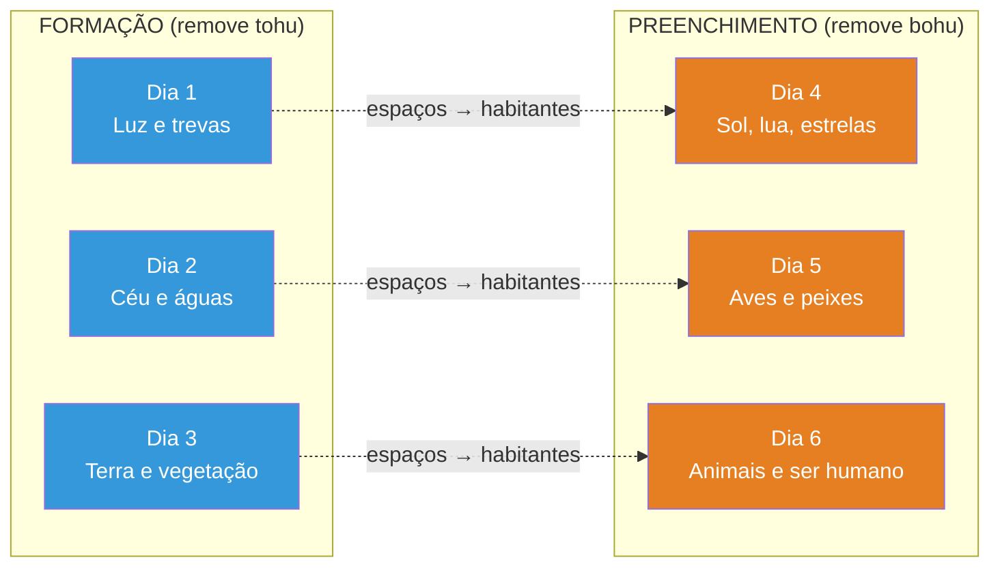
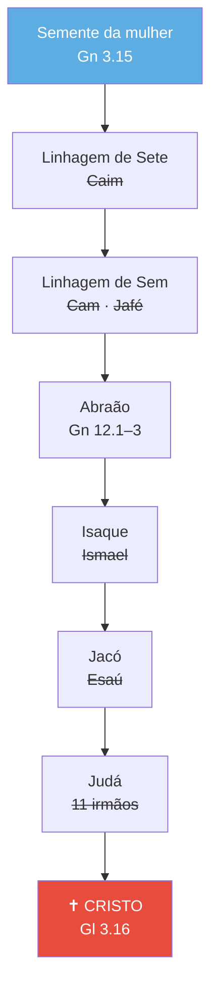
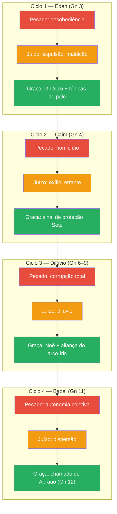

# Gênesis — Comentado e Explicado

**Uma análise exegética (interpretação cuidadosa do texto bíblico), teológica e prática do livro de Gênesis à luz de toda a Escritura**

---

## Sumário

**[[#1. Origem e razão do livro]]**
- [[#1.1. O nome do livro]]
- [[#1.2. Gênesis dentro do Pentateuco]]
- [[#1.3. Propósito do livro]]
- [[#1.4. Propósito teológico e pastoral]]
- [[#1.5. Autoria mosaica: evidências e contexto]]
- [[#1.6. Datação e contexto histórico]]
- [[#1.7. Notas técnicas e históricas]]
- [[#1.8. Desafios de interpretação e humildade na leitura]]

**[[#2. Gênesis na história da interpretação]]**
- [[#2.1. A leitura judaica antiga]]
- [[#2.2. Os Pais da Igreja (era patrística)]]
- [[#2.3. A Reforma: retorno ao texto]]
- [[#2.4. A era crítica moderna]]
- [[#2.5. Leituras contemporâneas no campo evangélico]]

**[[#3. Estrutura literária de Gênesis]]**
- [[#3.1. Dois grandes blocos]]
- [[#3.2. A fórmula *toledot* ("estas são as gerações de…")]]
- [[#3.3. Estruturas quiásticas]]
- [[#3.4. O padrão formação–preenchimento nos dias da criação]]
- [[#3.5. Outros recursos literários]]

**[[#4. Temas centrais e eixos teológicos]]**
- [[#4.1. Deus, o Criador e Senhor]]
- [[#4.2. Bênção vs. maldição]]
- [[#4.3. A semente e a descendência]]
- [[#4.4. A terra]]
- [[#4.5. A aliança]]
- [[#4.6. Casamento e sexualidade na ordem da criação]]
- [[#4.7. Gênesis como antídoto às ideologias contemporâneas]]
- [[#4.8. Eleição soberana: o padrão do mais novo sobre o mais velho]]

**[[#5. Da bondade original à necessidade de redenção]]**
- [[#5.1. A criação "muito boa"]]
- [[#5.2. O mandato cultural: a vocação humana na criação]]
- [[#5.3. A intrusão do mal]]
- [[#5.4. O ritmo teológico de Gênesis 1–11: queda, juízo e graça]]

**[[#6. Gênesis e o mundo antigo (ANE — *Ancient Near East*, Antigo Oriente Próximo)]]**
- [[#6.1. Gênesis vs. *Enuma Elish* (mito babilônico da criação)]]
- [[#6.2. Gênesis vs. Épico de Atrahasis]]
- [[#6.3. Gênesis vs. Épico de Gilgamesh (narrativa do dilúvio)]]
- [[#6.4. Gênesis vs. cosmogonias egípcias]]
- [[#6.5. Leituras debatidas (nota honesta de método)]]

**[[#7. Gênesis e a ciência]]**
- [[#7.1. Revelação e investigação científica: esferas distintas, mesmo Criador]]
- [[#7.2. Os "dias" de Gênesis 1: leituras evangélicas em debate]]
- [[#7.3. A idade da terra e do universo]]
- [[#7.4. Criação e evolução]]
- [[#7.5. Modelos de relação entre fé e ciência]]
- [[#7.6. A postura reformada: de Calvino aos nossos dias]]

**[[#8. Gênesis e o restante da Bíblia (fio canônico)]]**
- [[#8.1. Cristo como Verbo criador e centro da criação]]
- [[#8.2. Adão e Cristo: o primeiro e o último]]
- [[#8.3. Outras tipologias cristológicas em Gênesis]]
- [[#8.4. José como tipo de Cristo]]
- [[#8.5. Jesus e Gênesis nos Evangelhos]]
- [[#8.6. Hebreus: Melquisedeque e o capítulo da fé]]
- [[#8.7. Criação → Nova Criação: o arco que abre e fecha a Bíblia]]

**[[#9. Gênesis na vida da igreja]]**
- [[#9.1. Por que pregar e ensinar Gênesis hoje]]
- [[#9.2. Gênesis no discipulado e na formação de cosmovisão]]
- [[#9.3. Gênesis no aconselhamento pastoral]]
- [[#9.4. Gênesis na educação cristã e catequese]]
- [[#9.5. Gênesis e a apologética]]
- [[#9.6. Gênesis e a missão]]

**[[#10. Referências rápidas para catequese e ensino]]**

**[[#11. Bibliografia recomendada]]**

**[[#12. Notas]]**

**[[#13. Índice dos capítulos]]**

---

## 1. Origem e razão do livro

### 1.1. O nome do livro

O título "Gênesis" que usamos em português não vem do hebraico, mas da **Septuaginta (LXX)** — a tradução do Antigo Testamento do hebraico para o grego, feita em Alexandria (Egito) entre aproximadamente 250 e 150 a.C. A Septuaginta foi amplamente utilizada pelos judeus da diáspora, pelos primeiros cristãos e pelos próprios autores do Novo Testamento.

A palavra grega **γένεσις** (*génesis*) significa **origem, nascimento, começo** — o que reflete bem o conteúdo do livro, que trata das origens de tudo: do universo, da humanidade, do pecado, das nações e de Israel.

Na Bíblia hebraica, porém, o livro não recebe um nome temático. Seguindo o costume judaico de nomear cada livro pela sua primeira palavra, Gênesis se chama **בְּרֵאשִׁית** (*Bereshit*), que significa **"No princípio"** — exatamente as primeiras palavras do capítulo 1:

> "No princípio, Deus criou os céus e a terra."
> *(Gênesis 1.1)*

### 1.2. Gênesis dentro do Pentateuco

Gênesis é o primeiro de um conjunto de cinco livros chamado **Pentateuco** — do grego *penta* (cinco) + *teuchos* (rolo/livro). Na tradição judaica, esse conjunto é chamado de **Torá** (תּוֹרָה), palavra que significa não apenas "lei", mas **instrução, ensino divino** — a orientação de Deus para o seu povo.

| Ordem | Livro | Tema geral |
|-------|-------|------------|
| 1 | **Gênesis** | Origem do mundo e do povo de Israel |
| 2 | Êxodo | Libertação do Egito |
| 3 | Levítico | Leis sacerdotais e santidade |
| 4 | Números | Peregrinação no deserto |
| 5 | Deuteronômio | Repetição e aplicação da Lei |

Esses cinco livros formam uma **narrativa contínua**: onde Gênesis termina — com Israel estabelecido no Egito —, Êxodo começa, contando a escravização e a libertação. Levítico organiza o sistema de culto e santidade, Números narra a jornada de quarenta anos no deserto, e Deuteronômio registra os discursos finais de Moisés antes da entrada na Terra Prometida. É, na prática, **um único grande livro dividido em cinco partes**.

### 1.3. Propósito do livro

O livro de Gênesis foi escrito por Moisés durante os quarenta anos de peregrinação do povo de Israel no deserto, a caminho da Terra Prometida. Seu propósito central era relatar como tudo começou: por que existe algo em vez de nada, a origem do mundo, da vida e do ser humano.

Gênesis também explica a origem do casamento e de sua natureza, a causa da maldição que pesa sobre a humanidade e sobre a terra, e como o pecado entrou na experiência humana por meio da desobediência — não a origem cósmica do mal em si, que permanece entre os mistérios de Deus, mas o caminho concreto pelo qual a morte, a violência e a injustiça passaram a fazer parte da história:

> "As coisas encobertas pertencem ao SENHOR, nosso Deus, porém as reveladas nos pertencem, a nós e aos nossos filhos, para sempre, para que cumpramos todas as palavras desta lei."
> *(Deuteronômio 29.29)*

A partir disso, revela a necessidade de um Redentor.

Além disso, Gênesis tinha como foco registrar as origens do povo de Israel, que, após quatrocentos anos no Egito, haviam assimilado os costumes, práticas e conhecimentos egípcios, incluindo suas crenças, fé e religião. Como consequência, perderam quase por completo o conhecimento histórico sobre suas próprias origens e sobre o Deus verdadeiro.

Gênesis, portanto, funciona como um **memorial teológico**: reconta como Israel chegou até ali, as promessas de Deus aos patriarcas e a aliança estabelecida com Abraão. Reafirma:
- a origem da fé de Israel,
- a identidade do verdadeiro Deus,
- a eleição de um povo específico,
- e a base moral e teológica pela qual Israel receberia a terra prometida.

Por fim, Gênesis fornece a **base moral** que justifica a conquista da Terra Prometida: Deus, como Criador e Senhor de tudo, tem direito de julgar as nações pecadoras e de entregar a terra aos descendentes de Abraão, quando a iniquidade dos povos anteriores se completasse:

> "O SENHOR disse a Abrão, depois que Ló se separou dele: — Erga os olhos e olhe de onde você está para o norte, para o sul, para o leste e para o oeste; porque toda essa terra que você está vendo, eu a darei a você e à sua descendência, para sempre."
> *(Gênesis 13.14–15)*

> "Na quarta geração, voltarão para cá; porque a medida da iniquidade dos amorreus ainda não se encheu."
> *(Gênesis 15.16)*

### 1.4. Propósito teológico e pastoral

Do ponto de vista teológico e pastoral, Gênesis responde a perguntas fundamentais:
- Quem é Deus?
- O que é o mundo?
- Quem somos nós?
- Por que o mundo é como é (belo e, ao mesmo tempo, quebrado)?
- Por que precisamos de um Redentor?

Ele mostra que o mundo não surgiu ao acaso, nem de conflitos entre deuses, mas de um **Deus único, pessoal e soberano**, que cria com propósito e ordem. Ao mesmo tempo, explica por que esse mundo criado "muito bom" hoje é marcado por morte, violência e injustiça (Gn 3–4; 6–9; 11).

### 1.5. Autoria mosaica: evidências e contexto

A tradição judaica e cristã é unânime por milênios: Moisés é o autor do Pentateuco (Gênesis a Deuteronômio). Essa atribuição permaneceu inquestionada até o Iluminismo europeu.

**Testemunho de Jesus Cristo:**
O próprio Jesus reconhece Moisés como autor:

> "Porque, se vocês, de fato, cressem em Moisés, também creriam em mim; pois ele escreveu a meu respeito. Se, porém, não creem nos escritos dele, como crerão nas minhas palavras?"
> *(João 5.46–47)*

Para quem confessa Cristo como Senhor, o testemunho dele sobre a autoria de Moisés tem peso definitivo.

**Evidência interna do Pentateuco:**
O texto refere-se a Moisés escrevendo em diversas passagens (Êx 17.14; 24.4–7; 34.27; Nm 33.2; Dt 31.9,22,24). Além disso, o autor demonstra familiaridade detalhada com nomes, costumes, geografia, plantas e animais do Egito — conhecimento difícil de obter sem experiência direta.

**O problema do tempo histórico — inspiração para eventos pré-mosaicos:**
Moisés nasceu séculos depois de muitos dos eventos narrados em Gênesis. Ele não testemunhou a criação, o dilúvio nem a vida dos patriarcas. Como, então, pôde escrever sobre eles? A tradição cristã reconhece três vias complementares:

1. **Revelação divina direta** — Deus revelou a Moisés informações que ele não poderia obter por meios naturais, assim como revelou a Lei no Sinai.
2. **Tradição oral** — Na cultura antiga, a memorização e a transmissão fiel de narrativas entre gerações era prática estabelecida e confiável.
3. **Registros escritos anteriores** — Moisés pode ter utilizado documentos, genealogias e tábuas preservadas pelos patriarcas ao longo das gerações (a tese do *colofão* — nota de autoria colocada no final de um documento antigo — de Wiseman[^wiseman-1985], discutida na seção 3.2, apoia essa possibilidade).

Em todas essas vias, o princípio fundamental permanece: a Escritura é **inspiração divina**. O Espírito Santo guiou Moisés na composição do texto, garantindo que o registro fosse fiel e autoritativo, independentemente da fonte humana:

> "Toda a Escritura é inspirada por Deus e útil para o ensino, para a repreensão, para a correção, para a educação na justiça."
> *(2 Timóteo 3.16)*

**Fontes e composição:**
A maioria dos eruditos evangélicos reconhece que Moisés provavelmente usou fontes e documentos anteriores preservados pelo povo de Israel. Kenneth Mathews qualifica a autoria mosaica como "autor/compilador" que "acessou uma variedade de fontes antigas"[^mathews-1996]. Isso não diminui a autoria nem a inspiração — significa que Moisés, guiado pelo Espírito, organizou e redigiu material tanto recebido por revelação quanto preservado pela tradição oral e escrita.

**A hipótese documentária (JEDP) e a resposta evangélica:**
A partir do século XIX, especialmente com Julius Wellhausen[^wellhausen-1883], ganhou força a chamada **hipótese documentária**, que propõe que o Pentateuco foi compilado a partir de quatro fontes independentes: **J** (Javista, que usa o nome YHWH), **E** (Eloísta, que usa Elohim), **D** (Deuteronomista) e **P** (Sacerdotal, do alemão *Priestercodex*). Essa teoria dominou a academia por quase todo o século XX.

A tradição evangélica e reformada respondeu com objeções consistentes:

1. **O testemunho de Cristo** — Jesus, Paulo e Lucas atribuem os escritos a Moisés (Jo 5.46–47; Lc 24.27,44; Rm 10.5). Se a hipótese JEDP fosse verdadeira, Jesus estaria em erro sobre a origem de sua própria Escritura — algo incompatível com a confissão de que Ele é o Senhor.
2. **Fragilidade metodológica** — A divisão em fontes baseia-se em critérios como o uso de nomes divinos diferentes e supostas duplicações, mas esses fenômenos têm explicações literárias e teológicas adequadas. Autores antigos usavam nomes divinos diferentes conforme o contexto teológico, não porque fossem autores diferentes.
3. **Ausência de paralelos** — Não existe evidência de nenhum processo editorial de "cortar e colar" documentos como o proposto pela hipótese em qualquer literatura antiga do Oriente Próximo.
4. **Fragmentação contemporânea** — A própria academia secular questiona hoje a hipótese das quatro fontes como excessivamente simplista. Estudiosos como R. N. Whybray, John Van Seters e Rolf Rendtorff propuseram modelos alternativos, e o consenso acadêmico está longe de ser monolítico.

Isso não significa que Moisés não usou fontes — como visto acima, a tradição evangélica reconhece isso. A diferença é que o modelo evangélico vê Moisés como **autor principal sob inspiração divina**, não como um editor tardio costurando tradições contraditórias.

### 1.6. Datação e contexto histórico

A composição de Gênesis situa-se entre aproximadamente **1446 e 1406 a.C.**, durante a peregrinação de Israel no deserto. Provavelmente foi escrito enquanto Israel acampava no Sinai, período em que Moisés também recebeu a Lei.

**Contexto egípcio:**
Gênesis foi escrito para um povo que acabara de sair de quatrocentos anos no Egito. Isso explica elementos polêmicos no texto — a narrativa da criação confronta diretamente a cosmologia egípcia: enquanto os egípcios divinizavam o sol (Rá), as águas e a terra, Gênesis subordina todos esses elementos à Palavra de um Deus único. As pragas do Êxodo já são, em certo sentido, antecipadas pela teologia de Gênesis 1: Yahweh é Senhor de tudo o que o Egito adorava como deus.

**Evidências arqueológicas de antiguidade:**
Vários dados arqueológicos confirmam que o conteúdo de Gênesis reflete com precisão o segundo milênio a.C., período dos patriarcas:

- **Textos de Ebla (séc. XXIV a.C.)** — Descobertos em 1975 na Síria, mencionam o nome "Ebrium", possivelmente identificável com Éber de Gênesis 10.21. Esses arquivos contêm nomes pessoais e práticas comerciais compatíveis com o mundo patriarcal.
- **Textos de Mari (séc. XVIII a.C.)** — Encontrados no atual Iraque, atestam nomes patriarcais semelhantes aos de Gênesis (como formas análogas a Abraão, Jacó e Benjamim) e costumes tribais da região da Mesopotâmia.
- **Textos de Nuzi (séc. XV a.C.)** — Documentam práticas jurídicas que iluminam passagens de Gênesis: a adoção de um escravo como herdeiro na ausência de filhos (cf. Gn 15.2–3, Abraão e Eliezer), a entrega de uma serva para gerar filhos (cf. Gn 16.1–4, Sara e Hagar) e a venda do direito de primogenitura (cf. Gn 25.29–34, Esaú e Jacó).
- **Costumes e preços** — O preço de vinte siclos de prata pago por José como escravo (Gn 37.28) corresponde ao valor de mercado documentado para escravos no período patriarcal; em épocas posteriores, o preço era significativamente maior.

Esses dados não "provam" a Bíblia — mas confirmam que o cenário descrito em Gênesis é autêntico para o período que alega retratar, e não uma ficção tardia como a hipótese documentária sugeria.

### 1.7. Notas técnicas e históricas

- **Autoria e comunidade de leitura:** tradição mosaica com redação para **Israel em peregrinação** (contexto de Êxodo–Números). O alvo é formar o povo no **monoteísmo**, na **aliança** e na **identidade** distinta de Egito/Canaã.
- **Gênero literário: narrativa histórica de alta estilização** (repetições, paralelos, fórmulas). Não é mito; é teologia em história.
- **Propósito catequético:** Gênesis serve como **catecismo nacional**: quem é Deus, quem somos, qual a vocação, por que precisamos de redenção.

### 1.8. Desafios de interpretação e humildade na leitura

Gênesis apresenta desafios interpretativos significativos, especialmente nos capítulos 1–11, que cobrem eventos anteriores à existência da escrita e que Moisés não presenciou. Questões como a duração dos dias da criação, a extensão do dilúvio, o significado das genealogias e a linguagem figurativa do texto antigo são amplamente debatidas — e continuarão sendo.

Diante desses desafios, a postura correta é de **humildade e reverência**. Dois extremos devem ser evitados:

- **O simplismo** — ignorar os textos difíceis ou descartá-los como irrelevantes, perdendo a riqueza teológica que Deus depositou ali.
- **A hiper-análise** — tentar explicar cada microdetalhe à luz do conhecimento moderno, forçando o texto a responder perguntas que ele não se propôs a responder.

O caminho do estudo sério e fiel é intermediário: investigar ao máximo o que foi revelado, buscar o ensino espiritual e teológico que o texto oferece, e aceitar com paz que há mistérios que Deus reservou para si (Dt 29.29).

O propósito de Gênesis não é satisfazer todas as curiosidades científicas ou históricas, mas **revelar quem Deus é, quem somos e por que precisamos de redenção**. Quanto mais humilde a leitura, mais profundos os ensinamentos que se extraem dela.

---

## 2. Gênesis na história da interpretação

Gênesis não é lido no vácuo. Ao longo de mais de dois mil anos, judeus e cristãos o interpretaram de modos diversos — mas com uma continuidade notável nas afirmações centrais. Conhecer a história da interpretação protege o leitor de dois erros: achar que sua leitura é a única possível, ou achar que todas as leituras são igualmente válidas. A tradição interpretativa é mapa, não prisão — orienta sem substituir o texto.

### 2.1. A leitura judaica antiga

Os primeiros intérpretes de Gênesis foram os próprios escritores bíblicos posteriores — os Salmos, os Profetas e a literatura sapiencial releem Gênesis constantemente. Mas a tradição judaica pós-bíblica também produziu leituras influentes:

**Septuaginta (LXX, séc. III–II a.C.):** A tradução grega do AT já é um ato interpretativo. A escolha de *génesis* como título (em vez de traduzir *Bereshit*) revela como os tradutores entendiam o livro: é sobre *origens*. A LXX também verteu *ruach Elohim* (Gn 1.2) como *pneuma theou* ("Espírito de Deus"), interpretação que influenciou toda a leitura cristã posterior.

**Fílon de Alexandria (c. 20 a.C. – 50 d.C.):** Judeu helenizado, Fílon leu Gênesis através da filosofia platônica, aplicando o método **alegórico** extensivamente. Para ele, o relato da criação em seis dias não descreve tempo literal, mas uma ordem lógica — os "dias" são categorias de inteligibilidade divina. A criação de Adão é, ao mesmo tempo, história e alegoria da alma humana. Fílon influenciou profundamente a escola alexandrina cristã.

**Flávio Josefo (37–100 d.C.):** Historiador judeu que escreveu para o público greco-romano, Josefo tratou Gênesis como **narrativa histórica confiável** em suas *Antiguidades Judaicas*. Apresentou os patriarcas como figuras históricas reais e defendeu a antiguidade e superioridade da tradição mosaica sobre as mitologias pagãs.

**Targumim e Midrash:** Os targumim (traduções aramaicas) e os midrashim (comentários rabínicos) revelam como a sinagoga antiga lia Gênesis. Dois destaques: (1) o Targum Pseudo-Jonatã interpreta Gênesis 3.15 como referência ao **Rei Messias**, mostrando que a leitura messiânica do *protoevangelium* tem raízes judaicas, não apenas cristãs; (2) o Midrash *Bereshit Rabbah* (séc. V) é o comentário rabínico mais extenso de Gênesis e evidencia que os rabinos liam o texto com atenção simultânea ao sentido literal (*peshat*) e ao sentido homilético (*derash*).

### 2.2. Os Pais da Igreja (era patrística)

A igreja primitiva herdou Gênesis como Escritura e o leu à luz de Cristo — mas com métodos diferentes conforme a escola.

**Duas escolas, dois métodos:**

| Escola | Método | Ênfase | Representantes |
|--------|--------|--------|----------------|
| **Alexandria** | Alegórico/espiritual | O sentido "mais profundo" por trás da letra | Clemente, Orígenes, Dídimo |
| **Antioquia** | Histórico-gramatical | O sentido pretendido pelo autor no contexto original | Teodoro de Mopsuéstia, João Crisóstomo, Teodoreto |

**Ireneu de Lyon (c. 130–202):** Primeiro grande teólogo a articular Gênesis dentro de um sistema teológico completo. Identificou Gênesis 3.15 como a primeira profecia messiânica (*protoevangelium*)[^ireneu-180] e desenvolveu a doutrina da **recapitulação**: Cristo refaz e redime tudo o que Adão corrompeu. Para Ireneu, toda a história bíblica é um arco único de criação → queda → redenção → restauração.

**Orígenes (c. 185–253):** Brilhante mas controverso, Orígenes levou a alegoria ao extremo. Admitia que os "dias" da criação não podiam ser literais (como poderia haver "tarde e manhã" antes do sol?), mas propunha um sentido espiritual que, por vezes, se afastava da intenção do texto. A tradição reformada reconhece a erudição de Orígenes mas rejeita seu método alegórico como princípio hermenêutico.

**Agostinho de Hipona (354–430):** Gigante na interpretação de Gênesis. Escreveu pelo menos cinco obras sobre o tema, incluindo *De Genesi ad Litteram* ("Sobre Gênesis, ao pé da letra") — onde, ironicamente, propôs que a criação pode ter sido **instantânea**, com os seis dias representando um esquema de revelação angélica, não cronologia sequencial. Agostinho fixou verdades centrais que permaneceram consenso em toda a tradição cristã:

- *Creatio ex nihilo* — Deus criou do nada; a matéria não é eterna.
- A bondade essencial da criação — o mal não é substância, é privação do bem (*privatio boni*).
- O pecado original — a queda de Adão afetou toda a humanidade, transmitindo culpa e corrupção.
- A Escritura não ensina ciência natural — "o Espírito Santo não quis ensinar aos homens essas coisas que não têm utilidade para a salvação."

**João Crisóstomo (c. 347–407):** Representante da escola de Antioquia, pregou extensivamente sobre Gênesis (67 homilias). Insistia no **sentido literal e histórico** do texto: os dias são dias, os eventos são eventos, e a tarefa do intérprete é entender o que Moisés quis comunicar ao seu público original. Seu método histórico-gramatical é o mais próximo do que a tradição reformada adotaria mil anos depois — embora a questão específica da duração dos "dias" continue em debate legítimo dentro dessa mesma tradição (ver seção 7.2).

### 2.3. A Reforma: retorno ao texto

A Reforma Protestante do século XVI representou uma revolução hermenêutica. Os reformadores rejeitaram o método alegórico medieval (que acumulara quatro "sentidos" da Escritura) e retornaram ao **sentido literal-gramatical** — o significado que o autor humano pretendia comunicar, entendido à luz da gramática, do contexto histórico e da analogia da fé.

**Martinho Lutero (1483–1546):** Dedicou dez anos (1535–1545) a comentar Gênesis — suas *Preleções sobre Gênesis* ocupam oito volumes em suas obras completas. Lutero insistia que Gênesis é **história real**, não mito ou alegoria. Sobre os dias da criação, afirmou: "Moisés escreveu em linguagem simples, para que o povo pudesse entender. Quando Moisés diz que Deus criou os céus e a terra e tudo o que neles há em seis dias, então temos de aceitar que foram seis dias." (Essa posição de Lutero, embora influente, não é unanimidade na tradição reformada — ver seção 7.2 para o debate e a posição adotada neste projeto.) Ao mesmo tempo, enfatizou que o centro de Gênesis é Cristo: a promessa de Gênesis 3.15 é "o primeiro evangelho" e toda a história patriarcal aponta para Ele.

**João Calvino (1509–1564):** O comentário de Calvino sobre Gênesis (1554) é uma das obras exegéticas mais influentes da história da igreja[^calvino-1554]. Três contribuições são especialmente duradouras:

1. **O princípio da acomodação** — Deus adapta sua comunicação à capacidade humana. Moisés não escreveu como astrônomo ou filósofo natural, mas como pastor para seu povo.
2. **Exegese centrada na intenção do autor** — O intérprete deve buscar o que Moisés quis dizer ao público original, não sentidos ocultos ou alegóricos.
3. **O *sensus literalis* como sentido pleno** — Para Calvino, o sentido literal não é raso nem simplista — é o sentido completo do texto quando lido em seu contexto gramatical, histórico e canônico.

A tradição reformada subsequente — expressa na Confissão de Fé de Westminster (1646) e nos padrões confessionais — manteve esses princípios e afirmou: Deus criou o mundo "do nada", "no espaço de seis dias", e "tudo muito bom"[^cfw-4]. A expressão "no espaço de seis dias" é historicamente debatida dentro da própria tradição reformada: teólogos como B. B. Warfield e Herman Bavinck a interpretaram como compatível com dias não literais, enquanto outros mantiveram a leitura estritamente cronológica (ver seção 7.2).

### 2.4. A era crítica moderna

A partir do Iluminismo (séc. XVIII), a leitura de Gênesis sofreu uma transformação radical na academia europeia. O texto deixou de ser tratado primariamente como revelação divina e passou a ser analisado como documento humano sujeito a dissecção histórica e literária.

**A hipótese documentária (JEDP):** Já discutida em detalhe na seção 1.5, a teoria de Wellhausen[^wellhausen-1883] dominou a academia por mais de um século mas hoje está em fragmentação interna. Para a análise completa — fontes, objeções evangélicas e resposta reformada — ver seção 1.5.

**Crítica da forma (*Formgeschichte*):** Hermann Gunkel (1901) classificou as narrativas de Gênesis por gênero literário — mitos de criação, sagas patriarcais, etiologias. Sua contribuição para a análise literária foi significativa, mas seu pressuposto de que Gênesis contém "mitos" no sentido de ficções religiosas é incompatível com a confissão evangélica da historicidade do texto.

**Arqueologia e vindicação:** Paradoxalmente, os mesmos séculos que produziram a crítica destrutiva também produziram descobertas arqueológicas que **confirmaram** o cenário histórico de Gênesis: Ebla, Mari, Nuzi, os costumes patriarcais, os preços de escravos (ver seção 1.6). A arqueologia não "prova" a Bíblia, mas derrubou a alegação de que Gênesis é ficção tardia.

### 2.5. Leituras contemporâneas no campo evangélico

A partir da segunda metade do século XX, a erudição evangélica produziu uma geração de comentaristas que combinou rigor acadêmico com compromisso confessional. Esses autores — muitos dos quais são citados ao longo deste projeto — recuperaram a leitura de Gênesis como **texto inspirado, historicamente enraizado e teologicamente normativo**.

**Abordagem narrativa:**

Robert Alter (*The Art of Biblical Narrative*, 1981) revolucionou o estudo de Gênesis ao demonstrar a sofisticação literária do texto hebraico — repetições, ironia, diálogos, jogos de palavras — que a crítica das fontes desmontava em "fragmentos" sem perceber que eram técnicas narrativas deliberadas. Embora Alter não seja teólogo evangélico, sua análise literária confirmou o que os reformadores intuíam: Gênesis é obra unitária e magistralmente composta.

**Abordagem canônica:**

Brevard Childs e John Sailhamer[^sailhamer-1992] propuseram ler Gênesis no contexto do cânon completo — não como documento isolado, mas como parte do Pentateuco e da Bíblia como um todo. Sailhamer argumenta que o autor do Pentateuco organizou deliberadamente o material para apontar para o Messias, e que Gênesis 49.8–12 (a profecia de Siló/Judá) é a chave interpretativa de toda a obra.

**Comentários evangélicos de referência:**

Os grandes comentários evangélicos contemporâneos — Hamilton[^hamilton-1990], Wenham[^wenham-1987], Mathews[^mathews-1996] e Waltke[^waltke-2001] — compartilham convicções fundamentais: autoria mosaica (com uso de fontes), historicidade das narrativas, *creatio ex nihilo*, unidade do texto e leitura cristológica. Diferem em questões secundárias (como os "dias" e a *toledot*), mas concordam no essencial. Juntos, representam a maturidade da erudição evangélica sobre Gênesis no final do século XX e início do XXI (ver seção 11 para detalhes bibliográficos).

**A postura deste projeto:**

Este comentário se insere na tradição reformada e evangélica. Adota o método **gramático-histórico** de interpretação (que lê o texto conforme a gramática original e o contexto histórico em que foi escrito): busca o sentido pretendido pelo autor humano (Moisés), no contexto original (Israel no deserto), iluminado pela revelação posterior (o cânon completo) e centrado em Cristo. Honra a tradição interpretativa sem idolatrá-la — a norma final é sempre a Escritura, lida sob a guia do Espírito Santo.

---

## 3. Estrutura literária de Gênesis

### 3.1. Dois grandes blocos

Gênesis se divide em duas grandes partes:

**Capítulos 1–11 — História primitiva (*primeval history*)**

- Criação (1–2)
- Queda (3)
- Caim e Abel (4)
- Dilúvio (6–9)
- Torre de Babel (11)

Aqui, o foco está na **humanidade em geral** e em temas universais: origem do universo, do pecado humano, da cultura, das nações e da necessidade de redenção.

**Capítulos 12–50 — História patriarcal**

- Abraão, Isaque, Jacó e José.

O foco passa do cosmos para uma **família específica**, por meio da qual virá o Messias.

Esse arranjo literário mostra um movimento de funil e expansão:

**Panorama cronológico:** Gênesis cobre um período imenso — desde a criação do mundo até a morte de José no Egito, abrangendo mais de dois mil anos de narrativa bíblica:

| Período | Evento principal | Referência |
|---------|-----------------|------------|
| Criação | Deus cria os céus e a terra | Gênesis 1–2 |
| Queda | Entrada do pecado na experiência humana | Gênesis 3 |
| Primeiras gerações | Caim e Abel, linhagens de Sete e Caim | Gênesis 4–5 |
| Dilúvio | Juízo de Deus e preservação de Noé | Gênesis 6–9 |
| Pós-dilúvio | Nações e Torre de Babel | Gênesis 10–11 |
| Patriarcas | Abraão, Isaque, Jacó e José | Gênesis 12–50 |

**Os patriarcas e suas porções no livro:** A história patriarcal ocupa quatro quintos do livro e se concentra em quatro personagens principais:

| Patriarca | Capítulos | Destaque |
|-----------|-----------|----------|
| **Abraão** | 12–25 | Chamado, aliança, fé, sacrifício de Isaque |
| **Isaque** | 21–26 | Filho da promessa, bênção transmitida |
| **Jacó** | 25–36 | Luta, transformação, as doze tribos |
| **José** | 37–50 | Rejeição, exaltação, preservação de Israel no Egito |

De Jacó — que recebe de Deus o nome **Israel** — nascem os doze filhos que formarão as **doze tribos de Israel**, fundamento de toda a história nacional que se segue no restante do Antigo Testamento.

**Uma proporção reveladora:** quatro quintos do livro (caps. 12–50) cobrem apenas quatro gerações (Abraão até José), enquanto um quinto (caps. 1–11) cobre vinte gerações (Adão até Abraão). Isso mostra que, para Gênesis, a eleição de uma família importa mais do que a panorâmica da história universal — o particular serve o universal[^hamilton-1990].

### 3.2. A fórmula *toledot* ("estas são as gerações de…")

A espinha dorsal do livro é a fórmula **toledot** (estas são as gerações de…), que aparece **11 vezes** em Gênesis, marcando **10 seções** distintas (as *toledot* de Esaú em Gn 36.1 e 36.9 contam como duas ocorrências da fórmula, mas formam uma única seção). Mais do que uma lista genealógica, cada *toledot* sinaliza uma transição narrativa — o bastão passa de um personagem ou era para o seguinte.

**Debate acadêmico — superinscrição ou colofão?**

Existe uma divergência importante entre estudiosos sobre como a fórmula *toledot* funciona. A resposta muda a maneira como lemos a estrutura do livro e como entendemos a transmissão do texto.

**Tese 1 — Superinscrição (título do que vem depois):**
Defendida por Gordon Wenham[^wenham-1987], Kenneth Mathews[^mathews-1996] e Bruce Waltke[^waltke-2001]. Nesta leitura, "estas são as gerações de X" funciona como **cabeçalho**: introduz o que aconteceu a partir de X, o que X gerou ou produziu. Wenham argumenta: "Na cláusula 'estas são as toledot de X', o próprio significado de *toledot* exige que a declaração aponte para aquilo que X produz, e não para as origens de X."

*Implicação:* Gn 2.4 ("estas são as gerações dos céus e da terra") abre a narrativa do Éden e da Queda — é o título da história que se segue. O foco teológico é **o que Deus faz por meio de cada geração**: cada seção mostra como a promessa avança, se estreita e se aprofunda, de Adão até Jacó.

**Tese 2 — Colofão/subscrição (conclusão do que veio antes):**
Proposta por P. J. Wiseman[^wiseman-1985] e adotada por R. K. Harrison[^harrison-1969]. Baseia-se no costume mesopotâmico de colocar o nome do autor ou proprietário **no final** de uma tábua de argila, não no início. Nesta leitura, "estas são as gerações de X" significa: *este é o registro que pertencia a X* ou *que X preservou*.

*Implicação:* Gn 2.4 encerraria o relato da criação (1.1–2.3), e Adão seria o "guardião" desse registro. Gn 5.1 encerraria o relato de Adão, com Noé como o próximo guardião, e assim por diante. Essa leitura reforça a ideia de que Gênesis foi compilado a partir de **documentos escritos reais** — tábuas preservadas pelos patriarcas ao longo das gerações — que Moisés, sob inspiração do Espírito, reuniu e editou como um todo coerente. Ela fortalece o argumento da **historicidade** e da **transmissão documental** do texto.

**Por que isso importa:**

A diferença não é meramente técnica — ela afeta a leitura do livro em pelo menos três níveis:

1. **Estrutura literária:** se a *toledot* olha para frente ou para trás, muda onde cada "seção" começa e termina, e, portanto, quais narrativas pertencem a qual unidade.
2. **Transmissão e confiabilidade:** a tese do colofão sugere fontes escritas patriarcais concretas, o que reforça a historicidade da narrativa e dá peso à afirmação de que Moisés trabalhou com material documental, não apenas com tradição oral.
3. **Ênfase teológica:** a superinscrição enfatiza *o que Deus produz a partir de cada personagem* — a história da promessa avançando. O colofão enfatiza *quem testemunhou e preservou o registro* — a fidelidade humana em guardar a revelação recebida.

Ambas as leituras são compatíveis com a autoria mosaica e com a inspiração plena da Escritura. A maioria dos comentaristas evangélicos contemporâneos adota a superinscrição, mas a tese do colofão permanece uma contribuição valiosa para entender como o material de Gênesis pode ter sido preservado antes de Moisés.

**As dez seções:**

| Referência | *Toledot* de… | Tipo |
|-----------|---------------|------|
| 2:4 | dos céus e da terra | Narrativa |
| 5:1 | de Adão | Genealogia |
| 6:9 | de Noé | Narrativa |
| 10:1 | dos filhos de Noé | Genealogia |
| 11:10 | de Sem | Genealogia |
| 11:27 | de Terá (Abraão) | Narrativa |
| 25:12 | de Ismael | Genealogia |
| 25:19 | de Isaque | Narrativa |
| 36:1 | de Esaú | Genealogia |
| 37:2 | de Jacó | Narrativa |

O padrão alterna entre genealogia e narrativa (N–G–N–G, N–G–N–G–N), progressivamente estreitando o foco do universal ao particular: **humanidade → patriarcas → Israel**.

### 3.3. Estruturas quiásticas

Gênesis usa extensivamente o **quiasmo** (padrão A–B–C–B'–A'), uma técnica literária que organiza a narrativa de fora para dentro, dirigindo a atenção do leitor ao centro — o ponto teológico principal.

**O dilúvio (Gn 6–9) — o quiasmo mais elaborado:**
Gordon Wenham identificou uma estrutura quiástica de **31 pontos**[^wenham-1987], onde o pivô central é Gênesis 8.1:

> "Então Deus se lembrou de Noé e de todos os animais selvagens e de todos os animais domésticos que estavam com ele na arca. Deus fez soprar um vento sobre a terra, e as águas começaram a baixar."
> *(Gênesis 8.1)*

Tudo antes desse versículo retrata o juízo; tudo depois descreve a compaixão e a renovação. A mensagem central da narrativa do dilúvio não é a destruição — é a **memória fiel de Deus**.

**Os ciclos patriarcais também são quiásticos:**
- **Ciclo de Abraão:** o ponto focal é Gênesis 17.1–5 — a aliança.
- **Ciclo de Jacó:** o ponto focal é Gênesis 30.22–25 — a decisão de retornar a Canaã.
- **Ciclo de José:** o ponto focal é Gênesis 45.1–4 — José se revela aos irmãos.

Cada ponto focal revela o tema teológico central daquele ciclo: **aliança, terra, povo**.

### 3.4. O padrão formação–preenchimento nos dias da criação

Gênesis 1.2 apresenta dois problemas: a terra estava **"sem forma" (*tohu*) e "vazia" (*bohu*)**. Os seis dias resolvem esses dois problemas em ordem paralela:

| Formação (dias 1–3) | Preenchimento (dias 4–6) |
|---------------------|------------------------|
| Dia 1: luz e trevas | Dia 4: sol, lua e estrelas |
| Dia 2: céu e águas | Dia 5: aves e peixes |
| Dia 3: terra e vegetação | Dia 6: animais e ser humano |

Os três primeiros dias **formam** os espaços (removem o *tohu*); os três últimos **preenchem** esses espaços com habitantes (removem o *bohu*). Isso revela um Deus que cria com **ordem, propósito e planejamento** — não por acidente ou conflito.

### 3.5. Outros recursos literários

**Repetição rítmica em Gênesis 1:**
As frases "E disse Deus", "E assim se fez" e "E viu Deus que era bom" se repetem em ciclos de sete, criando um ritmo litúrgico que enfatiza a natureza deliberada e soberana da criação.

**Inclusio (estrutura de moldura):**
Gênesis 1.1 e 2.4a usam exatamente as mesmas palavras hebraicas — *bara* ("criar"), *shamayim* ("céus") e *ha'aretz* ("a terra") — formando uma moldura que abre e fecha a narrativa da criação como uma unidade completa.

**Jogos de palavras no hebraico:**
Gênesis tem a maior concentração de trocadilhos com nomes de toda a Bíblia Hebraica:
- ***'adam*** (ser humano) e ***'adamah*** (terra/solo): o homem é "o terrestre feito da terra" — sua identidade está ligada ao solo de onde foi formado e que foi chamado a cultivar.
- ***'ish*** (homem) e ***'ishshah*** (mulher): em Gn 2.23, Adão reconhece Eva como "osso dos meus ossos" usando um trocadilho que em hebraico soa como "esta é *homem-a*, tirada do *homem*".

**Gênesis 1 e Gênesis 2 — complementaridade:**
Gênesis 1 é a visão panorâmica (o cosmos inteiro); Gênesis 2 é o zoom (o Éden, o casal, o jardim). Não são relatos contraditórios, mas **complementares** — prática comum na literatura antiga, onde primeiro se dá o esboço geral e depois se preenchem os detalhes. Wenham[^wenham-1987] observa que Gênesis 1 funciona como "abertura" ou "prelúdio" para a história que começa propriamente na *toledot* de 2.4.

---

## 4. Temas centrais e eixos teológicos

Gênesis responde às perguntas mais fundamentais da existência humana: Quem é Deus? De onde viemos? Por que o mundo é belo e, ao mesmo tempo, quebrado? Por que existe o mal? Qual é o plano de Deus para a humanidade? Sem as respostas plantadas aqui, o restante da Bíblia perde o alicerce.

Cinco temas funcionam como fios condutores que percorrem o livro de ponta a ponta e sustentam toda a teologia bíblica que vem depois. Ao mesmo tempo, esses eixos confrontam diretamente as cosmovisões dominantes tanto do mundo antigo quanto do contemporâneo.

### 4.1. Deus, o Criador e Senhor

A soberania da Palavra é o ponto de partida de Gênesis: Deus fala e acontece. Tudo o que existe depende dele; nada é autônomo. A distinção Criador–criatura é a primeira verdade do livro e a base de toda adoração correta.

Gênesis revela Deus em múltiplas dimensões:

- **Deus criador** (Gn 1–2) — Ele cria tudo pela palavra, sem esforço, sem matéria prévia, sem conflito. A criação não é emanação divina nem produto de batalha cósmica — é ato livre e soberano.
- **Deus soberano sobre a história** (Gn 11) — Ele governa o curso das nações. Quando a humanidade tenta construir seu próprio projeto à parte de Deus (Babel), Ele intervém e redireciona a história segundo o seu propósito.
- **Deus que faz alianças** (Gn 12; 15; 17) — Ele não é um Deus distante. Escolhe Abraão, compromete-se com promessas formais e irrevogáveis, e entra em relacionamento pactual com o seu povo.
- **Deus redentor** (Gn 3.15) — Já na primeira cena de juízo, surge a primeira promessa de salvação: a semente da mulher esmagará a cabeça da serpente. Deus não abandona sua criação — Ele a resgata.

Essa visão de Deus confronta diretamente o **naturalismo materialista** (que nega um Criador pessoal), o **panteísmo** (que identifica Deus com a natureza), o **politeísmo** (que fragmenta o divino em forças concorrentes) e o **deísmo** (que admite um criador mas nega sua atuação contínua na história).

### 4.2. Bênção vs. maldição

Da bênção da criação à maldição da Queda, e da maldição de volta à promessa de restauração: esse é o pêndulo que move a narrativa de Gênesis. Deus abençoa, o pecado amaldiçoa, mas a graça reabre o caminho da bênção.

A **essência da bênção divina** é a presença relacional de Deus — "Eu estarei com vocês". A maldição, por sua vez, é a alienação dessa presença. Toda a trajetória de Gênesis pode ser lida como o drama de Deus reabrindo o caminho para sua presença, que o pecado fechou.

A progressão da bênção em Gênesis segue três estágios que espelham a expansão do plano redentor:

1. **Abraão será abençoado** (Gn 12.2a) — Deus age primeiro sobre uma pessoa.
2. **Abraão será uma bênção** (Gn 12.2b) — Essa pessoa se torna canal de bênção para outros.
3. **Todas as nações serão abençoadas nele** (Gn 12.3) — O particular serve o universal; a eleição de um visa a restauração de todos.

Nas *toledot*, o tema é quantificável: nas três gerações maiores finais (Terá, Isaque, Jacó), a bênção é mencionada **81 vezes** e a maldição apenas **3**[^derouchie-2013] — sinal de que, em Abraão, a maré está virando. A história de Gênesis é um movimento que começa em bênção (Gn 1.28), mergulha na maldição (Gn 3.17), e gradualmente retorna à bênção por meio da promessa e da aliança (Gn 12.2–3).

É significativo que a maldição de Gênesis 3 atinge precisamente os dois aspectos do mandato criacional: a **semente** (dor no parto, Gn 3.16) e o **domínio sobre a terra** (o solo é amaldiçoado, Gn 3.17–19). As promessas abraâmicas respondem exatamente a essas duas maldições: Deus promete **descendência incontável** e **uma terra boa**. A bênção de Abraão é, teologicamente, a reversão da maldição de Adão.

### 4.3. A semente e a descendência

Desde o protoevangelho, a Bíblia rastreia uma linhagem: a semente da mulher → Sete → Noé → Sem → Abraão → Judá → Davi → Cristo. A primeira promessa da Escritura já aponta para essa descendência:

> "Porei inimizade entre você e a mulher, entre a sua descendência e o descendente dela. Este lhe ferirá a cabeça, e você lhe ferirá o calcanhar."
> *(Gênesis 3.15)*

Esse versículo — chamado de *protoevangelium* ("primeiro evangelho") — é a semente de toda a história da redenção. A palavra grega *protoevangelium* combina *protos* ("primeiro") e *evangelion* ("boa nova, evangelho"), significando literalmente o **primeiro anúncio do evangelho** na história. A identificação dessa promessa como messiânica remonta pelo menos a **Ireneu de Lyon**[^ireneu-180], que a considerou a primeira profecia messiânica da Escritura.

Tudo o que vem depois na Bíblia é, de certa forma, o desenvolvimento dessa promessa. Se Gênesis 3.15 é a estrutura esquelética, o restante da Escritura é o preenchimento deste único versículo. James Hamilton[^hamilton-jr-2007] observa que Gênesis 3.15 opera não através de citações diretas nas Escrituras posteriores, mas através de **imagens recorrentes e pressupostos narrativos** — a divisão da humanidade em duas linhagens (a semente da mulher e a semente da serpente) que percorre todo o livro: Sete vs. Caim, Sem vs. Cão, Abraão vs. as nações idólatras, Jacó vs. Esaú, Judá vs. seus irmãos.

A expressão "semente da mulher" é única na Escritura — normalmente a descendência é atribuída ao homem. Para a tradição cristã, isso aponta para o nascimento virginal de Cristo, que seria, literalmente, semente da mulher sem pai humano.

Paulo interpreta a descendência como referindo-se a **uma pessoa**:

> "Ora, as promessas foram feitas a Abraão e ao seu descendente. Não diz: 'E aos descendentes', como falando de muitos, porém como de um só: 'E ao seu descendente', que é Cristo."
> *(Gálatas 3.16)*

E a vitória prometida em Gênesis 3.15 ecoa até o final da Bíblia:

> "E o Deus da paz em breve esmagará Satanás debaixo dos pés de vocês."
> *(Romanos 16.20)*

O estreitamento progressivo da semente é um dos movimentos teológicos mais notáveis de Gênesis — a promessa começa ampla e vai se afunilando até uma pessoa:

| Passagem | Estreitamento |
|----------|---------------|
| 3.15 | A semente da mulher (humanidade em geral) |
| 4.25; 5.1–32 | A linhagem de Sete (não a de Caim) |
| 9.26–27 | A linhagem de Sem (não a de Cam nem de Jafé) |
| 12.1–3 | A linhagem de Abraão |
| 21.12; 26.24 | A linhagem de Isaque (não a de Ismael) |
| 28.13–14 | A linhagem de Jacó (não a de Esaú) |
| 49.8–12 | A linhagem de **Judá** (não as outras 11 tribos) |

A última etapa dentro de Gênesis é a bênção de Jacó sobre Judá, que contém a **profecia de Siló** — uma das passagens messiânicas mais antigas da Escritura:

> "O cetro não se arredará de Judá, nem o bastão de comando de entre os seus pés, até que venha Siló; e a ele obedecerão os povos."
> *(Gênesis 49.10)*

A palavra *Shiloh* (שִׁילֹה) é interpretada como "aquele a quem pertence" — um título real messiânico. O cetro e o bastão de comando indicam que o Messias virá da tribo de Judá como **rei**. Ezequiel retoma essa linguagem séculos depois: "até que venha aquele a quem pertence de direito, e a ele o darei" (Ez 21.27). Em Cristo, filho de Judá, o cetro encontra seu portador definitivo.

Gênesis planta a raiz dessa árvore genealógica da redenção.

### 4.4. A terra

A terra aparece como lugar de domínio e mordomia (Gn 1), como solo amaldiçoado pelo pecado (Gn 3), e como promessa concreta a Abraão, reconfirmada a Isaque e a Jacó:

> "Habite nela, e estarei com você e o abençoarei. Porque a você e à sua descendência darei todas estas terras e confirmarei o juramento que fiz a Abraão, o seu pai."
> *(Gênesis 26.3 — a Isaque)*

> "Eu sou o SENHOR, o Deus de Abraão, seu pai, e o Deus de Isaque. A terra em que você está deitado, eu a darei a você e à sua descendência. A sua descendência será como o pó da terra; você se estenderá para o oeste e para o leste, para o norte e para o sul. Em você e na sua descendência serão benditas todas as famílias da terra."
> *(Gênesis 28.13–14 — a Jacó)*

O tema da terra prometida nasce aqui e atravessa toda a Escritura. Abraão torna-se "herdeiro do mundo" (Rm 4.13) — a promessa de uma terra específica se expande para uma herança cósmica. Hebreus interpreta os patriarcas como peregrinos que "buscavam uma pátria melhor, isto é, celestial" (Hb 11.13–16), e Cristo é declarado herdeiro de "todas as coisas" (Hb 1.2). O arco se completa na nova terra de Apocalipse 21 — onde a promessa a Abraão encontra seu cumprimento pleno e definitivo.

### 4.5. A aliança

De Noé a Abraão, Deus se compromete de modo formal e irrevogável. A aliança com Abraão é triádica: **descendência, terra, bênção às nações** — e é esse tripé que sustenta toda a história da salvação dali em diante.

Gênesis registra três alianças que formam a base de toda a teologia pactual da Escritura. A cadeia pactual que começa aqui percorre toda a Bíblia:

**Aliança com Adão (Gn 1–2)** — Também chamada aliança da criação ou das obras. Deus estabelece um relacionamento com Adão como representante (*cabeça federal* — isto é, aquele cujos atos têm consequências legais e espirituais para todos os que ele representa, assim como a decisão de um líder afeta todo o seu povo) de toda a humanidade. Os termos são claros: obediência traz vida, desobediência traz morte. Adão desobedeceu, e sua queda afetou toda a raça humana:

> "Portanto, assim como por um só homem o pecado entrou no mundo, e pelo pecado, a morte, e assim a morte passou a todos os seres humanos, porque todos pecaram."
> *(Romanos 5.12)*

**Aliança com Noé (Gn 8.20–9.17)** — Após o dilúvio, Deus faz uma promessa unilateral de sustentar a criação: nunca mais destruirá a terra com águas. O arco-íris é o sinal perpétuo:

> "Deus disse: — Este é o sinal da minha aliança que faço entre mim e vocês e entre todos os seres vivos que estão com vocês, para todas as futuras gerações: porei o meu arco nas nuvens e ele será por sinal da aliança entre mim e a terra. (...) O arco estará nas nuvens; eu o verei e me lembrarei da aliança eterna entre Deus e todos os seres vivos de todas as espécies que há sobre a terra."
> *(Gênesis 9.12–13,16)*

Essa aliança reafirma a intenção criacional de Deus — o pecado e a maldição não frustrarão seus propósitos para a humanidade e para a terra.

**Aliança com Abraão (Gn 12; 15; 17)** — A aliança central de Gênesis e a coluna vertebral de toda a história da redenção. Começa com um chamado e uma promessa triádica — uma grande nação, uma terra de herança, e bênção a todas as nações:

> "O SENHOR disse a Abrão: — Saia da sua terra, da sua parentela e da casa do seu pai e vá para a terra que lhe mostrarei. Farei de você uma grande nação, e o abençoarei, e engrandecerei o seu nome. Seja uma bênção! Abençoarei aqueles que o abençoarem e amaldiçoarei aquele que o amaldiçoar. Em você serão benditas todas as famílias da terra."
> *(Gênesis 12.1–3)*

Em Gênesis 15, a aliança é formalizada por meio de um ritual extraordinário. No costume do Antigo Oriente Próximo, quando duas partes faziam uma aliança, ambas passavam entre animais cortados ao meio — significando: "que aconteça comigo o mesmo que aconteceu com estes animais, se eu quebrar esta aliança." Porém em Gênesis 15, Abrão é posto em sono profundo e **somente Deus** — representado por um forno fumegante e uma tocha de fogo — passa entre os animais cortados. Abrão não passa. Isso é teologicamente revolucionário: a aliança depende **inteiramente de Deus**, não da obediência de Abraão. Deus assume as consequências dos dois lados. É aliança de **graça incondicional**. É nesse mesmo contexto que aparece o versículo fundacional da justificação pela fé:

> "Levando‑o para fora da tenda, disse‑lhe: — Olhe para o céu e conte as estrelas, se é que pode contá‑las. Então, prosseguiu: — Assim será a sua descendência. Abrão creu no SENHOR, e o SENHOR lhe atribuiu isso como justiça."
> *(Gênesis 15.5–6)*

O Novo Testamento lê a promessa a Abraão como o Evangelho antes do Evangelho:

> "Ora, tendo a Escritura previsto que Deus justificaria pela fé os gentios, anunciou primeiro o evangelho a Abraão: 'Em você serão benditas todas as nações.'"
> *(Gálatas 3.8)*

A justificação pela fé não começa no NT — começa em Gênesis 15[^mathews-2005]. Abraão creu no SENHOR, e isso lhe foi imputado como justiça. Paulo e Tiago voltam a esse versículo repetidamente (Rm 4.3; Gl 3.6; Tg 2.23) porque ele estabelece o princípio que governa toda a soteriologia bíblica.

### 4.6. Casamento e sexualidade na ordem da criação

Gênesis não apenas narra a criação do homem e da mulher — ele **fundamenta o casamento na ordem criada**, antes da Queda, antes da Lei, antes de qualquer cultura humana. Isso significa que o padrão do casamento não é convenção social passageira, mas ordenança do Criador.

O próprio Senhor Jesus recorre a Gênesis 1–2 para definir o casamento:

> "— Não tendes lido que o Criador, desde o princípio, os fez homem e mulher e que disse: 'Por essa razão, o homem deixará pai e mãe e se unirá à sua mulher, tornando-se os dois uma só carne'? Assim, eles já não são dois, mas uma só carne. Portanto, que ninguém separe o que Deus uniu."
> *(Mateus 19.4–6)*

Com isso, Ele confirma Gênesis como **história teológica real** e fundamenta o casamento monogâmico e heterossexual na **ordem criada**.

Paulo volta à criação para falar da ordem na comunidade de fé:

> "Porque, primeiro, foi formado Adão, depois, Eva. E Adão não foi iludido, mas a mulher, sendo enganada, caiu em transgressão."
> *(1 Timóteo 2.13–14)*

E revela que o mistério do casamento aponta para algo maior:

> "Por esta razão, o homem deixará pai e mãe e se unirá à sua mulher, e os dois se tornarão uma só carne. Grande é este mistério, mas eu me refiro a Cristo e à igreja."
> *(Efésios 5.31–32)*

O casamento humano, instituído em Gênesis 2, é **tipo e sombra** da união entre Cristo e sua Igreja. Essa conexão revela que o casamento não é apenas uma instituição social, mas uma realidade teológica com significado eterno.

### 4.7. Gênesis como antídoto às ideologias contemporâneas

O texto de Gênesis 1–3 confronta, de modo direto, algumas das premissas mais difundidas da cultura contemporânea:

- O ser humano tem **identidade recebida de Deus** — criado à imagem divina, homem e mulher —, não construída do zero pela cultura ou pela autopercepção.
- O casamento e a sexualidade estão **fundados na ordem da criação**, não em consenso social ou convenção passageira.
- Existe um **padrão moral objetivo** — Deus e sua lei — que não se curva ao espírito de época.
- O problema do mundo **não é a estrutura criada, mas o pecado**. Nenhuma engenharia social substitui a redenção.
- A ciência séria **não é inimiga da fé**, mas também não é o árbitro final da verdade sobre Deus — há realidades que só a revelação alcança.

Gênesis é, portanto:
- fundamento da **teologia bíblica** (de criação a nova criação),
- fundamento da **ética cristã** (vida, casamento, trabalho, dignidade humana),
- e ponto de partida para entender a **história da salvação**.

### 4.8. Eleição soberana: o padrão do mais novo sobre o mais velho

Um dos padrões mais recorrentes e teologicamente carregados de Gênesis é a **inversão da primogenitura** — repetidamente, Deus escolhe o **mais novo** sobre o mais velho, subvertendo a ordem cultural e natural para demonstrar que a aliança depende da Sua escolha livre, não do mérito ou do direito humano.

Esse padrão aparece ao longo de todo o livro:

| Mais velho (preterido) | Mais novo (escolhido) | Referência |
|---|---|---|
| Caim | **Sete** (substitui Abel) | Gn 4.25 |
| Jafé e Cam | **Sem** | Gn 9.26 |
| Ismael | **Isaque** | Gn 17.18–21 |
| Esaú | **Jacó** | Gn 25.23; Ml 1.2–3 |
| Rúben (primogênito) | **Judá** (linhagem real) | Gn 49.8–10 |
| Manassés | **Efraim** | Gn 48.13–20 |

O caso de Jacó e Esaú é o mais explícito teologicamente[^wenham-1994]. Deus declara Sua escolha **antes do nascimento dos gêmeos**, antes de qualquer obra ou mérito:

> "Porque, não tendo os gêmeos ainda nascido, nem tendo praticado bem ou mal — para que o propósito de Deus, segundo a eleição, prevalecesse, não por obras, mas por aquele que chama —, foi-lhe dito a ela: 'O mais velho servirá ao mais moço.' Como está escrito: 'Amei Jacó, porém me aborreci de Esaú.'"
> *(Romanos 9.11–13)*

Esse padrão ensina que **a família de Deus é definida pelo Seu chamado, não por biologia, cultura ou esforço humano**. A eleição é por graça — e essa verdade, plantada em Gênesis, floresce plenamente no Novo Testamento.

---

## 5. Da bondade original à necessidade de redenção

### 5.1. A criação "muito boa"

Gênesis ensina que o mundo foi criado **"muito bom"**. Não havia dor, morte, sofrimento ou catástrofe na experiência humana original. A criação saiu das mãos de Deus completa, ordenada e abençoada:

> "Deus viu tudo o que havia feito, e eis que era muito bom. Houve tarde e manhã, o sexto dia."
> *(Gênesis 1.31)*

Essa afirmação é teologicamente decisiva. Se a criação é "muito boa", então o mal não é parte da natureza das coisas — é intruso. A morte, a violência e o sofrimento não pertencem ao projeto original de Deus. Qualquer cosmovisão que trate o mal como "natural" ou "inevitável" contradiz a revelação bíblica desde a sua primeira página.

### 5.2. O mandato cultural: a vocação humana na criação

Antes da Queda, Deus deu ao ser humano uma vocação concreta. Isso é o que a tradição teológica chama de **mandato cultural** — o chamado para trabalhar, criar, governar e desenvolver a criação como representantes de Deus:

> "E Deus disse: — Façamos o ser humano à nossa imagem, conforme a nossa semelhança. Tenha ele domínio sobre os peixes do mar, sobre as aves dos céus, sobre os animais domésticos, sobre toda a terra e sobre todos os animais que rastejam pela terra. Assim Deus criou o ser humano à sua imagem, à imagem de Deus o criou; homem e mulher os criou. E Deus os abençoou e lhes disse: — Sejam fecundos, multipliquem-se, encham a terra e sujeitem-na. Tenham domínio sobre os peixes do mar, sobre as aves dos céus e sobre todo animal que rasteja pela terra."
> *(Gênesis 1.26–28)*

> "O SENHOR Deus tomou o homem e o colocou no jardim do Éden para o cultivar e o guardar."
> *(Gênesis 2.15)*

O mandato cultural abrange a totalidade da vida humana. Não é apenas sobre agricultura ou reprodução — é sobre **toda atividade que reflete a imagem do Criador**:

- **Trabalho** — Deus trabalha na criação; o ser humano trabalha como reflexo dele. O trabalho não é maldição (a maldição é o sofrimento *no* trabalho, Gn 3.17–19); é vocação original.
- **Família** — "Sejam fecundos, multipliquem-se" — a família é a primeira instituição humana, estabelecida antes de qualquer governo, lei ou templo.
- **Ciência e conhecimento** — Adão nomeia os animais (Gn 2.19–20), exercendo capacidade de observação, classificação e linguagem — fundamentos de toda investigação do mundo criado.
- **Arte e cultura** — Criar, cultivar, dar forma ao mundo — atividades inerentemente humanas e inerentemente boas quando exercidas para a glória de Deus.
- **Governo e mordomia** — "Tenham domínio" não é licença para exploração, mas chamado à **mordomia responsável**. O ser humano governa a criação como vice-regente de Deus, não como dono autônomo.

Esse mandato **não foi anulado pela Queda** — foi distorcido. O pecado corrompeu a maneira como o ser humano exerce domínio (opressão em vez de mordomia, exploração em vez de cultivo), mas a vocação permanece. Em Cristo, o mandato cultural é redimido e reorientado para a glória de Deus.

### 5.3. A intrusão do mal

O mal não é parte da estrutura criada — é **intruso**. A Queda (Gn 3) não revela um defeito de fabricação, mas uma rebelião contra o Criador. A partir dali, morte, violência e injustiça entram na experiência humana como consequência do pecado, não como parte do projeto original.

Isso fundamenta duas verdades centrais:
- O cristão **rejeita ideologias que normalizam o mal** (violência, imoralidade, desumanização) como se fossem "naturais" ou inevitáveis. O mal tem causa — o pecado — e tem solução — a redenção.
- A **nova criação em Cristo** (Ap 21–22) não é uma invenção, mas uma **restauração e superação da bondade original**. O que Deus criou bom, Ele recriará perfeito.

### 5.4. O ritmo teológico de Gênesis 1–11: queda, juízo e graça

A partir da Queda, Gênesis 1–11 repete um padrão claro e constante: **pecado → juízo → preservação/promessa**. Deus nunca para no juízo — sempre há uma linha de graça que sobrevive e avança.

**Ciclo 1 — A Queda no Éden (Gn 3)**

O pecado: Adão e Eva desobedecem ao mandamento de Deus, cedendo à tentação da serpente. O juízo: expulsão do jardim, maldição sobre a serpente, dor no parto, sofrimento no trabalho, morte. A graça: antes mesmo de executar o juízo, Deus promete a semente da mulher que esmagará a cabeça da serpente (Gn 3.15) — e Ele mesmo veste Adão e Eva com peles de animais (Gn 3.21), o primeiro sacrifício implícito na Escritura.

**Ciclo 2 — Caim e Abel (Gn 4)**

O pecado: Caim, com inveja, mata seu irmão Abel — o primeiro homicídio. O juízo: Caim é amaldiçoado, exilado, errante sobre a terra. A graça: Deus põe um sinal em Caim para protegê-lo da vingança, e levanta a linhagem de Sete como nova linha da promessa:

> "Adão tornou a ter relações com sua mulher. E ela deu à luz um filho, a quem pôs o nome de Sete, dizendo: — Deus me concedeu outro descendente em lugar de Abel, que Caim matou. A Sete nasceu-lhe também um filho, ao qual pôs o nome de Enos. Foi nesse tempo que se começou a invocar o nome do SENHOR."
> *(Gênesis 4.25–26)*

A linhagem de Sete substitui a de Abel e preserva a semente da promessa. Enquanto a linhagem de Caim se deteriora em violência (Lameque, Gn 4.23–24), a linhagem de Sete invoca o nome do SENHOR.

**Ciclo 3 — O dilúvio (Gn 6–9)**

O pecado: a maldade humana se multiplica a ponto de Deus lamentar ter feito o homem; "toda a inclinação do pensamento do seu coração era sempre e somente para o mal" (Gn 6.5). O juízo: o dilúvio destrói toda a vida na terra. A graça: "Noé, porém, achou graça diante do SENHOR" (Gn 6.8). Uma família é preservada, a criação é renovada, e Deus faz uma aliança com o arco-íris como sinal perpétuo de que nunca mais destruirá a terra com águas.

**Ciclo 4 — A Torre de Babel (Gn 11)**

O pecado: a humanidade se une em soberba para "construir uma torre cujo topo chegue até aos céus" e "fazer um nome para nós mesmos" — um projeto de autonomia e autoglorificação à parte de Deus. O juízo: Deus confunde as línguas e dispersa os povos sobre a face da terra. A graça: imediatamente após Babel, Gênesis apresenta a genealogia de Sem (Gn 11.10–26) que desemboca em **Abraão** — e com Abraão vem a promessa de que "em você serão benditas todas as famílias da terra" (Gn 12.3). A dispersão de Babel encontrará sua reversão em Pentecostes (At 2), quando o Espírito Santo reúne pessoas de todas as línguas sob o evangelho.

Esse ritmo faz de Gênesis 1–11 a **plataforma do plano de salvação**[^kidner-1967]: mostra por que a humanidade precisa de redenção e como Deus já começa a providenciá-la antes mesmo de chamar Abraão. Em cada ciclo, o pecado se agrava, o juízo vem, mas a graça de Deus preserva uma linha de promessa que nunca se rompe.

---

## 6. Gênesis e o mundo antigo (ANE — *Ancient Near East*, Antigo Oriente Próximo)

Gênesis foi escrito num mundo cheio de mitos sobre criação, dilúvio e deuses. Não os ignora — **confronta-os**, usando linguagem e temas familiares ao seu público para afirmar verdades radicalmente diferentes.

### 6.1. Gênesis vs. *Enuma Elish* (mito babilônico da criação)

**Semelhanças superficiais:** ambos descrevem um estado primordial de águas e caos antes da criação; a palavra hebraica *tehom* ("abismo") compartilha uma raiz semítica comum (*thm*) com o nome da deusa babilônica *Tiamat* — embora isso indique parentesco linguístico, não dependência direta (Tsumura); ambos apresentam a criação do ser humano no sexto momento, e a narrativa se organiza em sete unidades (sete dias em Gênesis, sete tabletes no *Enuma Elish*).

**Diferenças teológicas radicais:**

| | *Enuma Elish* | Gênesis |
|---|---|---|
| **Deuses** | Politeísmo; deuses nascem, brigam, morrem | Monoteísmo; Deus **já é** e cria sozinho |
| **Criação** | Resultado de batalha entre deuses (900 linhas de drama) | Ato soberano de uma Palavra (31 versículos) |
| **Ser humano** | Criado do sangue de um deus assassinado, para servir de escravo dos deuses | Criado à **imagem de Deus**, com dignidade e vocação |
| **Matéria** | Pré-existente e divina | Criada por Deus, subordinada a Ele |

Alexander Heidel[^heidel-1951] concluiu que não há evidência de que Gênesis 1 dependa do *Enuma Elish*. John Currid[^currid-2003] desenvolve essa análise demonstrando que Gênesis emprega um padrão de **polemização** — usa categorias conhecidas do ANE para subvertê-las teologicamente. Gênesis não é um mito reciclado — é uma **polêmica teológica deliberada** contra o politeísmo.

### 6.2. Gênesis vs. Épico de Atrahasis

O *Atrahasis* (séc. XVIII a.C.) é particularmente relevante porque é o único texto mesopotâmico que, como Gênesis 1–11, combina **criação + dilúvio numa narrativa contínua**. Alguns estudiosos propõem que a fonte "J" de Gênesis depende da tradição do *Atrahasis* para seu esboço da história primitiva.

**Diferenças decisivas:**
- No *Atrahasis*, os humanos são criados para ser **escravos dos deuses** — para realizar o trabalho braçal que os deuses menores se recusam a fazer. Em Gênesis, o ser humano é criado à **imagem de Deus**, com dignidade, vocação e domínio.
- A razão do dilúvio no *Atrahasis* é o **barulho** — os humanos se multiplicaram tanto que o ruído incomodava os deuses. Em Gênesis, a causa é a **maldade moral** da humanidade (Gn 6.5).
- Após o dilúvio, os deuses do *Atrahasis* controlam a população com infertilidade e morte infantil. O Deus de Gênesis renova a bênção: "Sejam fecundos, multipliquem-se e encham a terra" (Gn 9.1).

### 6.3. Gênesis vs. Épico de Gilgamesh (narrativa do dilúvio)

**Paralelos notáveis:** destruição da humanidade por decisão divina, seleção de um indivíduo para construir uma arca, inclusão de animais, uso de pássaros para testar as águas, sacrifício após o dilúvio, promessa de não destruir novamente.

**Diferenças fundamentais:**
- Em Gênesis, o dilúvio é **juízo moral** claro sobre o pecado humano. Em Gilgamesh, a motivação dos deuses é caprichosa e arbitrária.
- Noé é salvo por ser **justo e obediente**; Utanapishtim é salvo por esperteza — obteve informação privilegiada de um deus.
- O Deus de Gênesis é consistente, justo e misericordioso. Os deuses de Gilgamesh se arrependem impulsivamente e se acovardam diante do dilúvio que eles mesmos causaram.

### 6.4. Gênesis vs. cosmogonias egípcias

Dado que Israel saiu do Egito, o contexto egípcio é especialmente relevante. As três cosmogonias principais (Heliópolis, Mênfis, Hermópolis) compartilham elementos com Gênesis 1: oceano primordial, emergência da luz, separação de elementos. Mas os **distintivos** são decisivos:

- **Transcendência:** nas cosmogonias egípcias, os deuses **são** a natureza (Atum é o monte primordial, Ptah é a terra). Em Gênesis, Deus é **completamente separado** da criação — não há panteísmo nem emanacionismo.
- **Criação por *fiat*** (do latim "faça-se" — criação pela simples palavra falada): o verbo *bara* ("criar") tem na Bíblia **somente Deus como sujeito**. Nenhuma outra entidade participa do ato criador.
- **Luminares como servos:** enquanto o Egito adorava Rá (o sol) como divindade suprema, Gênesis nem sequer dá nome ao sol e à lua — chama-os de "luminar maior" e "luminar menor", rebaixando-os a meros **marcadores de tempo**.
- **Sequência ordenada de seis dias de trabalho + descanso:** embora o *Enuma Elish* também se organize em sete unidades (tabletes), o padrão de **trabalho intencional seguido de descanso sabático** é exclusivo de Gênesis — nos mitos do ANE e do Egito, não há descanso divino nem padrão de semana.

### 6.5. Leituras debatidas (nota honesta de método)

- **Gn 1:1–3:** leitura clássica **independente** ("No princípio, Deus criou…") vs. leituras que tomam 1:1 como **título** e 1:2–3 como o começo da ação; adotamos a leitura **clássica**, coerente com:

  > "Pela fé, entendemos que o universo foi formado pela palavra de Deus, de maneira que o visível veio a existir das coisas que não são visíveis."
  > *(Hebreus 11.3)*

- **Os "dias":** há interpretações **24h**, **dias analógicos**, **estrutura-funcional** (formar→encher) e **literária-teológica**. Adotamos a leitura de **dias divinos** (analógicos) — períodos reais de atividade criadora, mas não necessariamente de 24 horas humanas (ver seção 7.2). O foco do texto é **o que Deus faz**: ordena e dá finalidade (separar, nomear, abençoar), culminando na vocação humana.

---

## 7. Gênesis e a ciência

Gênesis 1–11 é, historicamente, o trecho da Escritura que mais gera tensão com o discurso científico moderno. Criação, dilúvio, idade da terra, origem das espécies — todos esses temas tocam tanto a teologia quanto as ciências naturais. Antes de entrar nos debates específicos, é necessário estabelecer com clareza como revelação e investigação científica se relacionam.

### 7.1. Revelação e investigação científica: esferas distintas, mesmo Criador

A ciência investiga *como* o mundo funciona; a Escritura revela *quem* o fez, *por que* o fez e *para que* o fez. Essas esferas não são idênticas, mas também não são isoladas — ambas tratam do mesmo mundo criado pelo mesmo Deus.

Calvino já reconhecia essa distinção no século XVI. Comentando Gênesis 1, ele afirma que Moisés não escreveu como astrônomo — "não por ignorância, mas porque a astronomia seria inútil para o povo comum" — e conclui que o Espírito Santo "não quis ensinar astronomia" pelo texto bíblico, mas acomodou a linguagem ao entendimento do leitor comum[^calvino-1554]. Esse princípio da **acomodação** é fundamental: a Bíblia fala verdade sobre a criação, mas fala na linguagem de seu tempo, não na linguagem técnica da ciência moderna.

Herman Bavinck desenvolveu esse princípio com precisão: "A Escritura tem seu próprio modo de falar — não o da ciência natural, mas o da percepção ordinária"[^bavinck-1895]. Isso não diminui a autoridade bíblica — antes, a protege de ser transformada em manual técnico de física ou biologia, papel para o qual nunca foi destinada.

A postura correta, portanto, não é nem de conflito (como se a ciência fosse inimiga da fé), nem de subserviência (como se a ciência devesse ditar a interpretação bíblica), mas de **humildade reverente**: investigamos o mundo criado com as ferramentas da razão e da observação, e lemos a Escritura com as ferramentas da exegese fiel, reconhecendo que ambas as fontes vêm do mesmo Deus e, quando corretamente entendidas, não podem se contradizer.

> "Os céus proclamam a glória de Deus, e o firmamento anuncia as obras das suas mãos."
> *(Salmo 19.1)*

### 7.2. Os "dias" de Gênesis 1: leituras evangélicas em debate

O significado dos "dias" (*yom*) de Gênesis 1 é uma das questões mais debatidas na história da interpretação bíblica. Não se trata de uma questão periférica, mas é importante reconhecer que **cristãos evangélicos comprometidos com a inerrância da Escritura** sustentam posições diferentes sobre este ponto.

As principais leituras dentro do campo evangélico são:

**1. Dias literais de 24 horas (criacionismo jovem)**

Defendida por teólogos como Douglas Kelly[^kelly-1997] e pelo movimento do *Institute for Creation Research*. Argumenta que *yom*, quando acompanhado de numeral ordinal e da expressão "houve tarde e manhã", refere-se consistentemente a um dia solar normal no hebraico bíblico. Apoia-se na leitura mais natural e imediata do texto e na tradição confessional (CFW 4.1: "no espaço de seis dias"). Implica uma terra jovem (milhares de anos, não bilhões).

**2. Dias-era (concordismo dia-era)**

*Concordismo* é a tentativa de harmonizar o texto bíblico com as descobertas científicas ponto a ponto. Sustenta que cada "dia" representa um longo período de tempo. Apoia-se no uso de *yom* em outros contextos bíblicos — como Gênesis 2.4, "no dia em que o SENHOR Deus fez a terra e os céus", referindo-se ao período inteiro da criação — e em 2 Pedro 3.8 ("um dia para o Senhor é como mil anos"). Hugh Ross[^ross-1994] é o principal defensor contemporâneo. Busca harmonizar a sequência bíblica com a cronologia geológica.

**3. Estrutura literária (*framework hypothesis*)**

Proposta por Meredith Kline[^kline-1958] e desenvolvida por Henri Blocher[^blocher-1984]. Argumenta que os seis dias formam uma **estrutura literária teológica** (formação nos dias 1–3, preenchimento nos dias 4–6), não uma cronologia sequencial. O propósito do texto é revelar *quem* criou e *com que ordem e propósito*, não *quando* ou *em quanto tempo*. Esta leitura é compatível tanto com uma terra antiga quanto com uma terra jovem — o ponto é que a questão cronológica não é o foco do texto.

**4. Dias analógicos**

Posição de C. John Collins[^collins-2006]: os "dias" são análogos aos dias humanos — períodos reais de atividade divina, mas não necessariamente idênticos a períodos solares de 24 horas. O texto usa linguagem antropomórfica (Deus "trabalhando" e "descansando") para comunicar verdade real por meio de analogia.

**Posição adotada neste projeto:** Entendemos os "dias" de Gênesis 1 como **dias divinos** — períodos reais de atividade criadora de Deus, mas não necessariamente idênticos a dias solares humanos de 24 horas. Essa leitura se alinha com a posição dos **dias analógicos** de C. John Collins[^collins-2006] e com o princípio da **acomodação** reconhecido por Calvino: Deus comunicou a verdade da criação usando a linguagem e as categorias compreensíveis para Moisés e o povo de sua época — uma narrativa organizada em "dias" de trabalho e descanso que estabelece o padrão para a semana humana, sem que isso implique que cada "dia" corresponda a exatas 24 horas humanas. A Escritura ensina que Deus opera fora das dimensões temporais humanas — o princípio expresso em 2 Pedro 3.8 ("um dia para o Senhor é como mil anos") e no Salmo 90.4 ("mil anos aos teus olhos são como o dia de ontem") refere-se primariamente à paciência e eternidade de Deus, mas revela um princípio válido: o tempo divino não se mede pelo relógio humano. Os "dias" da criação são medidos no tempo de Deus, não no nosso — o que é compatível com um período de criação muito mais longo do que seis dias solares. Ao mesmo tempo, reconhecemos com respeito que a leitura de dias literais é sustentada por teólogos sérios e tem tradição confessional significativa. A questão dos "dias" é importante, mas **não é o centro da mensagem de Gênesis 1** — o centro é Deus como Criador soberano, pessoal e bom.

### 7.3. A idade da terra e do universo

A questão da idade da terra está diretamente ligada à interpretação dos "dias", mas envolve também dados das ciências naturais.

**Posição da terra jovem (YEC — *Young Earth Creationism*):**

Baseada na soma das genealogias bíblicas e na leitura literal dos dias, situa a criação entre 6.000 e 10.000 anos atrás. Defensores como Jonathan Sarfati[^sarfati-2004] argumentam que os métodos radiométricos de datação envolvem pressupostos não verificáveis (como taxas constantes de decaimento e condições iniciais desconhecidas) e que evidências como camadas de sedimentos, DNA em fósseis e campos magnéticos são mais compatíveis com uma terra jovem.

**Posição da terra antiga (OEC — *Old Earth Creationism*):**

Aceita que a terra tem bilhões de anos, conforme indicado pela geologia, radiometria e cosmologia observacional. Hugh Ross[^ross-1994] e a organização *Reasons to Believe* argumentam que uma terra antiga é compatível com a inerrância bíblica, desde que os "dias" não sejam interpretados como períodos de 24 horas. Teólogos reformados como B. B. Warfield também admitiam uma terra antiga sem comprometer a autoridade da Escritura.

**O que é central e o que é periférico:**

A Bíblia não fornece uma idade explícita para a terra. As genealogias de Gênesis 5 e 11 podem conter lacunas — como é demonstrável comparando Mateus 1 com as genealogias do AT — e o texto não tem como propósito primário fornecer uma cronologia científica. O que é **inegociável** é a afirmação de que Deus criou tudo do nada, com propósito e soberania. A questão de *quando* é matéria de interpretação legítima dentro do campo evangélico.

### 7.4. Criação e evolução

O debate sobre evolução envolve distinções fundamentais que são frequentemente ignoradas no discurso público.

**Microevolução vs. macroevolução:**

A variação dentro de espécies — adaptação, seleção natural dentro de populações — é um fato observável e não contradiz Gênesis. É compatível com a expressão "segundo a sua espécie" (*lemino*), que indica categorias criadas com capacidade de variação interna. O que está em debate é a **macroevolução** — a tese de que todas as formas de vida descendem de um ancestral comum único por meio de processos puramente naturais, sem direção ou propósito.

**Evolucionismo naturalista (darwinismo filosófico):**

Sustenta que a vida surgiu e se desenvolveu inteiramente sem qualquer agência inteligente, apenas por mutação aleatória e seleção natural. Esta posição é **incompatível** com Gênesis e com toda a cosmovisão bíblica — não porque negue um mecanismo específico, mas porque nega a existência de um Criador pessoal e intencional. Richard Dawkins expressou essa filosofia com clareza: "A biologia é o estudo de coisas complicadas que dão a aparência de terem sido projetadas com um propósito." A fé bíblica responde: a aparência de propósito existe porque há, de fato, um Projetista.

**Criação evolucionária (evolucionismo teísta):**

Posição de teólogos como Denis Lamoureux e organizações como o *BioLogos*. Sustenta que Deus usou processos evolutivos como meio de criação. Embora afirme a existência de Deus como Criador, essa posição levanta dificuldades significativas para a teologia reformada: a historicidade de Adão como cabeça federal da humanidade, a entrada do pecado por um ato histórico singular, e a interpretação de Romanos 5.12–21 — que pressupõe um Adão real cuja desobediência afetou toda a raça humana. A Confissão de Fé de Westminster afirma Adão como pessoa histórica real, criada diretamente por Deus[^cfw-4].

**Design Inteligente (DI):**

Proposta desenvolvida por Michael Behe, William Dembski e Stephen Meyer[^meyer-2009]. Argumenta que certas estruturas biológicas exibem "complexidade irredutível" ou "informação especificada" que não pode ser adequadamente explicada por processos naturais não dirigidos. O DI não é uma posição teológica em si — é um argumento científico-filosófico que aponta para a necessidade de uma causa inteligente, sem identificar teologicamente essa causa. Para o cristão, a identidade do Designer é clara — é o Deus revelado na Escritura.

**Posição adotada neste projeto:**

A criação é ato direto e intencional de Deus. Rejeitamos o evolucionismo naturalista como filosoficamente incompatível com a fé bíblica. Reconhecemos que a questão dos mecanismos que Deus usou na criação continua em debate entre evangélicos, mas afirmamos como **inegociável** a historicidade de Adão como primeiro homem, cabeça federal da humanidade, conforme a teologia paulina (Rm 5.12–21; 1Co 15.22,45) e a tradição reformada.

### 7.5. Modelos de relação entre fé e ciência

Ian Barbour[^barbour-1997] classificou quatro modelos principais de relação entre religião e ciência. É útil conhecê-los para situar a abordagem bíblica com precisão:

| Modelo | Descrição | Avaliação |
|--------|-----------|-----------|
| **Conflito** | Ciência e fé são inimigas; um lado deve vencer. | Falsa dicotomia. Pressupõe que ambas competem pelo mesmo território. Adotado tanto pelo ateísmo militante quanto pelo fundamentalismo anti-intelectual. |
| **Independência** | Cada uma tem seu domínio próprio; não se tocam. | Protege a fé de ataques cientificistas, mas separa Deus da criação — produz um deísmo prático. |
| **Diálogo** | Há pontos de contato e perguntas-limite que ambas compartilham. | Mais realista, mas pode ser vago sem critérios claros de prioridade. |
| **Integração** | Ciência e teologia se fundem num sistema unificado. | Risco de subordinar a teologia à ciência (ou vice-versa), perdendo a integridade de ambas. |

A postura reformada situa-se mais próxima do **diálogo**, mas com uma hierarquia clara: a revelação especial (Escritura) tem prioridade epistemológica sobre a revelação geral (natureza investigada pela ciência), porque a Escritura é infalível e a interpretação humana da natureza é falível. Isso não significa ignorar os dados científicos — significa interpretá-los dentro de um quadro de referência que reconhece Deus como Criador e a Escritura como norma final.

> "Pela fé, entendemos que o universo foi formado pela palavra de Deus, de maneira que o visível veio a existir das coisas que não são visíveis."
> *(Hebreus 11.3)*

### 7.6. A postura reformada: de Calvino aos nossos dias

A tradição reformada tem uma posição consistente sobre fé e ciência que pode ser resumida em quatro princípios:

**1. Deus é o autor de dois livros**

A metáfora dos "dois livros" — o livro da natureza e o livro da Escritura — remonta a Agostinho e foi adotada por Calvino e pela Confissão Belga (art. 2): "Nós O conhecemos por dois meios: primeiro, pela criação, preservação e governo do universo (...); segundo, de modo mais claro e completo, pela Sua santa e divina Palavra." Ambos os livros vêm do mesmo Autor e, portanto, não podem se contradizer quando corretamente lidos.

**2. A Escritura é norma das normas (*norma normans*)**

Embora a natureza revele Deus (Rm 1.19–20; Sl 19.1), a interpretação da natureza é sempre feita por seres humanos falíveis. A Escritura, como revelação especial inspirada, tem **prioridade interpretativa**. Quando parece haver conflito, é preciso examinar tanto a interpretação do texto bíblico quanto a interpretação dos dados científicos — reconhecendo que o erro pode estar em qualquer dos lados humanos, mas nunca na Palavra de Deus.

**3. O princípio da acomodação**

Calvino ensina que Deus "acomoda" sua comunicação à capacidade humana[^calvino-1554]. A linguagem de Gênesis é **fenomenológica** (descreve o mundo como ele *aparece* ao observador comum — por exemplo, diz que o sol "nasce" e "se põe", embora saibamos que é a terra que gira) e **teológica** (revela quem Deus é e o que ele fez), não técnico-científica. Isso não é concessão ao erro — é sabedoria divina na comunicação. Moisés escreveu para pastores de ovelhas e escravos recém-libertos, não para físicos do século XXI.

**4. Humildade diante dos mistérios**

Bavinck advertiu que tanto a teologia quanto a ciência devem reconhecer seus limites: "A criação é e permanece um mistério que não podemos penetrar nem pela razão nem pela imaginação"[^bavinck-1895]. A postura reformada não é anti-intelectual — é profundamente intelectual, mas submissa à revelação. Investiga ao máximo, adora o que não consegue alcançar, e descansa no Deus que revelou o suficiente para a fé e a vida.

Augustus Nicodemus resume a postura com clareza pastoral: a Bíblia não é um livro de ciência, mas tudo o que afirma é verdade — inclusive quando toca assuntos que a ciência também investiga. A questão não é se Gênesis é "científico", mas se é **verdadeiro**. E a resposta reformada é um sim categórico[^nicodemus-2022].

> "As coisas encobertas pertencem ao SENHOR, nosso Deus, porém as reveladas nos pertencem, a nós e aos nossos filhos, para sempre, para que cumpramos todas as palavras desta lei."
> *(Deuteronômio 29.29)*

---

## 8. Gênesis e o restante da Bíblia (fio canônico)

Gênesis não é um livro isolado — é o **alicerce sobre o qual toda a Escritura se constrói**. Os temas plantados aqui são colhidos ao longo de toda a Bíblia. Esta seção traça as principais conexões entre Gênesis e o Novo Testamento, destacando como os autores do NT leem, interpretam e desenvolvem o que foi plantado neste primeiro livro.

### 8.1. Cristo como Verbo criador e centro da criação

O prólogo de João é uma releitura cristológica de Gênesis 1. "No princípio" (*en archē*) ecoa diretamente o "No princípio" (*bereshit*) de Gênesis 1.1, mas agora revela que o agente da criação é o Verbo — Cristo:

> "No princípio era o Verbo, e o Verbo estava com Deus, e o Verbo era Deus. Ele estava no princípio com Deus. Todas as coisas foram feitas por meio dele, e, sem ele, nada do que foi feito se fez."
> *(João 1.1–3)*

> "E o Verbo se fez carne e habitou entre nós, cheio de graça e de verdade, e vimos a sua glória, glória como do unigênito do Pai."
> *(João 1.14)*

O grego *eskēnōsen* ("habitou/tabernaculou") em João 1.14 evoca diretamente o tabernáculo do AT, onde a glória de Deus habitava entre Israel (Êx 25.8). Assim como Deus habitou no tabernáculo, agora habita plenamente em Cristo — o templo vivo de Deus entre os homens.

Paulo desenvolve o mesmo tema cristológico:

> "Pois nele foram criadas todas as coisas, nos céus e sobre a terra, as visíveis e as invisíveis, sejam tronos, sejam soberanias, sejam principados, sejam autoridades. Tudo foi criado por meio dele e para ele. Ele é antes de todas as coisas, e nele tudo subsiste."
> *(Colossenses 1.16–17)*

> "...nestes últimos dias, nos falou pelo Filho, a quem constituiu herdeiro de todas as coisas, pelo qual também fez o universo."
> *(Hebreus 1.2)*

O "Deus disse" de Gênesis 1 ganha nome e face no NT: é Cristo, o Verbo eterno, por quem e para quem tudo foi criado.

### 8.2. Adão e Cristo: o primeiro e o último

Paulo lê Adão como **cabeça federal** da humanidade caída e Cristo como o **"último Adão"**, cabeça da nova humanidade. A tipologia é de contraste deliberado — onde Adão trouxe pecado e morte, Cristo trouxe justificação e vida:

> "Porque, assim como, em Adão, todos morrem, assim também todos serão vivificados em Cristo."
> *(1 Coríntios 15.22)*

> "Pois assim está escrito: 'O primeiro homem, Adão, foi feito alma vivente.' O último Adão, porém, é espírito vivificante."
> *(1 Coríntios 15.45)*

Sem Gênesis 3, Romanos 5 não faz sentido. A queda de Adão (seção 5.3) é o pano de fundo necessário para entender a obra de Cristo. A entrada do pecado por um homem exige a redenção por outro — e esse outro é Cristo.

### 8.3. Outras tipologias cristológicas em Gênesis

> **Nota para o leitor:** *Tipologia* é o estudo de figuras, eventos ou pessoas do Antigo Testamento que prefiguram ("antecipam em sombra") realidades do Novo Testamento. Um *tipo* é a figura antiga; o *antítipo* é o cumprimento em Cristo.

**Abel — o justo cujo sangue clama (Gn 4)**
Abel é o primeiro justo que sofre injustamente. Seu sangue "clama desde a terra" (Gn 4.10). O autor de Hebreus estabelece o contraste tipológico:

> "E a Jesus, o Mediador da nova aliança, e ao sangue da aspersão que fala coisas melhores do que o sangue de Abel."
> *(Hebreus 12.24)*

O sangue de Abel clamava por justiça e vingança; o sangue de Cristo clama por **perdão e reconciliação**. Onde Abel é vítima passiva, Cristo é sacrifício voluntário.

**Isaque e o Akedah — o filho oferecido (Gn 22)**
O "sacrifício de Isaque" (*Akedah*, do hebraico עֲקֵדָה, "amarração") é uma das tipologias mais densas de Gênesis. Abraão recebe a ordem de oferecer seu **único filho amado** no monte Moriá — o mesmo local onde séculos depois seria construído o templo de Salomão (2 Cr 3.1) e, nas proximidades, Cristo seria crucificado. Os paralelos são extraordinários:

- Isaque é o **filho unigênito da promessa** — Cristo é o **Filho unigênito de Deus**.
- Isaque **carrega a lenha** para o sacrifício (Gn 22.6) — Cristo **carrega a cruz** (Jo 19.17).
- Abraão diz: **"Deus proverá para si o cordeiro"** (Gn 22.8) — e Deus de fato provê, primeiro o carneiro no lugar de Isaque, e definitivamente Cristo, o Cordeiro de Deus.
- Abraão recebe Isaque de volta **"como em figura"** — isto é, como tipo da ressurreição (Hb 11.17–19).

**A escada de Jacó — a conexão entre céu e terra (Gn 28.12)**
Jacó sonha com uma escada que liga a terra ao céu, com anjos subindo e descendo. Jesus aplica essa imagem a si mesmo:

> "Em verdade, em verdade vos digo que vereis o céu aberto e os anjos de Deus subindo e descendo sobre o Filho do Homem."
> *(João 1.51)*

Cristo é a verdadeira escada de Jacó — o **único mediador** entre Deus e os homens, a ponte entre céu e terra.

**As túnicas de pele (Gn 3.21)**
Após a Queda, Deus mesmo veste Adão e Eva com peles de animais — o que implica a primeira morte e o primeiro derramamento de sangue na Escritura. As folhas de figueira que eles mesmos costuraram (tentativa humana de cobrir a vergonha) são substituídas pela provisão divina. É o primeiro ato de **sacrifício substitutivo**: um animal morre para cobrir a nudez/vergonha do pecador — sombra do sacrifício de Cristo.

### 8.4. José como tipo de Cristo

José é a tipologia cristológica mais rica de Gênesis — um retrato detalhado de Cristo séculos antes de sua vinda[^hamilton-1995]. Os paralelos são extensos e deliberados:

| José | Cristo |
|------|--------|
| Amado pelo pai de modo especial (Gn 37.3) | O Filho amado do Pai (Mt 3.17) |
| Enviado pelo pai aos irmãos (Gn 37.13–14) | Enviado pelo Pai ao mundo (Jo 3.16) |
| Rejeitado e odiado pelos irmãos (Gn 37.4,8) | Rejeitado pelos seus (Jo 1.11) |
| Vendido por prata (Gn 37.28) | Vendido por prata (Mt 26.15) |
| Despido de sua túnica (Gn 37.23) | Despido e sortearam suas vestes (Mt 27.28,35) |
| Falsamente acusado (Gn 39.14–18) | Falsamente acusado (Mt 26.59–60) |
| Preso entre dois criminosos — um "restaurado", outro "condenado" (Gn 40.1–22) | Crucificado entre dois criminosos — um salvo, outro não (Lc 23.39–43) |
| Exaltado à mão direita do poder (Gn 41.40–43) | Exaltado à direita de Deus (At 2.33) |
| Dá pão ao mundo faminto (Gn 41.56–57) | Pão da vida para o mundo (Jo 6.35) |
| Perdoa os que o rejeitaram (Gn 45.1–15) | "Pai, perdoa-lhes" (Lc 23.34) |
| Salva aqueles mesmos que o venderam (Gn 50.20) | Salva aqueles mesmos que o crucificaram (At 2.36–41) |

A declaração de José resume o princípio teológico central da providência divina e prefigura a cruz:

> "Vocês, na verdade, planejaram o mal contra mim; porém Deus o tornou em bem, para fazer, como estão vendo agora, que se conserve a vida de muita gente."
> *(Gênesis 50.20)*

O mal humano não frustra o bem soberano de Deus — na verdade, Deus o utiliza para cumprir Seus propósitos de salvação. Na cruz, o maior mal da história (a execução do Filho de Deus) tornou-se o maior bem (a redenção da humanidade).

### 8.5. Jesus e Gênesis nos Evangelhos

Jesus referencia Gênesis repetidamente nos Evangelhos, tratando-o como **história real com implicações doutrinárias diretas** — não como mito ou alegoria:

- Cita Gn 1.27 e 2.24 para definir o casamento (Mt 19.4–6; ver seção 4.6).

- Compara os dias finais aos "dias de Noé":

  > "Pois assim como foi nos dias de Noé, assim será também a vinda do Filho do Homem. Pois assim como nos dias anteriores ao dilúvio comiam e bebiam, casavam e davam-se em casamento, até o dia em que Noé entrou na arca, e não o perceberam, até que veio o dilúvio e os levou a todos, assim será também a vinda do Filho do Homem."
  > *(Mateus 24.37–39)*

- Compara os dias finais aos "dias de Ló":

  > "O mesmo aconteceu nos dias de Ló: comiam, bebiam, compravam, vendiam, plantavam e edificavam; mas, no dia em que Ló saiu de Sodoma, choveu do céu fogo e enxofre e destruiu a todos. Assim será no dia em que o Filho do Homem se manifestar."
  > *(Lucas 17.28–30)*

- Afirma que Moisés "escreveu a meu respeito" (Jo 5.46).

O uso que Jesus faz de Gênesis confirma a historicidade das narrativas e sua relevância permanente para a fé e a conduta cristã.

### 8.6. Hebreus: Melquisedeque e o capítulo da fé

**Melquisedeque (Hb 7):** A figura enigmática de Gênesis 14 — rei de Salém, sacerdote do Deus Altíssimo — é interpretada em Hebreus como tipo do sacerdócio eterno de Cristo:

> "Melquisedeque, rei de Salém, trouxe pão e vinho; era sacerdote do Deus Altíssimo. Ele abençoou Abrão, dizendo: — Bendito seja Abrão pelo Deus Altíssimo, Criador dos céus e da terra. E bendito seja o Deus Altíssimo, que entregou os adversários de você nas suas mãos. E Abrão deu a Melquisedeque o dízimo de tudo."
> *(Gênesis 14.18–20)*

> "Porque este Melquisedeque, rei de Salém, sacerdote do Deus Altíssimo, foi ao encontro de Abraão, quando este voltava da matança dos reis, e o abençoou. (...) Sem pai, sem mãe, sem genealogia, ele não teve princípio de dias nem fim de existência, mas, feito semelhante ao Filho de Deus, permanece sacerdote para sempre."
> *(Hebreus 7.1–3)*

> "O SENHOR jurou e não voltará atrás: 'Você é sacerdote para sempre, segundo a ordem de Melquisedeque.'"
> *(Salmo 110.4)*

**Hebreus 11:** O "capítulo da fé" dedica sua maior seção a **Abraão** — sua obediência ao chamado, sua vida como peregrino, o nascimento de Isaque na velhice e a disposição de oferecê-lo:

> "Pela fé, Abraão, quando chamado, obedeceu, a fim de ir para um lugar que devia receber como herança; e partiu sem saber para onde ia. Pela fé, peregrinou na terra da promessa como em terra alheia, habitando em tendas com Isaque e Jacó, herdeiros com ele da mesma promessa. Porque Abraão aguardava a cidade que tem fundamentos, da qual Deus é o arquiteto e construtor."
> *(Hebreus 11.8–10)*

Sara também é destacada:

> "Pela fé, também, a própria Sara, apesar de não poder ter filhos e já ser idosa, recebeu poder para ser mãe, pois considerou fiel aquele que lhe havia feito a promessa. Por isso, também de um só homem, praticamente morto, saiu uma posteridade tão numerosa como as estrelas do céu e inumerável como a areia que está na praia do mar."
> *(Hebreus 11.11–12)*

### 8.7. Criação → Nova Criação: o arco que abre e fecha a Bíblia

> **Nota para o leitor:** *Escatologia* (do grego *eschatos*, "último") é o estudo das "últimas coisas" — a consumação final da história, incluindo a volta de Cristo, o juízo e a nova criação.

O arco que começa em Gênesis 1–2 só se completa em Apocalipse 21–22. A Bíblia inteira é a história do que acontece entre esses dois jardins — o Éden e a Nova Jerusalém:

| Gênesis 1–2 | Apocalipse 21–22 |
|---|---|
| Céus e terra criados | Novos céus e nova terra |
| Jardim com rio e árvore da vida | Cidade com rio da água da vida e árvore da vida |
| Presença de Deus com o homem | "Eis o tabernáculo de Deus com os seres humanos" |
| Maldição ausente | "Já não haverá maldição" |
| Adão e Eva banidos da presença de Deus | Os servos de Deus "verão a sua face" |

> "E vi novo céu e nova terra, pois o primeiro céu e a primeira terra passaram, e o mar já não existe. Vi também a cidade santa, a nova Jerusalém, que descia do céu, da parte de Deus, preparada como uma noiva enfeitada para o seu noivo. Então ouvi uma voz forte que vinha do trono e dizia: — Eis o tabernáculo de Deus com os seres humanos. Deus habitará com eles. Eles serão povos de Deus, e Deus mesmo estará com eles e será o Deus deles. E lhes enxugará dos olhos toda lágrima. E já não existirá mais morte, já não haverá luto, nem pranto, nem dor, porque as primeiras coisas passaram. E aquele que estava sentado no trono disse: — Eis que faço novas todas as coisas."
> *(Apocalipse 21.1–5)*

O paraíso perdido em Gênesis é o paraíso **restaurado e superado** em Apocalipse. A redenção não é um plano B — é a consumação do propósito original de Deus.

**O final de Gênesis — um caixão no Egito:**
O último versículo de Gênesis é notável pela tensão que cria:

> "José morreu com a idade de cento e dez anos; embalsamaram-no e o puseram num caixão, no Egito."
> *(Gênesis 50.26)*

O livro que começa com Deus criando os céus e a terra termina com um **caixão no Egito**. As promessas de terra, descendência e bênção universal foram feitas — mas nenhuma está cumprida. A família escolhida está fora da terra prometida, num país estrangeiro, e seu líder está morto. Essa tensão narrativa deliberada impulsiona o leitor para Êxodo e, em última análise, para toda a história bíblica até Cristo. José pediu que seus ossos fossem levados de volta a Canaã (Gn 50.25) — ato de fé de que Deus cumprirá Suas promessas, por mais distante que pareçam.

---

## 9. Gênesis na vida da igreja

As seções anteriores trataram de Gênesis em seu contexto literário, teológico, histórico, científico e canônico. Esta seção responde a uma pergunta diferente: **por que Gênesis importa para a vida concreta da igreja hoje?** Não como curiosidade acadêmica, mas como fundamento para a pregação, o discipulado, o aconselhamento, a educação cristã, a apologética e a missão.

### 9.1. Por que pregar e ensinar Gênesis hoje

Gênesis não é apenas o primeiro livro da Bíblia — é o **alicerce sobre o qual toda doutrina cristã se apoia**. Sem Gênesis, não há base para a doutrina da criação, do pecado, da aliança, da redenção nem da escatologia. Quem não conhece os fundamentos não entenderá o edifício.

Três razões tornam o ensino de Gênesis especialmente urgente na igreja contemporânea:

**1. O momento cultural exige.**

A cultura ocidental está em guerra aberta com as verdades plantadas em Gênesis: a identidade humana como imagem de Deus, o casamento como ordenança criacional, a distinção entre homem e mulher, a realidade do pecado, e a existência de um padrão moral objetivo. Crentes que não foram ensinados em Gênesis ficam vulneráveis a essas pressões — não por falta de fé, mas por falta de fundamento.

**2. Jesus e os apóstolos fundamentaram tudo em Gênesis.**

Jesus citou Gênesis para definir o casamento (Mt 19.4–6), para ensinar sobre os últimos dias (Mt 24.37–39, Lc 17.28–30) e para afirmar sua própria missão (Jo 5.46). Paulo construiu a doutrina da justificação sobre Gênesis 15.6 (Rm 4.3; Gl 3.6), a doutrina do pecado original sobre Adão (Rm 5.12–21) e a cristologia sobre a criação (Cl 1.16–17). Hebreus dedica seu maior capítulo de fé aos personagens de Gênesis. Ignorar Gênesis é cortar a raiz da árvore que o NT pressupõe.

**3. Gênesis forma cosmovisão, não apenas conhecimento.**

A maioria dos cristãos conhece "histórias" de Gênesis (Adão e Eva, Noé, a torre de Babel). Poucos entendem Gênesis como **sistema de pensamento** — uma cosmovisão completa que responde às perguntas fundamentais: De onde viemos? Quem somos? O que deu errado? Qual é a solução? Para onde caminhamos? Pregar Gênesis não é contar histórias antigas — é **formar a mente cristã**.

### 9.2. Gênesis no discipulado e na formação de cosmovisão

O discipulado cristão começa com a renovação da mente (Rm 12.2). E a mente é renovada quando ganha um novo **quadro de referência** — uma nova maneira de enxergar Deus, o mundo e a si mesmo. Gênesis fornece esse quadro.

**As quatro perguntas da cosmovisão e suas respostas em Gênesis:**

| Pergunta | Resposta de Gênesis |
|----------|---------------------|
| **Origem** — De onde veio tudo? | Deus criou do nada, com propósito e ordem (Gn 1–2) |
| **Identidade** — Quem somos? | Imagem de Deus, homem e mulher, com vocação e dignidade (Gn 1.26–28) |
| **Problema** — O que deu errado? | O pecado — rebelião contra o Criador, não defeito de fabricação (Gn 3) |
| **Solução** — Qual é a esperança? | A semente da mulher — a promessa de um Redentor (Gn 3.15; 12.1–3) |

Todo discipulado que não começa pela criação e pela queda produz cristãos que sabem *o que* crer, mas não sabem *por que* creem. Gênesis dá as razões. É o catecismo mais antigo da Escritura.

**Aplicação prática para líderes:** Ao discipular novos convertidos, comece por Gênesis, não pelo Novo Testamento. A narrativa criação–queda–redenção–nova criação é o fio que une toda a Bíblia. Quem começa pelo fim não entende o início; quem começa pelo início entende tudo o que vem depois.

### 9.3. Gênesis no aconselhamento pastoral

Gênesis fala diretamente às crises mais comuns que pastores e conselheiros enfrentam:

**Crise de identidade:** "Quem sou eu? Qual o meu valor?"

Gênesis responde: você é *imago Dei* — criado à imagem de Deus, com propósito, dignidade e valor intrínsecos. Sua identidade não depende do que você produz, do que outros dizem sobre você, nem da sua autopercepção — depende do que Deus declarou sobre você ao criá-lo. Essa verdade é fundamento para a cura de autoimagem distorcida, vergonha tóxica e rótulos destrutivos.

**Crise de sofrimento:** "Por que o mundo é tão quebrado?"

Gênesis responde: o sofrimento não é parte do projeto original — é **intruso**. O mundo foi criado "muito bom" (Gn 1.31), e o mal entrou pela rebelião humana (Gn 3). Isso impede duas respostas erradas: o fatalismo ("sempre foi assim, nada muda") e a raiva contra Deus ("por que você fez isso?"). Deus fez o mundo bom; o pecado o corrompeu; Cristo o restaurará.

**Crise no casamento e na família:**

Gênesis fundamenta o casamento na **ordem criacional**, não na cultura (Gn 2.24; Mt 19.4–6). Quando um casal em crise volta a Gênesis, descobre que o casamento não é contrato renegociável, mas aliança diante do Criador. A complementaridade entre homem e mulher, a unidade "uma só carne" e o propósito da família ganham peso quando lidos à luz da intenção original de Deus — antes da Queda, antes da Lei, antes de qualquer convenção social.

**Crise de vocação e trabalho:**

Gênesis ensina que o trabalho é **vocação original**, não castigo (Gn 2.15). A maldição não é o trabalho, mas o *sofrimento no trabalho* (Gn 3.17–19). Isso liberta o crente para enxergar sua profissão — qualquer profissão legítima — como mordomia diante de Deus, e o descanso como confiança no Criador que sustenta o mundo enquanto dormimos.

**Ansiedade e falta de sentido:**

Em um mundo marcado por insegurança, Gênesis lembra: o universo não está à deriva. Existe um Deus pessoal, soberano e bom que criou tudo com propósito. Você não é um acidente cósmico — é criatura amada, chamada, colocada no mundo com missão. Essa certeza é antídoto contra a ansiedade existencial que marca a geração atual.

### 9.4. Gênesis na educação cristã e catequese

Gênesis é o **ABC da teologia bíblica**. As crianças e jovens que crescem ouvindo Gênesis como narrativa coerente — não como coleção de "historinhas" isoladas — desenvolvem um fundamento que sustenta toda a fé posterior.

**O que ensinar em cada fase:**

| Faixa etária | Foco em Gênesis | Objetivo |
|-------------|-----------------|----------|
| **Crianças (6–10)** | As grandes histórias: criação, Adão e Eva, Noé, Abraão, José | Conhecer o Deus criador, bondoso e fiel |
| **Pré-adolescentes (11–13)** | As conexões: por que Deus criou, por que o pecado entrou, por que Deus escolheu Abraão | Entender o *enredo* da Bíblia como uma história única |
| **Adolescentes (14–17)** | As questões difíceis: ciência e fé, o problema do mal, sexualidade, identidade | Formar cosmovisão capaz de resistir à pressão cultural |
| **Adultos** | A teologia: aliança, eleição, tipologias, fio canônico, ANE | Aprofundar a compreensão e a capacidade de ensinar outros |

**Princípio pedagógico:** Gênesis deve ser ensinado como **narrativa contínua**, não como fragmentos. A criança que conhece "Noé e a arca" mas não entende por que veio o dilúvio (pecado) nem o que veio depois (aliança, Abraão) tem informação sem significado. O objetivo é que o aluno, de qualquer idade, consiga recontar o enredo: *criação → queda → promessa → patriarcas → Israel → Cristo → nova criação*.

### 9.5. Gênesis e a apologética

Gênesis é o campo de batalha central da apologética cristã — se a Bíblia é confiável desde a sua primeira página, ela é confiável em tudo o que segue.

**Contra o naturalismo:**

O naturalismo afirma que tudo o que existe é matéria e energia, sem propósito, sem Criador, sem direção. Gênesis 1.1 refuta essa premissa na primeira frase: "No princípio, **Deus** criou os céus e a terra." A existência do universo não é fato bruto — é ato pessoal. O apologeta cristão não precisa provar Deus por meio da ciência; precisa mostrar que a própria ciência pressupõe ordem, racionalidade e leis — realidades que fazem sentido num universo criado, mas não num acidente cósmico.

**Contra o relativismo moral:**

Se não há Criador, não há padrão moral objetivo — tudo é preferência cultural. Gênesis fundamenta a moralidade na **natureza de Deus e na ordem da criação**: existe certo e errado porque existe um Deus que define certo e errado. A proibição da árvore do conhecimento (Gn 2.17) é o primeiro mandamento — e com ele nasce a ética: há um "deve" e um "não deve" que não depende de opinião humana.

**Contra o niilismo e a falta de sentido:**

Se somos acidentes biológicos num universo sem propósito, a vida não tem significado intrínseco. Gênesis diz o contrário: somos criaturas intencionais de um Criador pessoal, feitos à sua imagem, com vocação, missão e destino. A crise de sentido do Ocidente moderno é, em última análise, uma crise de Gênesis — uma geração que perdeu suas origens perdeu também seu propósito.

**No ambiente universitário e na esfera pública:**

Augustus Nicodemus enfatiza que o cristão será confrontado na universidade, na mídia e na cultura com premissas que contradizem Gênesis — e precisa estar preparado. A preparação não é decorar argumentos, mas **enraizar-se na cosmovisão bíblica** a ponto de reconhecer as premissas falsas quando elas aparecem. Gênesis fornece esse enraizamento[^nicodemus-2022].

### 9.6. Gênesis e a missão

A Grande Comissão de Mateus 28.19 — "façam discípulos de todas as nações" — não começa no NT. Sua raiz está em Gênesis 12.3:

> "Em você serão benditas todas as famílias da terra."
> *(Gênesis 12.3)*

A promessa a Abraão é o **DNA da missão cristã**. O Deus que escolheu *uma* família fez isso para abençoar *todas* as famílias. A eleição particular serve a redenção universal — e esse princípio, plantado em Gênesis, só se cumpre plenamente quando o evangelho alcança todas as nações.

**O mandato de Gênesis 1.28 e a missão:**

O mandato cultural ("encham a terra e sujeitem-na") e o mandato missionário ("façam discípulos de todas as nações") não são mandamentos concorrentes — são faces da mesma moeda. Deus criou a humanidade para encher a terra com sua imagem; a missão da igreja é encher a terra com o conhecimento da glória de Deus (Hc 2.14). A nova criação completa o que a primeira criação iniciou.

**A dispersão de Babel e a reunião de Pentecostes:**

Gênesis 11 (Babel) e Atos 2 (Pentecostes) formam um par teológico deliberado. Em Babel, Deus confunde as línguas e dispersa os povos como juízo. Em Pentecostes, o Espírito Santo reúne pessoas de todas as línguas sob o evangelho — a reversão da dispersão. A missão da igreja é a continuação de Pentecostes: levar a mensagem de reconciliação a toda língua, tribo e nação, desfazendo a fragmentação de Babel pela unidade em Cristo.

> "Depois destas coisas, vi, e eis uma grande multidão que ninguém podia contar, de todas as nações, tribos, povos e línguas, em pé diante do trono e diante do Cordeiro."
> *(Apocalipse 7.9)*

A história que começa com um Deus criando todas as coisas termina com todas as nações adorando esse mesmo Deus. Gênesis é o primeiro capítulo dessa história; a missão é o capítulo que a igreja escreve hoje.

---

## 10. Referências rápidas para catequese e ensino

- **Criação:** Gn 1.1; 1.26–28; 2.7; Hb 11.3; Jo 1.1–3; Cl 1.16–17.
- **Mandato cultural:** Gn 1.28; 2.15.
- **Casamento:** Gn 2.24; Mt 19.4–6; Ef 5.31–32.
- **Queda e pecado original:** Gn 3.1–7; 3.15; Rm 5.12; 1Co 15.22.
- **Aliança com Noé:** Gn 8.20–9.17.
- **Aliança com Abraão:** Gn 12.1–3; 15; 17; Gl 3.8–16.
- **Justificação pela fé:** Gn 15.6; Rm 4.3; Gl 3.6.
- **Providência:** Gn 50.20.
- **Adão e Cristo:** Rm 5.12–21; 1Co 15.22,45.
- **Melquisedeque:** Gn 14.18–20; Sl 110.4; Hb 7.1–17.
- **Visão final:** Ap 21.1–5 (nova criação).

---

## 11. Bibliografia recomendada

### Comentários acadêmicos evangélicos

- **Victor P. Hamilton** — *The Book of Genesis, Chapters 1–17* e *Chapters 18–50*. NICOT. Grand Rapids: Eerdmans, 1990/1995. Dois volumes. Excelente em linguística hebraica e teologia. Considerado o melhor comentário geral sobre Gênesis.
- **Gordon J. Wenham** — *Genesis 1–15* e *Genesis 16–50*. Word Biblical Commentary. Waco/Dallas: Word Books, 1987/1994. Dois volumes. Forte em estrutura literária, quiasmos e dispositivos narrativos. Perspectiva evangélica conservadora.
- **Kenneth A. Mathews** — *Genesis 1–11:26* e *Genesis 11:27–50:26*. New American Commentary. Nashville: Broadman & Holman, 1996/2005. Dois volumes. Evangélico, acessível, forte em contexto do ANE. Afirma inerrância e autoridade plena da Escritura.
- **Bruce K. Waltke** com Cathi J. Fredricks — *Genesis: A Commentary*. Grand Rapids: Zondervan, 2001. Volume único. Ênfase no reino de Deus como paradigma central. Forte em teologia e fluxo narrativo.
- **John H. Sailhamer** — *The Pentateuch as Narrative: A Biblical-Theological Commentary*. Grand Rapids: Zondervan, 1992. Leitura canônica do Pentateuco que demonstra a estrutura messiânica deliberada do texto mosaico.

### Comentários clássicos e intermediários

- **João Calvino** — *Commentaries on the First Book of Moses Called Genesis* (1554). Disponível em edições modernas: Banner of Truth Trust, 1965; Eerdmans (Calvin's Commentaries). Obra fundacional da exegese reformada. Calvino enfatiza o princípio da **acomodação** e insiste que o propósito de Gênesis é revelar Deus como Criador, não ensinar filosofia natural.
- **Derek Kidner** — *Genesis: An Introduction and Commentary*. Tyndale Old Testament Commentary. Downers Grove: IVP, 1967. Conciso, evangélico e pastoral. Disponível em português: *Gênesis: Introdução e Comentário*. São Paulo: Vida Nova.
- **John D. Currid** — *Genesis*. EP Study Commentary. 2 vols. Darlington: Evangelical Press, 2003/2015. Reformado, forte em paralelos com o ANE e foco cristocêntrico.

### Obras especializadas citadas

- **Alexander Heidel** — *The Babylonian Genesis: The Story of the Creation*. 2ª ed. Chicago: University of Chicago Press, 1951. Comparação detalhada entre Gênesis e o *Enuma Elish*.
- **P. J. Wiseman** — *Ancient Records and the Structure of Genesis: A Case for Literary Unity*. Ed. revisada por D. J. Wiseman. Nashville: Thomas Nelson, 1985. Defende a tese do colofão para as fórmulas *toledot*.
- **R. K. Harrison** — *Introduction to the Old Testament*. Grand Rapids: Eerdmans, 1969. Adota e desenvolve a tese de Wiseman sobre os colofões.
- **James M. Hamilton Jr.** — "The Seed of the Woman and the Blessing of Abraham". *Tyndale Bulletin* 58.2, 2007, p. 253–273. Análise das duas linhagens (semente da mulher vs. semente da serpente) ao longo de Gênesis.
- **Jason S. DeRouchie** — "The Blessing-Commission, the Promised Offspring, and the Toledot Structure of Genesis". *Journal of the Evangelical Theological Society* 56.2, 2013, p. 219–247. Relação entre bênção, descendência e estrutura *toledot*.
- **Ireneu de Lyon** — *Adversus Haereses* (Contra as Heresias), c. 180 d.C. Primeira identificação explícita de Gênesis 3.15 como profecia messiânica.

### Obras sobre fé e ciência

- **Douglas F. Kelly** — *Creation and Change: Genesis 1.1–2.4 in the Light of Changing Scientific Paradigms*. Ross-shire: Mentor, 1997. Defesa detalhada dos dias literais de 24 horas com interação com a ciência contemporânea.
- **Henri Blocher** — *In the Beginning: The Opening Chapters of Genesis*. Downers Grove: IVP, 1984. Apresentação cuidadosa da *framework hypothesis* por um teólogo evangélico francês.
- **C. John Collins** — *Genesis 1–4: A Linguistic, Literary, and Theological Commentary*. Phillipsburg: P&R Publishing, 2006. Análise linguística rigorosa do hebraico de Gênesis 1–4, com a proposta dos "dias analógicos".
- **Hugh Ross** — *Creation and Time: A Biblical and Scientific Perspective on the Creation-Date Controversy*. Colorado Springs: NavPress, 1994. Principal defesa contemporânea do concordismo dia-era (terra antiga, criação progressiva).
- **Stephen C. Meyer** — *Signature in the Cell: DNA and the Evidence for Intelligent Design*. New York: HarperOne, 2009. Argumento central do Design Inteligente a partir da informação biológica.
- **Ian G. Barbour** — *Religion and Science: Historical and Contemporary Issues*. San Francisco: HarperSanFrancisco, 1997. Classificação clássica dos quatro modelos de relação entre fé e ciência.
- **Jonathan Sarfati** — *Refuting Compromise: A Biblical and Scientific Refutation of "Progressive Creationism"*. Green Forest: Master Books, 2004. Defesa do criacionismo de terra jovem com interação detalhada com a posição de Hugh Ross.
- **Herman Bavinck** — *Reformed Dogmatics*, vol. 2: *God and Creation*. Grand Rapids: Baker Academic, 2004. Tratamento magistral da doutrina da criação na tradição reformada.

### Referências em português

- **Augustus Nicodemus Lopes** — *No Princípio de Tudo: A Mensagem de Gênesis 1–11 para a Igreja de Hoje*. São Paulo: Vida Nova, 2022. Teólogo reformado brasileiro, PhD pelo Westminster Theological Seminary. Método gramático-histórico. Associado ao Ligonier Ministries e à The Gospel Coalition.
- **Adauto Lourenço** — *Como Tudo Começou + Gênesis 1 & 2*. Disponível pelo Instituto Reformado.

---

## 12. Notas

[^hamilton-1990]: HAMILTON, Victor P. *The Book of Genesis, Chapters 1–17*. New International Commentary on the Old Testament. Grand Rapids: Eerdmans, 1990.

[^hamilton-1995]: HAMILTON, Victor P. *The Book of Genesis, Chapters 18–50*. New International Commentary on the Old Testament. Grand Rapids: Eerdmans, 1995.

[^wenham-1987]: WENHAM, Gordon J. *Genesis 1–15*. Word Biblical Commentary. Waco: Word Books, 1987.

[^wenham-1994]: WENHAM, Gordon J. *Genesis 16–50*. Word Biblical Commentary. Dallas: Word Books, 1994.

[^mathews-1996]: MATHEWS, Kenneth A. *Genesis 1–11:26*. New American Commentary. Nashville: Broadman & Holman, 1996.

[^mathews-2005]: MATHEWS, Kenneth A. *Genesis 11:27–50:26*. New American Commentary. Nashville: Broadman & Holman, 2005.

[^waltke-2001]: WALTKE, Bruce K.; FREDRICKS, Cathi J. *Genesis: A Commentary*. Grand Rapids: Zondervan, 2001.

[^calvino-1554]: CALVINO, João. *Commentaries on the First Book of Moses Called Genesis*. 1554. Reimpr. Edinburgh: Banner of Truth Trust, 1965.

[^kidner-1967]: KIDNER, Derek. *Genesis: An Introduction and Commentary*. Tyndale Old Testament Commentary. Downers Grove: IVP, 1967. Ed. portuguesa: *Gênesis: Introdução e Comentário*. São Paulo: Vida Nova.

[^currid-2003]: CURRID, John D. *Genesis*. EP Study Commentary. 2 vols. Darlington: Evangelical Press, 2003/2015.

[^heidel-1951]: HEIDEL, Alexander. *The Babylonian Genesis: The Story of the Creation*. 2ª ed. Chicago: University of Chicago Press, 1951.

[^wiseman-1985]: WISEMAN, P. J. *Ancient Records and the Structure of Genesis: A Case for Literary Unity*. Ed. rev. por D. J. Wiseman. Nashville: Thomas Nelson, 1985.

[^harrison-1969]: HARRISON, R. K. *Introduction to the Old Testament*. Grand Rapids: Eerdmans, 1969.

[^hamilton-jr-2007]: HAMILTON JR., James M. "The Seed of the Woman and the Blessing of Abraham". *Tyndale Bulletin* 58.2, 2007, p. 253–273.

[^derouchie-2013]: DEROUCHIE, Jason S. "The Blessing-Commission, the Promised Offspring, and the Toledot Structure of Genesis". *Journal of the Evangelical Theological Society* 56.2, 2013, p. 219–247.

[^ireneu-180]: IRENEU DE LYON. *Adversus Haereses* (Contra as Heresias). c. 180 d.C. Livro III, cap. 23; Livro V, cap. 21.

[^wellhausen-1883]: WELLHAUSEN, Julius. *Prolegomena zur Geschichte Israels*. Berlim, 1883. (Ed. inglesa: *Prolegomena to the History of Israel*. Edinburgh: A. & C. Black, 1885.)

[^bavinck-1895]: BAVINCK, Herman. *Gereformeerde Dogmatiek*. Vol. 2. Kampen: J. H. Kok, 1895–1901. (Ed. inglesa: *Reformed Dogmatics*, vol. 2: *God and Creation*. Grand Rapids: Baker Academic, 2004.)

[^kelly-1997]: KELLY, Douglas F. *Creation and Change: Genesis 1.1–2.4 in the Light of Changing Scientific Paradigms*. Ross-shire: Mentor, 1997.

[^ross-1994]: ROSS, Hugh. *Creation and Time: A Biblical and Scientific Perspective on the Creation-Date Controversy*. Colorado Springs: NavPress, 1994.

[^kline-1958]: KLINE, Meredith G. "Because It Had Not Rained". *Westminster Theological Journal* 20, 1958, p. 146–157.

[^blocher-1984]: BLOCHER, Henri. *In the Beginning: The Opening Chapters of Genesis*. Downers Grove: IVP, 1984.

[^collins-2006]: COLLINS, C. John. *Genesis 1–4: A Linguistic, Literary, and Theological Commentary*. Phillipsburg: P&R Publishing, 2006.

[^sarfati-2004]: SARFATI, Jonathan. *Refuting Compromise: A Biblical and Scientific Refutation of "Progressive Creationism"*. Green Forest: Master Books, 2004.

[^meyer-2009]: MEYER, Stephen C. *Signature in the Cell: DNA and the Evidence for Intelligent Design*. New York: HarperOne, 2009.

[^barbour-1997]: BARBOUR, Ian G. *Religion and Science: Historical and Contemporary Issues*. San Francisco: HarperSanFrancisco, 1997.

[^cfw-4]: ASSEMBLEIA DE WESTMINSTER. *Confissão de Fé de Westminster*, cap. 4: "Da Criação". 1646.

[^nicodemus-2022]: LOPES, Augustus Nicodemus. *No Princípio de Tudo: A Mensagem de Gênesis 1–11 para a Igreja de Hoje*. São Paulo: Vida Nova, 2022.

[^sailhamer-1992]: SAILHAMER, John H. *The Pentateuch as Narrative: A Biblical-Theological Commentary*. Grand Rapids: Zondervan, 1992.

---

## 13. Índice dos capítulos

*Análise capítulo a capítulo — cada capítulo segue o padrão: texto bíblico (NAA), termos hebraicos, resumo, exegese detalhada, conexões bíblicas e aplicações.*

| Capítulo | Título | Status |
|----------|--------|--------|
| Gênesis 1 | A Criação | Em andamento |
| Gênesis 2 | O homem, a mulher e o casamento | Pendente |
| Gênesis 3 | A Queda e a promessa | Pendente |
| Gênesis 4 | Caim e Abel | Pendente |
| Gênesis 5 | Genealogia de Adão a Noé | Pendente |
| Gênesis 6 | A corrupção da humanidade | Pendente |
| Gênesis 7 | O dilúvio | Pendente |
| Gênesis 8 | As águas baixam | Pendente |
| Gênesis 9 | Aliança com Noé | Pendente |
| Gênesis 10 | A tabela das nações | Pendente |
| Gênesis 11 | Torre de Babel e genealogia de Sem | Pendente |
| Gênesis 12–50 | História patriarcal | Futuro |
